## Nucleotide diversity and Tajima's D

```bash
# extract scaffolds in chromosome linkage groups
#- this represents 72375426 of 80573711, or 89.83% of genome
cat ../../01_REF/trichuris_trichiura.fa.fai | grep -v "Trichuris_trichiura_00_*" | grep -v "MITO" | awk '{print $1,1,$2}' OFS="\t" > chromosome_scaffolds.bed

# extract nucleotide diversity for each group
for i in ancient_x_nuclear_3x_animalPhonly.list \
     CHN_x_nuclear_3x_animalPhonly.list \
     BABOON_x_nuclear_3x_animalPhonly.list \
     HND_x_nuclear_3x_animalPhonly.list \
     UGA_x_nuclear_3x_animalPhonly.list; do \
          vcftools --gzvcf nuclear_samples3x_missing0.8_animalPhonly.recode.vcf.gz --keep ${i} --bed chromosome_scaffolds.bed --window-pi 50000 --out ${i%.list}_50k;
          vcftools --gzvcf nuclear_samples3x_missing0.8_animalPhonly.recode.vcf.gz --keep ${i} --bed chromosome_scaffolds.bed --TajimaD 50000 --out ${i%.list}_50k;
     done

# summary stats for Pi
for i in *_50k.windowed.pi;
     do echo ${i}; cat ${i} | datamash --headers mean 5 sstdev 5;
done

# summary stats for TajD
for i in *_50k.Tajima.D;
     do echo ${i}; cat ${i} | datamash --headers mean 4 sstdev 4 --narm;
done

_50k.Tajima.D

# other random vcftools analyses
vcftools --gzvcf nuclear_samples3x_missing0.8_animalPhonly.recode.vcf.gz --indv-freq-burden --out nuclear_samples3x_missing0.8_animalPhonly

vcftools --gzvcf nuclear_samples3x_missing0.8_animalPhonly.recode.vcf.gz --het --out nuclear_samples3x_missing0.8_animalPhonly

vcftools --gzvcf nuclear_samples3x_missing0.8_animalPhonly.recode.vcf.gz --relatedness --out nuclear_samples3x_missing0.8_animalPhonly

vcftools --gzvcf nuclear_samples3x_missing0.8_animalPhonly.recode.vcf.gz --FILTER-summary --out nuclear_samples3x_missing0.8_animalPhonly

```


### plot nucleotide diversities

```R
# load libraries
library(tidyverse)
library(ggsci)

# list file names
file_names <- list.files(path = "./",pattern = "_x_nuclear_3x_animalPhonly_50k.windowed.pi")

# load data using file names, and make a formatted data frame
data <-
     purrr::map_df(file_names, function(x) {
	data <- read.delim(x, header = T, sep="\t")
     data <- tibble::rowid_to_column(data, "NUM")
	cbind(pop_id = gsub("_x_nuclear_3x_animalPhonly_50k.windowed.pi","",x), data)
	})

ggplot(data,aes(pop_id,PI,col=pop_id)) +
     geom_jitter() +
     geom_boxplot(fill=NA, col="black") +
     labs(x = "Population" , y = "Nucleotide diversity (Pi)", colour = "Population") +
     theme_bw() +
     theme(axis.text.x = element_text(angle = 90, vjust = 0.5, hjust=1)) +
     scale_color_npg()

ggsave("plot_nucleotide_diversity_boxplot.png")
ggsave("plot_nucleotide_diversity_boxplot.pdf", useDingbats=F, height=5, width=5)


ggplot(data,aes(NUM*50000,PI,col=CHROM, group=pop_id)) +
     geom_point() +
     labs(x = "Population" , y = "Nucleotide diversity (Pi)", col=NA) +
     theme_bw() +
     facet_grid(pop_id~.) +
     theme(legend.position = "none")


ggplot(data,aes(NUM*50000,PI,col=CHROM, group=pop_id)) +
     geom_point() +
     labs(x = "Population" , y = "Tajima's D", col=NA) +
     theme_bw() +
     facet_grid(pop_id~.) +
     theme(legend.position = "none") +
     scale_color_npg()

ggsave("plot_nucleotide_diversity_genomewide.png")

```

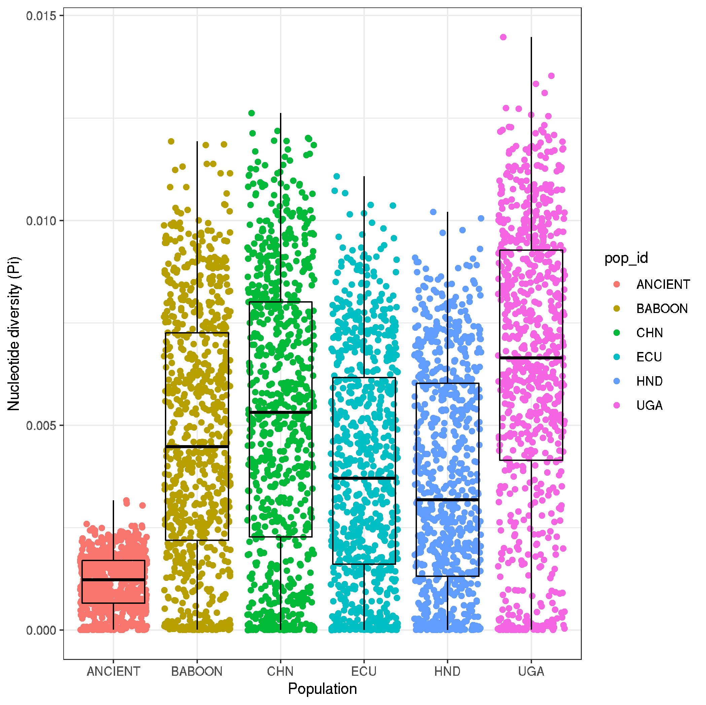
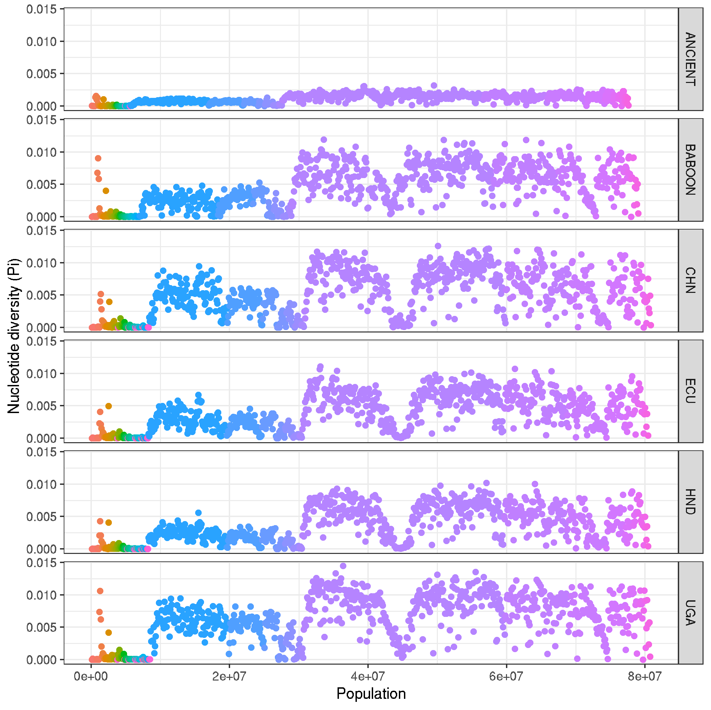


### plot Tajimas D

```R

library(tidyverse)
library(ggsci)

# list file names
file_names <- list.files(path = "./",pattern = "_x_nuclear_3x_animalPhonly_50k.Tajima.D")

# load data using file names, and make a formatted data frame
data <-
     purrr::map_df(file_names, function(x) {
	data <- read.delim(x, header = T, sep="\t")
     data <- tibble::rowid_to_column(data, "NUM")
	cbind(pop_id = gsub("_x_nuclear_3x_animalPhonly_50k.Tajima.D","",x), data)
	})

# plot boxplots and distributions of Tajima's D
ggplot(data,aes(pop_id,TajimaD,col=pop_id)) +
     geom_jitter() +
     geom_boxplot(fill=NA, col="black") +
     labs(x = "Population" , y = "Tajima's D") +
     theme_bw() +
     theme(axis.text.x = element_text(angle = 90, vjust = 0.5, hjust=1)) +
     scale_color_npg()

ggsave("plot_tajimaD_boxplot.png")
ggsave("plot_tajimaD_boxplot.pdf", useDingbats=F, width=8, height=5)


ggplot(data,aes(NUM*50000,TajimaD,col=CHROM, group=pop_id)) +
     geom_point() +
     labs(x = "Population" , y = "Tajima's D", col=NA) +
     theme_bw() +
     facet_grid(pop_id~.) +
     theme(legend.position = "none") +
     scale_color_npg()

ggsave("plot_tajimaD_genomewide.png")
ggsave("plot_tajimaD_genomewide.pdf", useDingbats=F, width=7, height=7)


plot_tajD <-
     ggplot(data,aes(NUM*50000,TajimaD,col=pop_id, group=pop_id)) +
     geom_smooth(span = 0.1, se = FALSE) +
     labs(x = "Population" , y = "Tajima's D", col= "Population") +
     theme_bw() +
     theme() +
     scale_color_npg()

plot_Pi + plot_tajD + plot_layout(ncol = 1, guides = "collect")

```

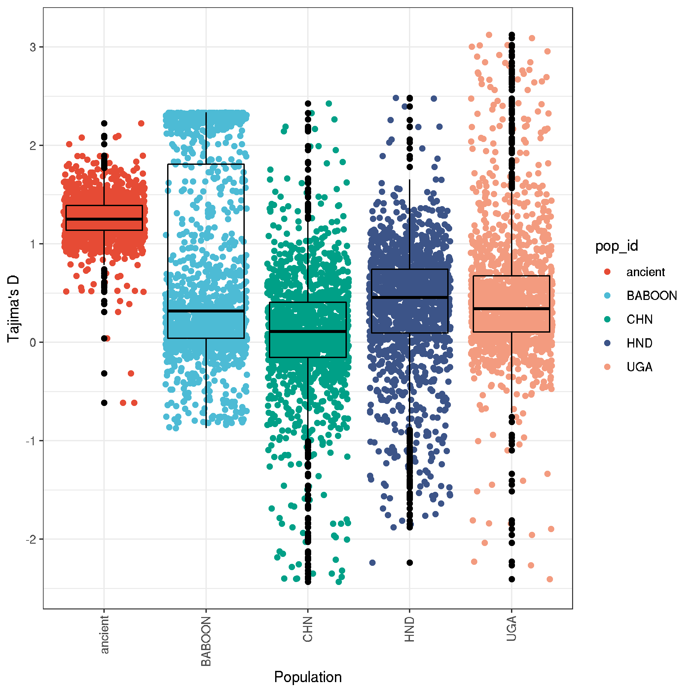
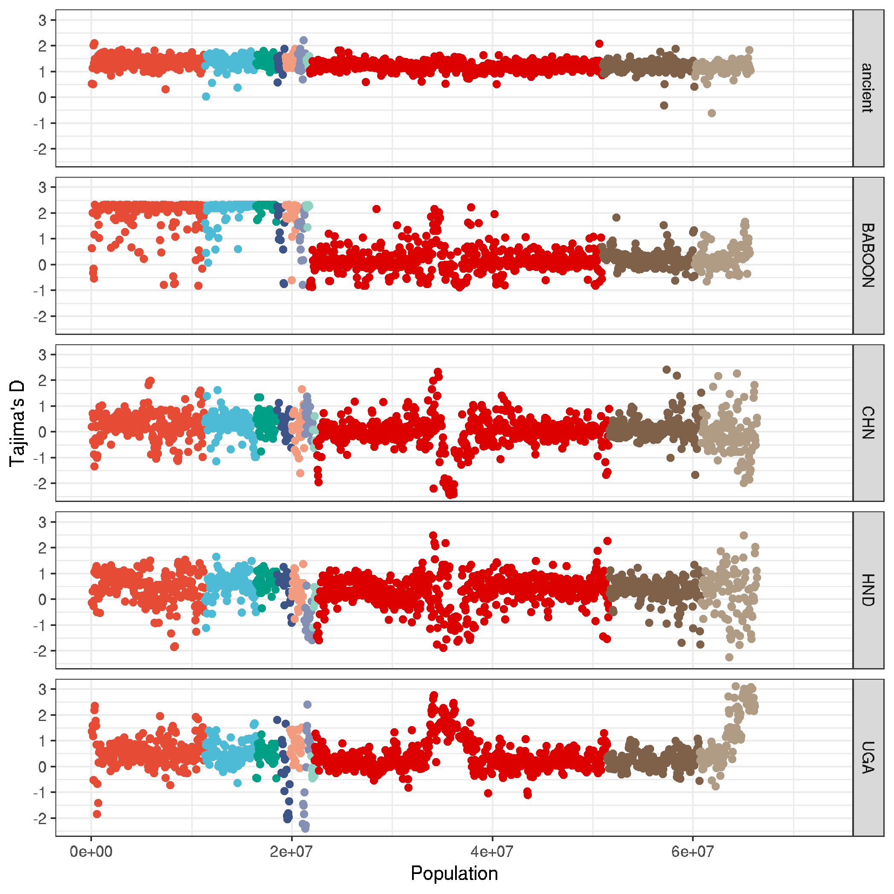


## Genome wide genetic differentiation

```bash

# run vcftools weir-fst-pop for all pairwise combinations of populatiions
for i in ancient_x_nuclear_3x_animalPhonly.list \
BABOON_x_nuclear_3x_animalPhonly.list \
CHN_x_nuclear_3x_animalPhonly.list \
HND_x_nuclear_3x_animalPhonly.list \
UGA_x_nuclear_3x_animalPhonly.list; do \
     for j in ancient_x_nuclear_3x_animalPhonly.list \
     BABOON_x_nuclear_3x_animalPhonly.list \
     CHN_x_nuclear_3x_animalPhonly.list \
     HND_x_nuclear_3x_animalPhonly.list \
     UGA_x_nuclear_3x_animalPhonly.list; do \
          if [[ "$i" == "$j" ]] || [[ -f ${i%_x_nuclear_3x_animalPhonly.list}_v_${j%_x_nuclear_3x_animalPhonly.list}_50k.windowed.weir.fst ]] || [[ -f ${j%_x_nuclear_3x_animalPhonly.list}_v_${i%_x_nuclear_3x_animalPhonly.list}_50k.windowed.weir.fst ]]; then
               echo "Same, same, move on"
               else
               vcftools --gzvcf nuclear_samples3x_missing0.8_animalPhonly.recode.vcf.gz --bed chromosome_scaffolds.bed --weir-fst-pop ${i} --weir-fst-pop ${j} --fst-window-size 50000 --out ${i%_x_nuclear_3x_animalPhonly.list}_v_${j%_x_nuclear_3x_animalPhonly.list}_50k;
          fi;
     done;
done


```

- make some plots

```R
# load libraries
library(tidyverse)
library(ggsci)
library(patchwork)

# list file names
file_names <- list.files(path = "./",pattern = "_50k.windowed.weir.fst")

# load data using file names, and make a formatted data frame
data <-
     purrr::map_df(file_names, function(x) {
	data <- read.delim(x, header = T, sep="\t")
     data <- tibble::rowid_to_column(data, "NUM")
	cbind(sample_pair = gsub("_50k.windowed.weir.fst","",x), data)
	})

# plot boxplots and distributions of pairwise Fst analyses
ggplot(data,aes(sample_pair,WEIGHTED_FST,col=sample_pair)) +
     geom_jitter() +
     geom_boxplot(fill=NA, col="black") +
     labs(x = "Population" , y = "WEIGHTED_FST") +
     theme_bw() +
     theme(axis.text.x = element_text(angle = 90, vjust = 0.5, hjust=1))

# save it
ggsave("plot_human_pop_pairwise_FST_boxplot.png")


# plot genome-wide distributions of pairwise Fst analyses
ggplot(data, aes(NUM*50000, WEIGHTED_FST, col=CHROM, group=sample_pair)) +
     geom_point() +
     labs(x = "Population" , y = "WEIGHTED_FST", col=NA) +
     theme_bw() +
     facet_grid(sample_pair~.) +
     theme(legend.position = "none") +
     scale_color_npg()

ggsave("plot_human_pop_pairwise_FST__genomewide.png")


# function to load specific datasets to make multipanel figures
plot_pairwise_fst <- function(file) {
     # load and prep data
     data <- read.delim(file, header=T, sep="\t")
     data <- tibble::rowid_to_column(data, "NUM")
     data$COMPARISON <- gsub("_50k.windowed.weir.fst","",file)
     # plot
     ggplot(data, aes(NUM*50000, WEIGHTED_FST, col=CHROM)) +
     geom_point(size=0.5) +
     labs(x = "Genomic position (bp)" , y = "Weighted FST", col=NA) +
     theme_bw() + ylim(0,1) +
     facet_grid(COMPARISON~.) +
     theme(legend.position = "none", text = element_text(size = 10))+
     scale_color_npg()
}

# for main text
CHN_v_UGA_fst <- plot_pairwise_fst("CHN_v_UGA_50k.windowed.weir.fst")
HND_v_UGA <- plot_pairwise_fst("HND_v_UGA_50k.windowed.weir.fst")
CHN_v_HND <- plot_pairwise_fst("CHN_v_HND_50k.windowed.weir.fst")
BABOON_v_UGA_fst <- plot_pairwise_fst("BABOON_v_UGA_50k.windowed.weir.fst")

CHN_v_UGA_fst + HND_v_UGA + CHN_v_HND + BABOON_v_UGA_fst + plot_layout(ncol=1)

ggsave("plot_pairwise_FST_genomewide.pdf", width=170, height=150, units="mm")

# BABOON_v_UGA_fst <- plot_pairwise_fst("BABOON_v_UGA_50k.windowed.weir.fst")
# human_vs_LMCG_fst <- plot_pairwise_fst("human_vs_LMCG_50k.windowed.weir.fst")
#
# BABOON_v_UGA_fst + human_vs_LMCG_fst + plot_layout(ncol=1)
# ggsave("plot_humananimal_pop_pairwise_FST_genomewide.png")
#
# # for supplementary data
# CHN_v_UGA_fst <- plot_pairwise_fst("CHN_v_UGA_50k.windowed.weir.fst")
#
# CHN_v_UGA_fst + CHN_v_ECU_fst + ECU_v_UGA_fst + plot_layout(ncol=1)
# ggsave("plot_human_pop_pairwise_FST_genomewide.png")
#

```

- boxplot summaries
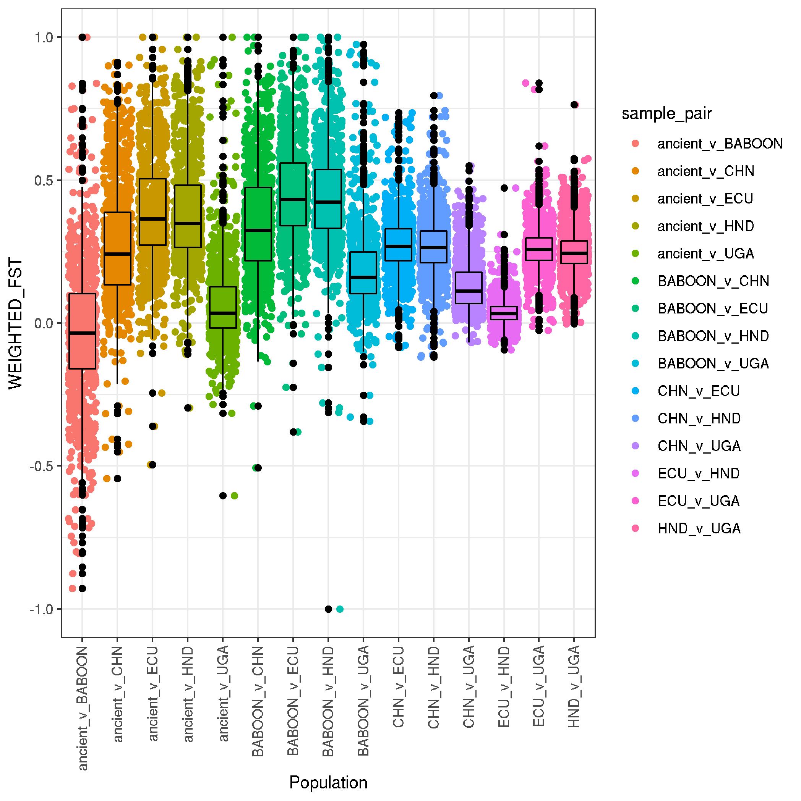

- genomewide - human populations
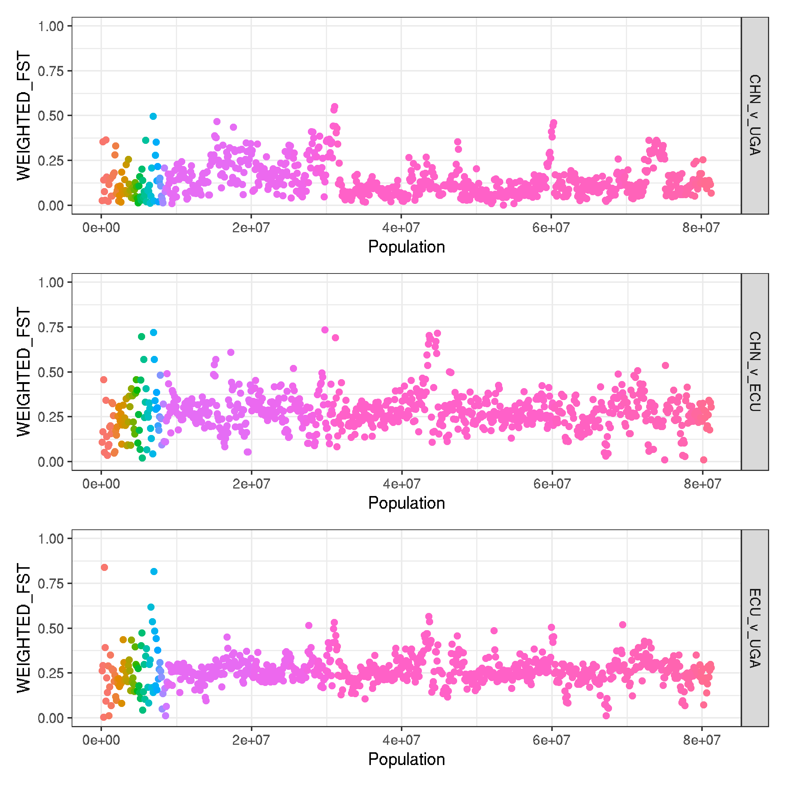

- genomewide - human v animal populations
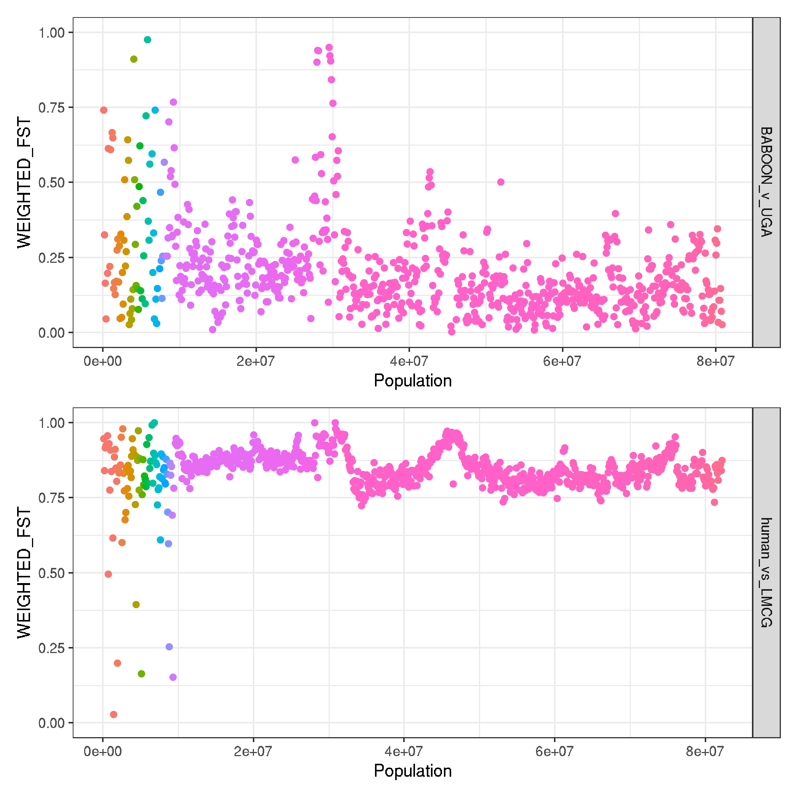


### extracting top 1% of Fst values for each comparison

```R

extract_top_1 <- function(file){
     require(tidyverse)
     data <- read.table(file, header=T)
     data_top1 <- data %>% filter(WEIGHTED_FST > quantile(WEIGHTED_FST, 0.99)) %>% select(CHROM:BIN_END,WEIGHTED_FST)
     write.table(data_top1, file=paste0(file,".top1.coords"), row.names = F, col.names = F, quote = F, sep = '\t')
}

extract_top_1("HND_v_UGA_50k.windowed.weir.fst")
extract_top_1("CHN_v_UGA_50k.windowed.weir.fst")
extract_top_1("CHN_v_HND_50k.windowed.weir.fst")
extract_top_1("BABOON_v_UGA_50k.windowed.weir.fst")

```

```bash
# extract the overlapping genes in the top 1% datasets
for i in *top1.coords; do
     bedtools intersect -b ${i} -a liftover_annotation.gff3 -wb |\
     awk '$3=="gene" {print $9}' | cut -f1 -d ";" | cut -f2 -d ":" \
     > ${i%.coords}.genes;
done

for i in *top1.coords; do
     bedtools intersect -b ${i} -a liftover_annotation.gff3 -wb |\
     awk -F '[\t]' '$3=="gene" {print $10,$11,$12,$13,$4,$5,$9}' OFS="\t" | cut -f1 -d ";" | sed 's/ID=gene://g' \
     > ${i%.coords}.intersect;
done

# extract all gene IDs
cat liftover_annotation.gff3 |\
     awk '$3=="gene" {print $9}' |\
     cut -f1 -d ";" | cut -f2 -d ":" \
     > liftover_annotation.genelist

# use gProfiler to determine intersection
#>> no enriched genes found for any comparison

```

- testing correlation of Fst between UGA-CHN and UGA-Americas to see if there is variation shared by UGA-Americas that is not shared by UGA-China. If true, this might support independent migration into the Americas

```R
# load libraries
library(tidyverse)
library(patchwork)

uga_chn <- read.table("CHN_v_UGA_50k.windowed.weir.fst", header=T)
uga_chn$pair <- "UGAvCHN"
chn_americas <-read.table("CHN_v_AMERICAS_50k.windowed.weir.fst", header=T)
chn_americas$pair <- "CHNvAMERICAS"
uga_americas <-read.table("UGA_v_AMERICAS_50k.windowed.weir.fst", header=T)
uga_americas <- "UGAvAMERICAS"

data <- dplyr::bind_rows(uga_chn,chn_americas)
data <- dplyr::bind_rows(data,chn_americas)

uga_chn <- read.table("CHN_v_UGA_50k.windowed.weir.fst", header=T)
chn_americas <-read.table("CHN_v_AMERICAS_50k.windowed.weir.fst", header=T)
uga_americas <-read.table("UGA_v_AMERICAS_50k.windowed.weir.fst", header=T)

data <- dplyr::inner_join(uga_chn,chn_americas,by=c("CHROM","BIN_START"))
data <- dplyr::inner_join(data,uga_americas,by=c("CHROM","BIN_START"))
data <- data %>% select(CHROM,BIN_START,WEIGHTED_FST.x,WEIGHTED_FST.y,WEIGHTED_FST)
colnames(data) <- c("CHROM", "BIN_START", "FST_UGAvCHN", "FST_CHNvAMERICAS", "FST_UGAvAMERICAS")


plot_1 <-
     ggplot(data, aes(FST_UGAvCHN, FST_UGAvAMERICAS)) +
     geom_smooth(method = "lm", se = FALSE) +
     geom_point(size=0.5) +
     xlim(0,1) +
     ylim(0,1) +
     theme_bw()

plot_2 <-
     ggplot(data, aes(FST_UGAvCHN, FST_CHNvAMERICAS)) +
     geom_smooth(method = "lm", se = FALSE) +
     geom_point(size=0.5) +
     xlim(0,1) +
     ylim(0,1)+
     theme_bw()

plot_3 <-
     ggplot(data, aes(FST_UGAvAMERICAS, FST_CHNvAMERICAS)) +
     geom_smooth(method = "lm", se = FALSE) +
     geom_point(size=0.5) +
     xlim(0,1) +
     ylim(0,1)+
     theme_bw()

plot_1 + plot_2 + plot_3 + plot_layout(ncol=3)

```

```bash
cd /nfs/users/nfs_s/sd21/lustre118_link/trichuris_trichiura/04_VARIANTS/GATK_HC_MERGED

# extract data from UGA_CHN_AMERICAS samples, no missing data, to calculate per site allele freq, whcih will be used to calculate private and shared site frequencies
vcftools \
--gzvcf Trichuris_trichiura.cohort.nuclear_variants.final.recode.vcf.gz \
--max-missing 1 \
--keep UGA_x_nuclear_3x_animalPhonly.list \
--keep CHN_x_nuclear_3x_animalPhonly.list \
--keep AMERICAS_x_nuclear_3x_animalPhonly.list \
--recode \
--out UGA_CHN_AMERICAS

#> After filtering, kept 2430928 out of a possible 6571976 Sites


vcftools --vcf UGA_CHN_AMERICAS.recode.vcf --keep UGA_x_nuclear_3x_animalPhonly.list --freq --out UGA
vcftools --vcf UGA_CHN_AMERICAS.recode.vcf --keep CHN_x_nuclear_3x_animalPhonly.list --freq --out CHN
vcftools --vcf UGA_CHN_AMERICAS.recode.vcf --keep AMERICAS_x_nuclear_3x_animalPhonly.list --freq --out AMERICAS

paste UGA.frq CHN.frq AMERICAS.frq > UGA_CHN_AMERICAS.freq

# alt freq columns
#UGA_ALT = 8
#CHR_ALT = 16
#AMERICAS_ALT = 24

sed 's/:/\t/g' UGA_CHN_AMERICAS.freq | grep -v "CHROM" | cut -f8,16,24 > tmp; mv tmp UGA_CHN_AMERICAS.freq

```

- make some plots, and summary data

```R
# load libraries
library(tidyverse)
library(UpSetR)

data <- read.table("UGA_CHN_AMERICAS.freq",header=F)
colnames(data) <- c("UGA", "CHN", "AMERICAS")
data <- data %>% mutate_if(is.numeric, ~1 * (. > 0.05))

pdf(file="UGA_CHN_AMERICAS_shared_v_private_variants.pdf", onefile=FALSE)
upset(data,sets.bar.color = "#56B4E9", point.size = 3.5, mainbar.y.label = "Shared variants above freq(alt) = 0.05", sets.x.label = "Variants")
dev.off()

png(file="UGA_CHN_AMERICAS_shared_v_private_variants.png")
upset(data,sets.bar.color = "#56B4E9", point.size = 3.5, mainbar.y.label = "Shared variants above freq(alt) = 0.05", sets.x.label = "Variants")
dev.off()

data %>% group_by_all() %>% summarise(COUNT = n()) %>% mutate(freq = COUNT / sum(COUNT))

```

| UGA | CHN | AMERICAS | COUNT | FREQ |
| --- | --- | ---   | --- |
|    0    |    0    |    0    |    1811631   |
|    0    |    0    |    1    |    148234 |
|    0    |    1   |    0    |     116536     |
|    0    |    1    |    1    |    83018     |
|    1    |    0   |    0    |  226805     |
|    1    |    0    |    1    |    33990 |
|    1    |    1    |    0    |    164206 |
|    1    |    1    |    1    |    282751    |

- note: 0,0,0 are positions in whihc the freq is very low in all populaitons. These variants are not used in calculating totals.

- private = (148234+116536+226805) / total = 46.57094947%
- shared by all three = 282751 / total = 26.7873316%
- shared by UGA and Americas, not China = 33990 / total = 3.220152718%

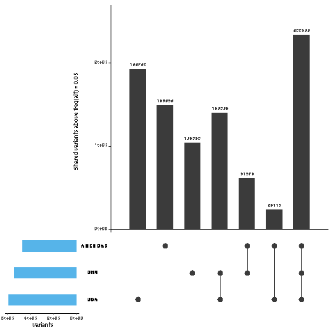


## Ancient DNA analyses


```bash
# working directory
cd  ~/lustre118_link/trichuris_trichiura/05_ANALYSIS/POOLSEQ
```


```R
library(tidyverse)
library(ggrepel)
library(patchwork)
library(ggsci)

data <- read.table("curated_data_npstats_age.txt", header=T)

country_colours <-
     c("Denmark" = "#3C5488",
     "Holland" = "#9DAAC4",
     "Lithuania" = "#0F1522")

ggplot(data) +
     geom_smooth(aes(Age,Pi), method = "lm", colour="grey") +
     geom_point(aes(Age, Pi, colour = Country), size=3) +
     geom_text_repel(aes(Age, Pi, label=Population), size=3) +
     ylim(0,0.015) + xlim(800,2020) +
     theme_bw() + labs(x="Estimated age of sampling location", y="Nucleotide diversity (Pi)") +
     scale_colour_manual(values = country_colours)

ggsave("ancient_sites_Pi_over_time.png", height=2, width=7.5)
ggsave("ancient_sites_Pi_over_time.pdf", height=2, width=7.5, useDingbats=FALSE)


```

Figure: [map](../04_analysis/genomewide_genetic_variation/ancient_sites_Pi_over_time.pdf)
- new main text figure
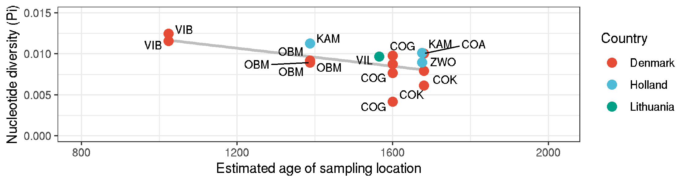


## Heterozygosity vs coverage
```R
library(tidyverse)
library(ggpmisc)

data <- read.table("heterozygosity_x_coverage.txt", header = T)

formula <- x ~ y

ggplot(data,aes(F,COV)) +
     geom_point() + xlim(0,1) +
     labs(x="Heterozygosity (F)", y="Coverage") +
     facet_grid(POPULATION~.) + theme_bw() +
     geom_smooth(method = "lm", se = FALSE)+
     stat_fit_glance(method = 'lm',
          method.args = list(formula = formula),
          geom = 'text',
          aes(label = paste("P-value = ", signif(..p.value.., digits = 3), sep = "")),
          label.x = 0.5, label.y = 0.5, size = 3) +
     stat_poly_eq(aes(label = paste(..rr.label..)),
          label.x = 0.5, label.y = 0.15, formula = formula, parse = TRUE, size = 3)

ggsave("heterozygosity_x_coverage.png")
ggsave("heterozygosity_x_coverage.pdf", height=7, width=7, useDingbats=FALSE)
```

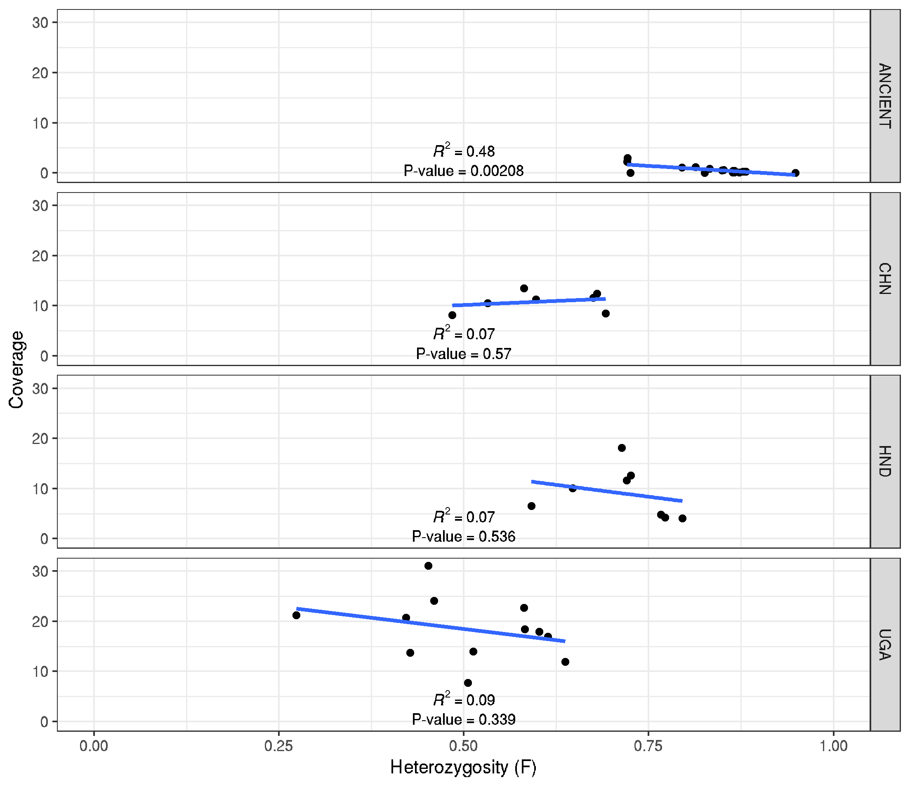


### Relatedness and kinship between samples in a population
- Want to know to what degree individual worms from a population are related to each other.
- can do this via calculating kinship coefficients, to determine 1st, 2nd, 3rd degree relatives


```bash
# run vcftools to calculated relatedness
vcftools --gzvcf nuclear_samples3x_missing0.8_animalPhonly.recode.vcf.gz --relatedness2 --max-missing 1

# extract relevant pairwise comparisons for making the network.
#--- note only want within population comparisons, rather than between populations
#--- also want to remove self v self.
>allpops.relatedness2
for i in CHN DNK_COZ_PH HND UGA_DK UGA_KAB ; do
     awk -v name=$i '$1~name && $2~name {print $0,name}' OFS="\t" out.relatedness2 |\
     awk '{if($1!=$2) print $8,$1,$2,$7}' OFS="\t" >> allpops.relatedness2;
done

# make a file with population groups for colouring the network in
cut -f 1,2 allpops.relatedness2 | sort | uniq > metadata.txt
```


```R
# load libraries
# https://briatte.github.io/ggnet/
library(tidyverse)
library(GGally)
library(network)
library(sna)
library(ggplot2)


# read data
data <- read.table("allpops.relatedness2")
metadata <- read.table("metadata.txt")


# convert kinship coefficients into a coded 1st, 2nd, 3rd degree relatives
data_1 <-
     data %>%
     mutate(V4 = if_else(V4 >= 0.05 & V4 < 0.10125, 0.5,
               if_else(V4 >= 0.10125 & V4 < 0.1925, 1,
               if_else(V4 >= 0.1925 & V4 < 0.375, 2, 0))))

# coding:
#0 degree = 0.5
#1st degree = 0.25 (0.1925-0.375)
#2nd degree = 0.125 (0.10125-0.1925)
#3rd degree = 0.0675 (0.05-0.10125)
#4th degree = 0.03375

# convert data from paired observations to a matrix of observations
data_2 <-
     data_1 %>%
     unique() %>%
     pivot_wider(., id_cols=V2, names_from=V3, values_from=V4, values_fill=0)

data_3 <- as.data.frame(data_2, row.names=F)

# clean up matrix
data_4 <-
     data_3 %>%
     remove_rownames %>%
     column_to_rownames(var="V2")

data_4.1 <- as.matrix(data_4)

# make the network
data_5 <- network(data_4.1, ignore.eval = FALSE, names.eval = "kinship")

# add the population metaddata
data_5 %v% "Population" = metadata$V1
data_5 %v% "Host" = metadata$V3

# set colours for populations
col =  c("CHN" = "#E64B35B2", "DNK_COZ_PH" = "#00A087B2", "HND" = "#8491B4B2", "NLD" = "#91D1C2B2", "UGA_KAB" = "#DC0000B2", "UGA_DK" = "#DC0000B8")

col <-
     c("CHN" = "#00A087",
     "CMR" = "#902F21",
     "DNK" = "#3C5488",
     "ESP" = "#E7EAF0",
     "HND" = "#4DBBD5",
     "NLD" = "#9DAAC4",
     "UGA" = "#E64B35",
     "LTU" = "#0F1522",
     "TZA" = "#F2A59A")


#set.edge.attribute(data_5, "lty", ifelse(data_5 %e% "kinship" = 3, 1, ifelse(data_5 %e% "kinship" = 2, 2, 3)))

# plot the network
ggnet2(data_5, edge.size = "kinship", color = "Population", palette = "Set1", size=4, shape="Host")

# save it
ggsave("kinship_network.pdf", useDingbats=F, height=8, width=8)
ggsave("kinship_network.png")

```

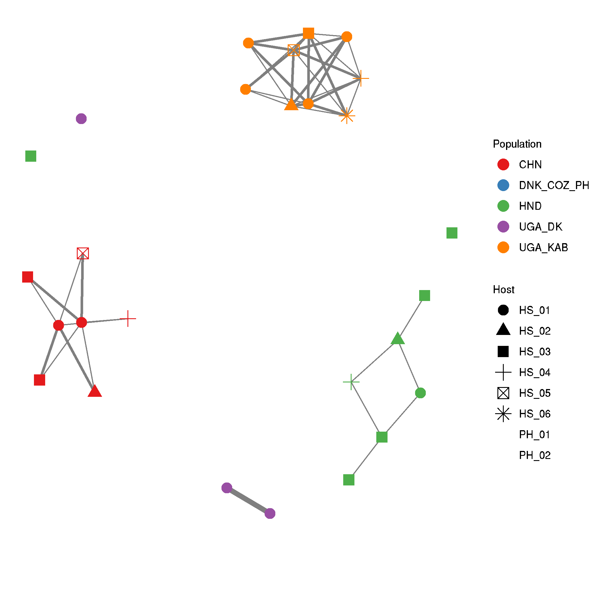
