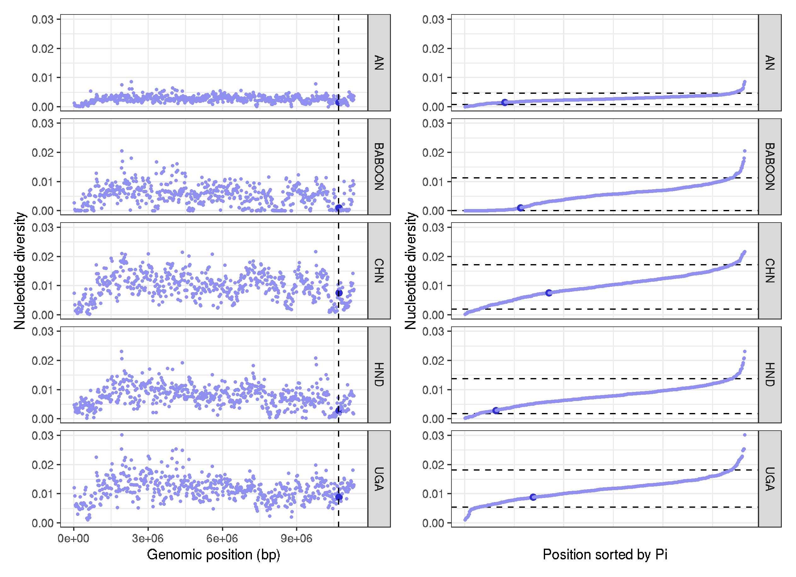

## Beta tubulin

## Contents
- Analysis of variation within beta tubulin
- Reanalysis of nucleotide diversity around beta-tubulin - post peer review

## Analysis of variation within beta tubulin
```bash
vcftools \
      --gzvcf Trichuris_trichiura.cohort.nuclear_variants.final.recode.vcf.gz \
      --bed btubulin.exons.bed \
      --site-pi \
      --keep mod_human_samples.list \
      --maf 0.01 \
      --out BZ_nuc_div

#> After filtering, kept 42 out of 73 Individuals
#> After filtering, kept 9 out of a possible 6571976 Sites

vcftools \
      --gzvcf Trichuris_trichiura.cohort.nuclear_variants.final.recode.vcf.gz \
      --bed btubulin.exons.bed \
      --freq \
      --keep mod_human_samples.list \
      --maf 0.01 \
      --out BZ_allele_freq

vcftools \
      --gzvcf Trichuris_trichiura.cohort.nuclear_variants.final.recode.vcf.gz \
      --bed btubulin.exons.bed \
      --hardy \
      --keep mod_human_samples.list \
      --maf 0.01 \
      --out BZ_hardy


```

```R
# load library
library(tidyverse)
library(ggsci)
library(patchwork)
library(viridis)
library(ggrepel)

# load data
exons <- read.table("btubulin.exons.bed", header=T)
nuc <- read.table("out.sites.pi", header=T)
resistant_snps <- read.table("btubulin.canonicalresistantSNPs.bed",header=T)

allele_freq <- read.table("BZ_allele_freq.frq2", header=F, sep="\t", skip=1)
colnames(allele_freq) <- c("chrom", "pos", "alleles", "total_alleles", "ref", "ref_freq", "var", "var_freq")

# original
# ggplot() +
#      geom_segment(data=exons, aes(x=min(start),xend=max(end),y=0.5,yend=0.5),col="black", size=2) +
#      geom_rect(data=exons,aes(xmin=start,ymin=0,xmax=end,ymax=1),fill="grey80") +
#      ylim(-0.5,1.5) +
#      labs(title="Beta-tubulin (TTRE_0000877201)",x="Genomic position (bp)", y="") +
#      geom_segment(data=resistant_snps, aes(x=start,xend=end,y=0,yend=1),col="orange", size=1) +
#      geom_segment(data=nuc, aes(x=POS,xend=POS,y=0,yend=1,col=PI), size=2) +
#      theme_bw() + theme(axis.title.y=element_blank(),
#           axis.text.y=element_blank(),
#           axis.ticks.y=element_blank())

# ggsave("btubulin_variation_gene.png")
# ggsave("btubulin_variation_gene.pdf", height=2, width=5)


# post peer review
ggplot() +
     geom_segment(data=exons, aes(x=min(start), xend=max(end),y=0,yend=0), col="black", size=2) +
     geom_rect(data=exons, aes(xmin=start,ymin=-0.1, xmax=end, ymax=0.1), fill="grey80") +
     ylim(-1,1) +
     labs(title="Beta-tubulin (TTRE_0000877201)",x="Genomic position (bp)", y="Minor allele frequency (neg) + Nucleotide diversity (pos)", color="Frequency") +
     geom_segment(data=resistant_snps, aes(x=start, xend=end, y=-0.1, yend=0.1),col="red", size=1) +
     geom_text_repel(data=resistant_snps, aes(x=start, y=0, label=start), col="red", box.padding = 0.5, max.overlaps = Inf, nudge_y = 0.75) +
     geom_segment(data=nuc, aes(x=POS, xend=POS, y=0, yend=PI, col=PI), size=1) +
     geom_point(data=nuc, aes(x=POS, y=PI, col=PI), size=3) +
     geom_segment(data=allele_freq, aes(x=pos, xend=pos, y=0, yend=-var_freq, col=var_freq), size=1) +
     geom_point(data=allele_freq, aes(x=pos, y=-var_freq, col=var_freq), size=3) +
     theme_bw() + scale_colour_viridis()  + scale_fill_viridis()


ggsave("btubulin_variation_gene_R1.png")
ggsave("btubulin_variation_gene_R1.pdf", height=2, width=5)
```


## Reanalysis of nucleotide diversity around beta-tubulin
```bash
# working directory
/lustre/scratch118/infgen/team333/sd21/trichuris_trichiura/05_ANALYSIS/DXY
```

```R
library(tidyverse)
library(patchwork)

data <- read.table("trichuris_allsites_pi.txt", header=T)

chr <- filter(data,chromosome=="Trichuris_trichiura_1_001")
chr <- mutate(chr, colour = ifelse(10684531>window_pos_1 & 10684531<window_pos_2, "1", "0.5"))
chr <- chr %>%
     group_by(pop) %>%
     mutate(position = 1:n())

plot_1 <- ggplot(chr, aes(position*20000, avg_pi, col=colour, size=colour)) +
     geom_point() +
     facet_grid(pop~.) +
     geom_vline(xintercept=c(10684531,10686350), linetype="dashed", size=0.5) +
     labs(x = "Genomic position (bp)" , y = "Nucleotide diversity") +
     scale_colour_manual(values = c("#9090F0", "#3030D0")) +
     scale_size_manual(values=c("0.5" = 0.5, "1" = 2)) +
     theme_bw() + theme(legend.position="none")


# rearrange Pi data to determine where btubulin sits in the distribution of pi
chr_sort <- arrange(chr,avg_pi)
chr_sort <-
     chr_sort %>%
     group_by(pop) %>%
     mutate(position = 1:n())
chr_sort_quantile <-
     chr_sort %>%
     group_by(pop) %>%
     summarise(enframe(quantile(avg_pi, c(0.05,0.95)), "quantile", "avg_pi"))


plot_2 <- ggplot(chr_sort) +
     geom_hline(data=chr_sort_quantile,aes(yintercept=c(avg_pi)), linetype="dashed", size=0.5) +
     geom_point(aes(position, avg_pi, col=colour, size=colour)) + facet_grid(pop~.) + theme_bw() +
     scale_colour_manual(values = c("#9090F0", "#3030D0")) +
     labs(x = "Position sorted by Pi" , y = "Nucleotide diversity") +
     scale_size_manual(values=c("0.5" = 0.5, "1" = 2)) +
     theme(legend.position="none",
          axis.text.x=element_blank(),
         axis.ticks.x=element_blank())

plot_1 + plot_2

ggsave("btubulin_variation_scaffold.png")
ggsave("btubulin_variation_scaffold.pdf", useDingbats=F, width=7, height=5)
```

