# Population genomics of ancient and modern *Trichuris trichiura*

## Background

### Original sampling data
- Modern genomes  from human hosts (49)
     - Human worm isolates (27)
          - Uganda (12), China (7), Honduras (8)
     - Human egg isolates (10)
          - Cameroon (5), Tanzania (5)

- Modern genomes from non-human hosts (7)
     - Worm isolates (7)
          - Baboon – Denmark (2), Colobus - Spain (2), Leaf-Monkey – China (3)

- Ancient samples (17 samples from 10 sites)
     - 1000 AD: Viborg, DK (2) – 2x Mito + 0,01x/0,16x NG
     - 1350 AD : Kampen, Netherlands (2) – 2x Mito + 1,8x/4,7x NG - yes
     - 1350-1400 AD: Odense, DK (4) – in analysis - yes
     - 1500-1600 AD: Zwolle, Netherlands (1) – Mito + 2,3x NG - yes
     - 1550-1580 AD: Vilnius, Lithuania (1) – in analysis - yes
     - 1600-1800 AD: Gl. Strand, CPH, DK (4) – in analysis - yes
     - 1680 AD: Kultorvet, CPH, DK (2) – in analysis - yes
     - 1700 AD: Adelgade, CPH, DK (1) – in analysis - yes


### Overarching questions
- describe new genome?
     - basic assembly stats
- global population structure
     - worldmap
     - PCA (nuclear / mtDNA)
     - structure
     - dispersal - MSMC (difference in popn size between human and animals?)
- admixture
     - from ancient to modern
     - from humans to animals
          - treemix / admixture / D-statistics
- genome-wide diversity
     - similar to oncho popgen paper
          - nucleotide diversity (https://www.ncbi.nlm.nih.gov/pmc/articles/PMC5512550/; Fig2)
               - human vs animals (nucleotide div, Tajimas D)
               - Fst (human vs animal)
               - Fst (two clades of human Tt)

- evidence of selection around beta-tubulin?
     - might apply to some modern samples


### Downstream analyses
- relatedness
     - PCA https://speciationgenomics.github.io/pca/
          - whole genomes modern
          - mtDNA genomes all
     - faststructure
- admixture
     - treemix
          - tutorial: https://speciationgenomics.github.io/Treemix/
     - admixtools https://github.com/uqrmaie1/admixtools
          - D statistics
- population history
     - MSMC / SMC++ (https://github.com/popgenmethods/smcpp)
- genome-wide patterns of genetic diversity
     - Pi
     - Tajimas D
     - Fst


## working directory
```bash
cd /nfs/users/nfs_s/sd21/lustre118_link/trichuris_trichiura
WORKING_DIR=/nfs/users/nfs_s/sd21/lustre118_link/trichuris_trichiura

```

## Project setup
```shell
mkdir 00_SCRIPTS 01_REF 02_RAW 03_MAPPING 04_VARIANTS 05_ANALYSIS
```
---

## Reference genome
- the reference is an unpublished Trichuris trichiura assembly generated in the Parasite Genomics team at Sanger
- this is a new PacBio assembly, rahter than an improvement from the original assembly published by Foth et al (2014)
- this assembly is from worms extracted from Peter Nejsum that originated in Uganda, whereas the Foth assembly was from Ecuadorian worms.
- this assembly didn't have an annotation when the project started

### Genome stats
- genome stats of the new assembly
     - sum = 80573711, n = 113, ave = 713041.69, largest = 29164577
     - N50 = 11299416, n = 2
     - N60 = 9167782, n = 3
     - N70 = 5100676, n = 5
     - N80 = 2017282, n = 7
     - N90 = 643749, n = 14
     - N100 = 1808, n = 113
     - N_count = 250000
     - Gaps = 25

### BUSCO stats
- BUSCO stats of the assembly (see below for commands and comparison against old assembly)
     - C:81.4%[S:79.3%,D:2.1%],F:1.7%,M:16.9%,n:978
     - 797	Complete BUSCOs (C)
     - 776	Complete and single-copy BUSCOs (S)
     - 21	Complete and duplicated BUSCOs (D)
     - 17	Fragmented BUSCOs (F)
     - 164	Missing BUSCOs (M)
     - 978	Total BUSCO groups searched


```bash
cd /nfs/users/nfs_s/sd21/lustre118_link/trichuris_trichiura/01_REF

# make a generic bwa index for mapping later on
bwa index trichuris_trichiura.fa

# make a generic dict file for SNP calling later on
samtools dict trichuris_trichiura.fa > trichuris_trichiura.dict

```


## Raw sequencing data
- Sequencing was performed at the Centre for Geogenetics (CGG), University of Copenhagen
- I received the raw sequencing data from Peter on a hard drive, and copied all to the lustre environment as is into the directory 02_RAW
- want to collect all of the FASTQ files into one place, and then begin processing them

```bash
cd ${WORKING_DIR}/02_RAW

for i in *gz; do
     echo ${i%_???.fastq.gz};
done | sort | uniq | while read NAME; do
          cat ${NAME}* > ${NAME}.merged.fastq.gz;
     done &

# sample used in the Foth 2014 genome paper
pf data --type lane --id 6929_8 -l ./ --filetype fastq

```

- this generated a total of 130 R1 files and 60 R2 files
- the difference in number reflects the fact that the "modern" samples have been sequenced using PE reads whereas the "ancient" samples have been sequenced using SE reads. Will need to treat these a little differently later on.
- there is also a difference in the number of samples with useable data (based on some sample informaiton spreadsheets from MS / PJ), and the total number
     - some samples are controls
     - some samples presumably didnt work, and so we excluded from the preliminary analyses
     - some samples are duplicates, and so will need to be merged at some point too.
---

## metadata
- I have begun to curate the metadata, to get a better idea of what data is actually available, and to ensure that I have consistent informaiton for all samples.
- The existing naming scheme is not very informative to me at least, and so will rename everything with a simple format
- GoogleSheet:  https://docs.google.com/spreadsheets/d/1PiapiaZZw0g0i3lN0feXxqEVupvaAuOm0IViXnZPFqk/edit?usp=sharing

---
## trimming
- trimming using AdapterRemoval, which seems to be used for a few different ancient DNA projects. I think it is because it trims and merges, which generally improves the mapping scores off some poor qual end of reads.
- Tool: https://buildmedia.readthedocs.org/media/pdf/adapterremoval/latest/adapterremoval.pdf

```bash
cd ${WORKING_DIR}/02_RAW

### run the trimming

# main samples
while read OLD_NAME NEW_NAME; do
     bsub.py --threads 4 20 adapter_remove_modern "${WORKING_DIR}/00_SCRIPTS/run_adapter_remove_PE.sh ${OLD_NAME} ${NEW_NAME}";
done < ${WORKING_DIR}/modern.sample_list

while read OLD_NAME NEW_NAME; do
     bsub.py --threads 4 20 adapter_remove_ancient "${WORKING_DIR}/00_SCRIPTS/run_adapter_remove_SE.sh ${OLD_NAME} ${NEW_NAME}";
done < ${WORKING_DIR}/ancient.sample_list

# other samples
while read OLD_NAME NEW_NAME; do
     bsub.py --threads 4 20 adapter_remove_others_PE "${WORKING_DIR}/00_SCRIPTS/run_adapter_remove_PE.sh ${OLD_NAME} ${NEW_NAME}";
done < ${WORKING_DIR}/others_PE.sample_list

while read OLD_NAME NEW_NAME; do
     bsub.py --threads 4 20 adapter_remove_others_SE "${WORKING_DIR}/00_SCRIPTS/run_adapter_remove_SE.sh ${OLD_NAME} ${NEW_NAME}";
done < ${WORKING_DIR}/others_SE.sample_list

```

where "run_adapter_remove_PE.sh" is:

```bash
#!/bin/bash
# adaptor remove PE - modern samples
OLD_NAME=${1}
NEW_NAME=${2}

/nfs/users/nfs_s/sd21/lustre118_link/software/ANCIENT/adapterremoval/bin/AdapterRemoval \
--file1 ${OLD_NAME}_R1.merged.fastq.gz \
--file2 ${OLD_NAME}_R2.merged.fastq.gz \
--basename ${NEW_NAME}_PE \
--trimns --trimqualities --collapse --threads 4

```

and where "run_adapter_remove_SE.sh" is:

```bash
#!/bin/bash
# single end - ancient samples
OLD_NAME=${1}
NEW_NAME=${2}

/nfs/users/nfs_s/sd21/lustre118_link/software/ANCIENT/adapterremoval/bin/AdapterRemoval \
--file1 ${OLD_NAME}_R1.merged.fastq.gz \
--basename ${NEW_NAME}_SE \
--trimns --trimqualities --threads 4

```


### FIX: merge duplicate ancient read sets
These seem to have been a single sample, extracted twice (or in two ways, perhaps two washes of a column) and sequenced individually. Given the low coverage, these should be merged (I think).

```bash
# merge the duplicated set, renaming with a unique name that refers to both the originals, and then remove the originals
cat AN_DNK_COG_EN_001_SE.truncated AN_DNK_COG_EN_002_SE.truncated > AN_DNK_COG_EN_0012_SE.truncated; rm AN_DNK_COG_EN_001_SE.truncated AN_DNK_COG_EN_002_SE.truncated
cat AN_DNK_COG_EN_003_SE.truncated AN_DNK_COG_EN_004_SE.truncated > AN_DNK_COG_EN_0034_SE.truncated; rm AN_DNK_COG_EN_003_SE.truncated AN_DNK_COG_EN_004_SE.truncated
cat AN_DNK_COG_EN_005_SE.truncated AN_DNK_COG_EN_006_SE.truncated > AN_DNK_COG_EN_0056_SE.truncated; rm AN_DNK_COG_EN_005_SE.truncated AN_DNK_COG_EN_006_SE.truncated
cat AN_DNK_COG_EN_007_SE.truncated AN_DNK_COG_EN_008_SE.truncated > AN_DNK_COG_EN_0078_SE.truncated; rm AN_DNK_COG_EN_007_SE.truncated AN_DNK_COG_EN_008_SE.truncated
cat AN_DNK_COK_EN_001_SE.truncated AN_DNK_COK_EN_002_SE.truncated > AN_DNK_COK_EN_0012_SE.truncated; rm AN_DNK_COK_EN_001_SE.truncated AN_DNK_COK_EN_002_SE.truncated
cat AN_DNK_COK_EN_003_SE.truncated AN_DNK_COK_EN_004_SE.truncated > AN_DNK_COK_EN_0034_SE.truncated; rm AN_DNK_COK_EN_003_SE.truncated AN_DNK_COK_EN_004_SE.truncated
cat AN_DNK_OBM_EN_001_SE.truncated AN_DNK_OBM_EN_002_SE.truncated > AN_DNK_OBM_EN_0012_SE.truncated; rm AN_DNK_OBM_EN_001_SE.truncated AN_DNK_OBM_EN_002_SE.truncated
cat AN_DNK_OBM_EN_003_SE.truncated AN_DNK_OBM_EN_004_SE.truncated > AN_DNK_OBM_EN_0034_SE.truncated; rm AN_DNK_OBM_EN_003_SE.truncated AN_DNK_OBM_EN_004_SE.truncated
cat AN_DNK_OBM_EN_005_SE.truncated AN_DNK_OBM_EN_006_SE.truncated > AN_DNK_OBM_EN_0056_SE.truncated; rm AN_DNK_OBM_EN_005_SE.truncated AN_DNK_OBM_EN_006_SE.truncated
cat AN_DNK_OBM_EN_007_SE.truncated AN_DNK_OBM_EN_008_SE.truncated > AN_DNK_OBM_EN_0078_SE.truncated; rm AN_DNK_OBM_EN_007_SE.truncated AN_DNK_OBM_EN_008_SE.truncated
cat AN_DNK_OBM_EN_009_SE.truncated AN_DNK_OBM_EN_010_SE.truncated > AN_DNK_OBM_EN_0910_SE.truncated; rm AN_DNK_OBM_EN_009_SE.truncated AN_DNK_OBM_EN_010_SE.truncated
cat AN_LTU_VIL_EN_001_SE.truncated AN_LTU_VIL_EN_002_SE.truncated > AN_LTU_VIL_EN_0012_SE.truncated; rm AN_LTU_VIL_EN_001_SE.truncated AN_LTU_VIL_EN_002_SE.truncated
cat AN_NLD_KAM_EN_001_SE.truncated AN_NLD_KAM_EN_002_SE.truncated > AN_NLD_KAM_EN_0012_SE.truncated; rm AN_NLD_KAM_EN_001_SE.truncated AN_NLD_KAM_EN_002_SE.truncated
cat AN_NLD_KAM_EN_003_SE.truncated AN_NLD_KAM_EN_004_SE.truncated > AN_NLD_KAM_EN_0034_SE.truncated; rm AN_NLD_KAM_EN_003_SE.truncated AN_NLD_KAM_EN_004_SE.truncated
cat AN_NLD_ZWO_EN_001_SE.truncated AN_NLD_ZWO_NA_002_SE.truncated > AN_NLD_ZWO_EN_0012_SE.truncated; rm AN_NLD_ZWO_EN_001_SE.truncated AN_NLD_ZWO_NA_002_SE.truncated

# make a new sample list to work from using new names
ls -1 AN* | cut -c-18 > ../ancient.sample_list_v2

```

### FIX: additional samples to include

```bash
# found some additional samples I had not initially included - they were misclassified in the "other", so correcting them and add to the "ancient.sample_list_v2"
mv OTHER_MSOE43_027_SE.truncated AN_DNK_VIB_EN_001_SE.truncated
mv OTHER_MSOE44_028_SE.truncated AN_DNK_VIB_EN_002_SE.truncated
mv OTHER_MSOE45_029_SE.truncated AN_DNK_VIB_EN_003_SE.truncated
mv OTHER_MSOE46B_030_SE.truncated AN_DNK_VIB_EN_004_SE.truncated
mv OTHER_MSOE46C_031_SE.truncated AN_DNK_VIB_EN_005_SE.truncated

cat AN_DNK_VIB_EN_001_SE.truncated AN_DNK_VIB_EN_002_SE.truncated > AN_DNK_VIB_EN_0012_SE.truncated; rm AN_DNK_VIB_EN_001_SE.truncated AN_DNK_VIB_EN_002_SE.truncated
cat AN_DNK_VIB_EN_003_SE.truncated AN_DNK_VIB_EN_004_SE.truncated AN_DNK_VIB_EN_005_SE.truncated > AN_DNK_VIB_EN_345_SE.truncated; rm AN_DNK_VIB_EN_003_SE.truncated AN_DNK_VIB_EN_004_SE.truncated AN_DNK_VIB_EN_005_SE.truncated

ls -1 AN_DNK_VIB_EN_0012_SE.truncated AN_DNK_VIB_EN_345_SE.truncated | cut -c-18 > ../ancient.sample_list_v2


# clean up
rm *discarded *settings

```


## Mapping
- Need to map ancient and modern samples a little differently, based on the fact that ancient samples only have SE reads, whereas modern samples are PE.
- Below are two mapping scripts for each approach.

### script for mapping the ancient samples - these are all single end (SE) reads

```bash
#!/bin/bash
# map SE reads
OLD_NAME=${1}
NEW_NAME=${2}

# map the SE reads
bwa mem -t 4 -R $(echo "@RG\tRG:${NEW_NAME}\tID:${NEW_NAME}\tSM:${NEW_NAME}") -Y -M ${WORKING_DIR}/01_REF/trichuris_trichiura.fa ${WORKING_DIR}/02_RAW/${NEW_NAME}_SE.truncated |\
     samtools view --threads 4 -b - |\
     samtools sort --threads 4 -o ${NEW_NAME}.tmp.sort.SE.bam - ;

# mark duplicate reads
java -Xmx20g -jar /nfs/users/nfs_s/sd21/lustre118_link/software/picard-tools-2.5.0/picard.jar MarkDuplicates INPUT=${NEW_NAME}.tmp.sort.SE.bam OUTPUT=${NEW_NAME}.tmp2.bam METRICS_FILE=${NEW_NAME}.tmp.metrics TMP_DIR=$PWD/${NEW_NAME}.tmp;

# generate mapping stats from unfilted bam
samtools flagstat ${NEW_NAME}.tmp2.bam > ${NEW_NAME}.flagstat;

# filter bam to only contain mapped reads
samtools view --threads 4 -F 4 -b -o ${NEW_NAME}.bam ${NEW_NAME}.tmp2.bam;

# index the filtered bam
samtools index -b ${NEW_NAME}.bam;

# clean up unnecessary tmp files
rm -r ${NEW_NAME}.*tmp*

```


### script for mapping modern samples - these are all paired-end (PE) reads

```bash
#!/bin/bash
# map PE reads
OLD_NAME=${1}
NEW_NAME=${2}

# map the PE reads
bwa mem -t 4 -R $(echo "@RG\tRG:${NEW_NAME}\tID:${NEW_NAME}\tSM:${NEW_NAME}") -Y -M ${WORKING_DIR}/01_REF/trichuris_trichiura.fa ${WORKING_DIR}/02_RAW/${NEW_NAME}_PE.pair1.truncated ${WORKING_DIR}/02_RAW/${NEW_NAME}_PE.pair2.truncated |\
     samtools view --threads 4 -b - |\
     samtools sort --threads 4 -o ${NEW_NAME}.tmp.sort.PE.bam - ;

#merge SE reads that are either merged PE reads, or singletons after adapter filtering
cat ${WORKING_DIR}/02_RAW/${NEW_NAME}_PE.singleton.truncated ${WORKING_DIR}/02_RAW/${NEW_NAME}_PE.collapsed.truncated ${WORKING_DIR}/02_RAW/${NEW_NAME}_PE.collapsed > ${NEW_NAME}_SE.tmp.fastq ;

# map SE reads
bwa mem -t 4 -R $(echo "@RG\tRG:${NEW_NAME}\tID:${NEW_NAME}\tSM:${NEW_NAME}") -Y -M ${WORKING_DIR}/01_REF/trichuris_trichiura.fa ${NEW_NAME}_SE.tmp.fastq | \
     samtools view --threads 4 -b - |\
     samtools sort --threads 4 -o ${NEW_NAME}.tmp.sort.SE.bam - ;

# merge PE and SE bams
samtools merge ${NEW_NAME}.tmp.bam ${NEW_NAME}.tmp.sort.PE.bam ${NEW_NAME}.tmp.sort.SE.bam;

# mark duplicate reads
java -Xmx20g -jar /nfs/users/nfs_s/sd21/lustre118_link/software/picard-tools-2.5.0/picard.jar MarkDuplicates INPUT=${NEW_NAME}.tmp.bam OUTPUT=${NEW_NAME}.tmp2.bam METRICS_FILE=${NEW_NAME}.tmp.metrics TMP_DIR=$PWD/${NEW_NAME}.tmp;

# generate mapping stats from unfilted bam
samtools flagstat ${NEW_NAME}.tmp2.bam > ${NEW_NAME}.flagstat;

# filter bam to only contain mapped reads
samtools view --threads 4 -F 4 -b -o ${NEW_NAME}.bam ${NEW_NAME}.tmp2.bam;

# index the filtered bam
samtools index -b ${NEW_NAME}.bam;

# clean up unnecessary tmp files
rm -r ${NEW_NAME}.*tmp*

```


```bash

cd ${WORKING_DIR}/03_MAPPING

# run the mapping jobs for modern and ancient samples
while read OLD_NAME NEW_NAME; do
     bsub.py --threads 4 20 mapping_modern "${WORKING_DIR}/00_SCRIPTS/run_map_modern_PE.sh ${OLD_NAME} ${NEW_NAME}" ;
done < ${WORKING_DIR}/modern.sample_list

while read OLD_NAME NEW_NAME; do
     bsub.py --threads 4 20 mapping_otherPE "${WORKING_DIR}/00_SCRIPTS/run_map_modern_PE.sh ${OLD_NAME} ${NEW_NAME}" ;
done < ${WORKING_DIR}/others_PE.sample_list

# run the mapping jobs for the control and other samples
#while read OLD_NAME NEW_NAME; do bsub.py --threads 4 20 mapping_ancient "${WORKING_DIR}/00_SCRIPTS/run_map_ancient_SE.sh ${OLD_NAME} ${NEW_NAME}" ; done < ${WORKING_DIR}/ancient.sample_list_v2
while read OLD_NAME NEW_NAME; do
     bsub.py --threads 4 20 mapping_otherSE "${WORKING_DIR}/00_SCRIPTS/run_map_ancient_SE.sh ${OLD_NAME} ${NEW_NAME}" ;
done < ${WORKING_DIR}/others_SE.sample_list

mkdir MAPPED_OTHER
mv OTHER_M* MAPPED_OTHER

mkdir MAPPED_CONTROL
mv CONTROL_* MAPPED_CONTROL


# rerun of ancient samples due to name change
while read NEW_NAME; do
     bsub.py --threads 4 20 mapping_ancient "${WORKING_DIR}/00_SCRIPTS/run_map_ancient_SE.sh NULL ${NEW_NAME}" ;
done < ${WORKING_DIR}/ancient.sample_list_v2


multiqc *flagstat --title mapping

```

[Mapping MultiQC report](../04_analysis/mapping_multiqc_report.html)


### Kraken of trimmed reads post mapping
- The mapping shows that there is variable mapping rates, and that for some samples there is very poor mapping.
- This is particularly the case for the ancient samples, which is to be expected to a degree, given they are both old and collected from the environment.
- Kraken might give some insight into this, given they might be heavily contaminated with bacteria etc.

```bash

# load kraken 2
module load kraken2/2.0.8_beta=pl526h6bb024c_0-c1

# run kraken on the modern PE trimmed reads
while read OLD_NAME NEW_NAME; do
     bsub.py 10 kraken2 "kraken2 --db /lustre/scratch118/infgen/pathogen/pathpipe/kraken/minikraken_20190423/minikraken2_v1_8GB \
     --report ${WORKING_DIR}/02_RAW/${NEW_NAME}.kraken2report \
     --paired ${WORKING_DIR}/02_RAW/${NEW_NAME}_PE.pair1.truncated \
     ${WORKING_DIR}/02_RAW/${NEW_NAME}_PE.pair2.truncated";
done < ${WORKING_DIR}/modern.sample_list

# run kraken on the ancient SE trimmed reads
# while read OLD_NAME NEW_NAME; do
#      bsub.py 10 kraken2_SE "kraken2 --db /lustre/scratch118/infgen/pathogen/pathpipe/kraken/minikraken_20190423/minikraken2_v1_8GB
#      --report ${WORKING_DIR}/02_RAW/${NEW_NAME}.kraken2report
#      ${WORKING_DIR}/02_RAW/${NEW_NAME}_SE.truncated";
# done < ${WORKING_DIR}/ancient.sample_list

while read NEW_NAME; do
     bsub.py 5 kraken2_SE "kraken2 --db /lustre/scratch118/infgen/pathogen/pathpipe/kraken/minikraken_20190423/minikraken2_v1_8GB \
     --report ${WORKING_DIR}/02_RAW/${NEW_NAME}.kraken2report \
     ${WORKING_DIR}/02_RAW/${NEW_NAME}_SE.truncated";
done < ${WORKING_DIR}/ancient.sample_list_v2

# once the kraken runs have completed, run multiqc .
multiqc *kraken2report --title kraken

```

[Kraken MultiQC report](../04_analysis/kraken_multiqc_report.html)

- the output shows most samples have a small degree of contamination based on hits in the kraken database
- non have a lot of contamination, which is slightly surprising
- this alone doesnt explain the mismapping, althoguh, it simply may mean that the putative contaminant is not present in the kraken databased
- could try
     - blasting some sequences
     - mapping to other reference - are there other nematodes in these environmental ancient samples?


## Damage
- need to check to what degree deanimation (increased frequency of C > T and G > A) has affected the DNA used for sequencing
- this is a common artefact in ancient samples - this is expected from ancient reads, and will likely affect the older samples more.
- Not expecting this in the modern samples

```bash
# To view deamination-derived damage patterns in a simple table, without separating CpG sites
#samtools view AN_DNK_COG_EN_002.bam | python pmdtools.0.60.py --deamination

mkdir ${WORKING_DIR}/03_MAPPING/DEAMINATION

# modern samples
while read -r OLD_NAME NEW_NAME; do
     # To compute deamination-derived damage patterns separating CpG and non-CpG sites
     samtools view ${NEW_NAME}.bam | pmdtools --platypus --requirebaseq 30 --number=10000 > PMD_temp.txt ;
     # make plots
     R CMD BATCH ${WORKING_DIR}/00_SCRIPTS/plotPMD.R ;
     # move and rename
     mv deamination_plot.png ${WORKING_DIR}/03_MAPPING/DEAMINATION/${NEW_NAME}.deamination_plot.png ;
done < ${WORKING_DIR}/modern.sample_list

# ancient samples
while read -r NEW_NAME; do
     # To compute deamination-derived damage patterns separating CpG and non-CpG sites
     samtools view ${NEW_NAME}.bam | pmdtools --platypus --requirebaseq 30 --number=10000 > PMD_temp.txt ;
     # make plots
     R CMD BATCH ${WORKING_DIR}/00_SCRIPTS/plotPMD.R ;
     # move and rename
     mv deamination_plot.png ${WORKING_DIR}/03_MAPPING/DEAMINATION/${NEW_NAME}.deamination_plot.png ;
done < ../ancient.sample_list_v2

```

- where "plotPMD.R" is:

```R
# script to make deamination frequency plots from PMD data

# load libraries
require(reshape2)
require(patchwork)
require(ggplot2)
require(dplyr)
require(tidyverse)

# read data from PMD, example "samtools view AN_DNK_COG_EN_002.bam | head -n 100000 | pmdtools --platypus --requirebaseq 30 > PMD_temp.txt"
data <- read.table("PMD_temp.txt", header=T)

data2 <- melt(data,id.vars="z")

# split into 5' and 3' datasets, and add some variables for plotting
data_5 <- data2 %>%
     filter(str_detect(variable, "5")) %>%
     mutate(base_substitution = if_else(str_detect(variable,"GA"), "G-to-A", if_else(str_detect(variable,"CT"), "C-to-T", "other"))) %>%
     mutate(CpG_state = if_else(str_detect(variable,"CpG"), "CpG", "non-CpG"))

data_3 <- data2 %>%
     filter(str_detect(variable, "3")) %>%
     mutate(base_substitution = if_else(str_detect(variable,"GA"), "G-to-A", if_else(str_detect(variable,"CT"), "C-to-T", "other"))) %>%
     mutate(CpG_state = if_else(str_detect(variable,"CpG"), "CpG", "non-CpG"))

# make plots
plot_5 <- ggplot(data_5, aes(z, value, colour = base_substitution, group = variable, linetype = CpG_state, size = base_substitution)) +
     geom_line() +
     ylim(0, 0.2) +
     theme_bw() +
     scale_colour_manual(values = c("other" = "black", "C-to-T" = "red" , "G-to-A" = "blue"))+
     scale_size_manual(values=c("other" = 0.5, "C-to-T" = 1 , "G-to-A" = 1))+
     scale_linetype_manual(values = c("CpG" = "dashed", "non-CpG" = "solid")) +
     labs(x="Distance from 5' end of sequence read", y="Mismatch frequency")

plot_3 <- ggplot(data_3, aes(z, value, colour = base_substitution, group = variable, linetype = CpG_state, size = base_substitution)) +
     geom_line() +
     ylim(0, 0.2) +
     theme_bw() +
     scale_colour_manual(values = c("other" = "black", "C-to-T" = "red" , "G-to-A" = "blue"))+
     scale_size_manual(values=c("other" = 0.5, "C-to-T" = 1 , "G-to-A" = 1))+
     scale_linetype_manual(values = c("CpG" = "dashed", "non-CpG" = "solid")) +
     labs(x="Distance from 3' end of sequence read", y="Mismatch frequency")

# bring it together
plot_5 + plot_3 + plot_layout(guides = "collect")

# save it
ggsave("deamination_plot.png", height=5, width=10)

```

- Example of a modern sample (MN_CHN_GUA_HS_001)

- Example of a ancient sample (AN_DNK_COG_EN_002)  


- clearly a CT bias in the first two bases of the ancient sample, that doesnt seem to be present in the modern sample
     - not present in all samples I dont think, but in quite a few that I have checked.
- simplest solution is to remove the first two bases from all reads before moving forward


```bash
# can calculate the proportion of deamination damage in the 1st position as a proxy for overall damage to the reads
ls -1 *bam | grep -v "trimmed" | while read -r BAM ; do
     data=$(samtools view ${BAM} | pmdtools --first --requirebaseq 30 --number=10000); echo -e "${BAM}\t${data}";
done

```

### trim bases from reads in bam
Using "bamUtils trimBam" to remove the 5' and 3' 2 bp from mapped reads

```bash
# trim modern samples
while read -r OLD_NAME NEW_NAME; do
     bsub.py 5 --threads 4 trim_bams "${WORKING_DIR}/00_SCRIPTS/run_trimreads_in_bam.sh ${NEW_NAME}";
done < ${WORKING_DIR}/modern.sample_list

# trim ancient samples
while read -r NEW_NAME; do
     bsub.py 5 --threads 4 trim_bams "${WORKING_DIR}/00_SCRIPTS/run_trimreads_in_bam.sh ${NEW_NAME}";
done < ${WORKING_DIR}/ancient.sample_list_v2

# once done, clean up
rm *[0-9].bam*

```

where "run_trimreads_in_bam.sh" is:

```bash
#!/bin/bash

# trim left and right bases from reads in a bam.

NAME=${1}

bamutils_clip_left=2
bamutils_clip_right=2

bamUtils trimBam ${NAME}.bam ${NAME}.tmp.bam -L ${bamutils_clip_left} -R ${bamutils_clip_right}
samtools sort -@ 4 ${NAME}.tmp.bam -o ${NAME}.trimmed.bam
samtools index ${NAME}.trimmed.bam
rm ${NAME}.tmp.bam

```

## Genome coverage

```bash
cd /nfs/users/nfs_s/sd21/lustre118_link/trichuris_trichiura/03_MAPPING/COV_STATS

# run coverage stats
bsub.py --queue long 5 cov "~sd21/bash_scripts/run_cov_stats 100000"

```

where "run_cov_stats" is:

```bash
##########################################################################################
# run_cov_stats
##########################################################################################

# Usage: ~sd21/bash_scripts/run_cov_stats < window size >

module load bamtools/2.5.1--he860b03_5

WINDOW=$1

for i in *.bam
do

bamtools header -in ${i} | grep "^@SQ" | awk -F'[:\t]' '{printf $3"\t"1"\t"$5"\n"}' OFS="\t" > ${i%.bam}.chr.bed
bamtools header -in ${i} | grep "^@SQ" | awk -F'[:\t]' '{printf $3"\t"$5"\n"}' OFS="\t" > ${i%.bam}.chr.genome

bedtools makewindows -g ${i%.bam}.chr.genome -w ${WINDOW} > ${i%.bam}.${WINDOW}_window.bed

samtools bedcov -Q 20 ${i%.bam}.chr.bed ${i} | awk -F'\t' '{printf $1"\t"$2"\t"$3"\t"$4"\t"$4/($3-$2)"\n"}' OFS="\t" > ${i%.bam}.chr.cov
samtools bedcov -Q 20 ${i%.bam}.${WINDOW}_window.bed ${i} | awk -F'\t' '{printf $1"\t"$2"\t"$3"\t"$4"\t"$4/($3-$2)"\n"}' OFS="\t" > ${i%.bam}.${WINDOW}_window.cov

rm ${i%.bam}.chr.bed ${i%.bam}.${WINDOW}_window.bed ${i%.bam}.chr.genome

done

for i in *.chr.cov; do
     printf "${i}\n" > ${i}.tmp | awk '{print $5}' OFS="\t" ${i} >> ${i}.tmp;
done

paste *.tmp > coverage_stats.summary

rm *.tmp

```

### Generate quantitative stats on coverage for supplementary tables etc

```bash
# extract mtDNA and nuclear (mean & stddev) data
for i in *trimmed.chr.cov; do
     name=${i%.trimmed.chr.cov};
     nuc=$(grep -v "MITO" ${i%.trimmed.chr.cov}.100000_window.cov | datamash mean 5 sstdev 5 );
     mtDNA=$(grep "MITO" ${i} | cut -f5 );
     echo -e "${name}\t${nuc}\t${mtDNA}";
done > nuc_mtDNA_coverage.stat

```

- this data will go into a supplementary table


### generate some coverage plots,
- particularly to compare relative coverage between sex chromosome scaffolds and autosomes to determine sex of individual sample

```R
# working dir: /nfs/users/nfs_s/sd21/lustre118_link/trichuris_trichiura/03_MAPPING/COV_STATS

# load libraries
library(tidyverse)

# function to plot coverage per individual sample
plot_cov <- function(data, title){
data <- read.table(data,header=F)

plot <- ggplot(data,aes(1:nrow(data),V5,col=V1)) +
     geom_point() +
     labs(title=title, x="Genomic position", y="Mean coverage per 100kb window") +
     theme_bw() + theme(legend.position = "none") +
     ylim(0,2*mean(data$V5))

print(plot)
}

# run function, reading in a specific sample, to plot coverage
plot_cov("MN_UGA_KAB_HS_003.100000_window.cov","MN_UGA_KAB_HS_003.100000_window.cov")

ggsave("MN_UGA_KAB_HS_003.100000_window.cov.png")

```

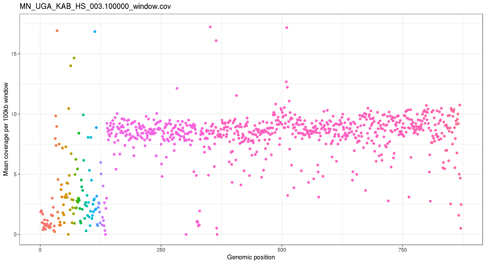

```bash

# nuclear to mitochondrial DNA coverage ratio
nucmito <- read.table("nuc_mtDNA_coverage.stats",header=F)

ggplot(nucmito,aes(V1,V4)) +
     geom_point() +
     theme(axis.text.x = element_text(angle = 90, vjust = 0.5, hjust=1)) +
     labs(title = "Nuclear to mitochondrial genome coverage ratio", y = "Coverage Ratio")

ggsave("nuc_mito_cov_ratio.png")

```

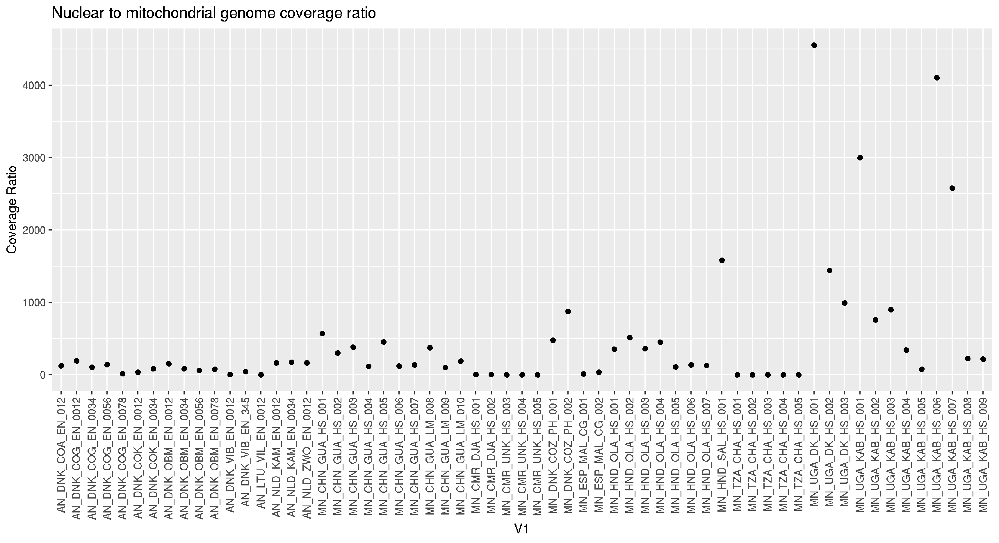


### Genome-wide coverage to determine worm sex
- using genome wide coverage data to iner the sex of the worms.
- we know that "Trichuris_trichiura_1" lingage group is the X chromosome based on synteny with Trichuris muris
- a ratio of this LG to other scaffolds should give the sex of the individual worms,
- the pooled worms will be mixed sex, so should have an intermediate profile to that of either male or female individual worms.

```R

### Make some genome wide coverage plots
# load libraries
library(tidyverse)
library(ggsci)
library(stringr)

# list file names
file_names <- list.files(path = "./",pattern = ".trimmed.100000_window.cov")

# load data using file names, and make a formatted data frame
data <- purrr::map_df(file_names, function(x) {
     	data <- read.delim(x, header = F, sep="\t")
          data <- tibble::rowid_to_column(data, "NUM")
     	cbind(sample_name = gsub(".trimmed.100000_window.cov","",x), data)
     	})
colnames(data) <- c("sample_name", "NUM", "CHROM", "START", "END", "RAW_COVERAGE", "PROPORTION_COVERAGE")

# remove mitochondrial genome and unplaced scaffolds
data <- data[data$CHROM != "Trichuris_trichiura_MITO",]
data <- data %>% filter(!str_detect(CHROM, "Trichuris_trichiura_00_"))

# annotate sex linked scaffolds
data$SEX <- str_detect(data$CHROM,"Trichuris_trichiura_1_")

# plot boxplots and distributions of pairwise Fst analyses
ggplot(data, aes(NUM, PROPORTION_COVERAGE/(median(PROPORTION_COVERAGE)), col=SEX, group = sample_name)) +
          geom_point(size=0.2) +
          labs( x = "Genome position" , y = "Relative coverage per 100kb window") +
          theme_bw() + theme(legend.position = "none", strip.text.x = element_text(size = 6)) +
          facet_wrap(~sample_name, scales = "free_y")+scale_color_manual(values=rep(c("orange","blue"),2))+ theme_classic()

ggsave("plot_relative_genomewide_coverage_allsamples.png")
ggsave("plot_relative_genomewide_coverage_allsamples.pdf",height=10, width=20, useDingbats=FALSE)

```

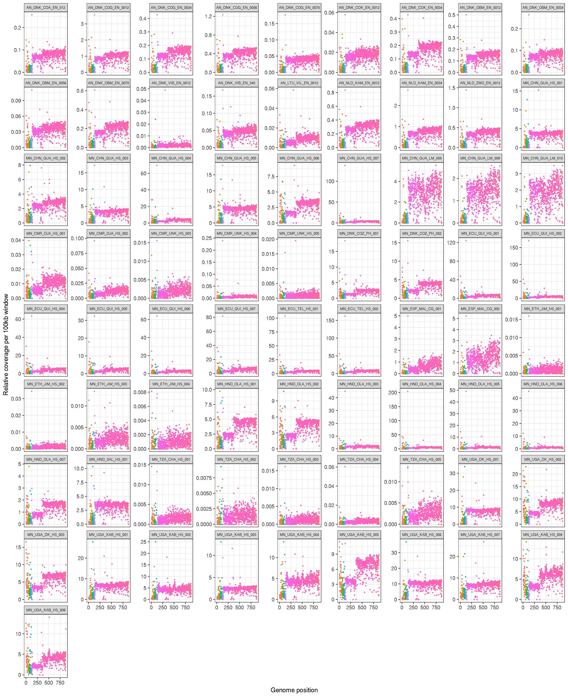          

- originally made these plots to determine relative coverage of X to autosomes, but figured it'd be better simply to calculate the ratio and plot it, so I have dont that in the next section.


```bash

# extract mtDNA and nuclear (mean & stddev) data
for i in *trimmed.chr.cov; do
     name=${i%.trimmed.chr.cov};
     autosome=$(grep "Trichuris_trichiura_2\|Trichuris_trichiura_3]" ${i%.trimmed.chr.cov}.100000_window.cov | datamash mean 5 sstdev 5 );
     xchromosome=$(grep "Trichuris_trichiura_1" ${i%.trimmed.chr.cov}.100000_window.cov | datamash mean 5 sstdev 5  );
     echo -e "${name}\t${autosome}\t${xchromosome}";
done > autosome_to_Xchromsome_cov.stat

```

- and to plot the data

```R
library(tidyverse)

cov_data <- read.table("autosome_to_Xchromsome_cov.stat")
sample_type <- read.table("single_v_pooled_sampletype.txt")

data <- left_join(cov_data,sample_type,by="V1")
colnames(data) <- c("sample_name", "autosome_cov_mean", "autosome_cov_sd", "x_cov_mean", "x_cov_sd", "sample_type" )

ggplot(data, aes(sample_name, x_cov_mean/autosome_cov_mean, col=sample_type)) +    
     geom_point() +
     labs(title="X-to-autosomal coverage ratio", x="Sample name", y="X-to-autosomal coverage ratio") +
     theme_bw() + theme(axis.text.x = element_text(angle = 90, vjust = 0.5, hjust=1)) +
     ylim(0.35,1.2) +
     coord_flip()

ggsave("plot_x-to-autosome_ratio_sexdet.png")
ggsave("plot_x-to-autosome_ratio_sexdet.pdf",height=10, width=7, useDingbats=FALSE)

```

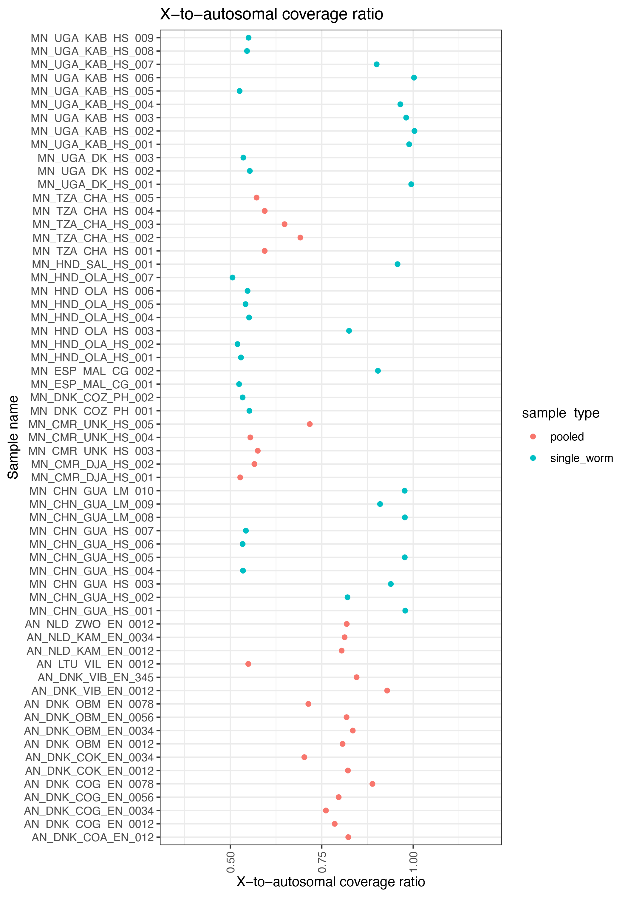

- count 17 males based on ~0.5x coverage (XY)
- count 17 females based on ~1X coverage
     - note 2 with intermediate coverage, likely female but not clear


## SNP calling
- Using GATK haplotypecaller to call SNPs
- First pass QC: --min-base-quality-score 20 --minimum-mapping-quality 30
- scripts below split jobs by sample and by sequence, generating GVCFs, and then once done, merging them back together again. It does this by generating small jobs submitted in arrays to perform tasks in parallel, greatly speeding up the overall job time.


### Genome scope
- Using genomescope to estimate heterozygosity from a couple of samples which can be used as an input to GATK genotyping

```bash

WORKING_DIR=/nfs/users/nfs_s/sd21/lustre118_link/trichuris_trichiura

mkdir ${WORKING_DIR}/02_RAW/GENOMESCOPE
cd ${WORKING_DIR}/02_RAW/GENOMESCOPE


jellyfish=/nfs/users/nfs_s/sd21/lustre118_link/software/COMPARATIVE_GENOMICS/jellyfish-2.2.6/bin/jellyfish
export LD_LIBRARY_PATH=${LD_LIBRARY_PATH}:/nfs/users/nfs_s/sd21/lustre118_link/software/COMPARATIVE_GENOMICS/jellyfish-2.2.6/lib
genomescope=/nfs/users/nfs_s/sd21/lustre118_link/software/COMPARATIVE_GENOMICS/genomescope/genomescope.R

echo -e "
export LD_LIBRARY_PATH=${LD_LIBRARY_PATH}:/nfs/users/nfs_s/sd21/lustre118_link/software/COMPARATIVE_GENOMICS/jellyfish-2.2.6/lib" > run_jellyfish2genomescope

while read OLD_NAME NEW_NAME; do
     echo -e "
     # run jellyfish to count kmers
     ${jellyfish} count -C -m 17 -s 1000000000 -t 10 ${WORKING_DIR}/02_RAW/${NEW_NAME}_PE.pair*.truncated -o ${NEW_NAME}.jellyfish.kmercount; \\
     # run jellyfish to make a histogram of kmers for input to genomescope
     ${jellyfish} histo -t 10 ${NEW_NAME}.jellyfish.kmercount > ${NEW_NAME}.jellyfish.histo;
     # run genomescope
     Rscript ${genomescope} ${NEW_NAME}.jellyfish.histo 17 100 ${NEW_NAME}.genomescope_out 1000" >> run_jellyfish2genomescope
done < ${WORKING_DIR}/modern.sample_list

chmod a+x run_jellyfish2genomescope

bsub.py --queue long --threads 10 20 jellyfish "./run_jellyfish2genomescope"

```

- once completed, opened histo files in genomescope (http://qb.cshl.edu/genomescope/)
- generally, the sequencing coverage was too low for this to work well. For most samples, the model failed to converge. However, some did work, shown below.
- heterozygosities:
     - MN_UGA_DK_HS_001: 0.0157
          - Model converged het:0.0157 kcov:6.82 err:0.00251 model fit:0.184 len:71832293
     - MN_UGA_KAB_HS_001:  0.0229
          - Model converged het:0.0229 kcov:7.33 err:0.00403 model fit:0.442 len:71863652
     - MN_UGA_KAB_HS_006: 0.0175
          - Model converged het:0.0175 kcov:8.87 err:0.0138 model fit:0.431 len:77034118
- GATK uses a heterozygosity default of 0.001, which is at least 10-fold lower than data here. Worth changing.

eg.


### GATK

```bash
# working dir
WORKING_DIR=/nfs/users/nfs_s/sd21/lustre118_link/trichuris_trichiura

# load gatk
module load gatk/4.1.4.1

# also need htslib for tabix
module load common-apps/htslib/1.9.229

```

### Step 1. make GVCFs per sample

```bash
mkdir ${WORKING_DIR}/04_VARIANTS/GVCFS
cd ${WORKING_DIR}/04_VARIANTS/GVCFS

# create bam list using full path to bams - this allows bams to be anywhere
ls ${WORKING_DIR}/03_MAPPING/*.trimmed.bam > ${WORKING_DIR}/04_VARIANTS/bam.list_new

#new bams
#   ls ${WORKING_DIR}/03_MAPPING/AN_DNK_VIB_EN_0012.trimmed.bam ${WORKING_DIR}/03_MAPPING/AN_DNK_VIB_EN_345.trimmed.bam > ${WORKING_DIR}/04_VARIANTS/bam.list_new
#  ls ${WORKING_DIR}/03_MAPPING/AN_DNK_COA_EN_012.trimmed.bam  > ${WORKING_DIR}/04_VARIANTS/bam.list_new

BAM_LIST=${WORKING_DIR}/04_VARIANTS/bam.list

# rerun with new bams
#BAM_LIST=${WORKING_DIR}/04_VARIANTS/bam.list_new

REFERENCE=${WORKING_DIR}/01_REF/trichuris_trichiura.fa

# make a sequences list to allow splitting jobs per scaffold/contig
grep ">" ${WORKING_DIR}/01_REF/trichuris_trichiura.fa | sed -e 's/>//g' > ${WORKING_DIR}/04_VARIANTS/sequences.list

ulimit -c unlimited

# make jobs
while read BAM; do \
	n=1
	SAMPLE=$( echo ${BAM} | awk -F '/' '{print $NF}' | sed -e 's/.trimmed.bam//g' )  
	mkdir ${SAMPLE}_GATK_HC_GVCF
	mkdir ${SAMPLE}_GATK_HC_GVCF/LOGFILES
	echo "gatk GatherVcfsCloud \\" > ${SAMPLE}_GATK_HC_GVCF/run_gather_${SAMPLE}_gvcf
	while read SEQUENCE; do
	echo -e "gatk HaplotypeCaller \\
          --input ${BAM} \\
          --output ${SAMPLE}_GATK_HC_GVCF/${n}.${SAMPLE}.${SEQUENCE}.tmp.gvcf.gz \\
          --reference ${REFERENCE} \\
          --intervals ${SEQUENCE} \\
          --heterozygosity 0.015 \\
          --indel-heterozygosity 0.01 \\
          --annotation DepthPerAlleleBySample --annotation Coverage --annotation ExcessHet --annotation FisherStrand --annotation MappingQualityRankSumTest --annotation StrandOddsRatio --annotation RMSMappingQuality --annotation ReadPosRankSumTest --annotation DepthPerSampleHC --annotation QualByDepth \\
          --min-base-quality-score 20 --minimum-mapping-quality 30 --standard-min-confidence-threshold-for-calling 30 \\
          --emit-ref-confidence GVCF " > ${SAMPLE}_GATK_HC_GVCF/run_hc_${SAMPLE}.${SEQUENCE}.tmp.job_${n};
	echo -e "--input ${PWD}/${SAMPLE}_GATK_HC_GVCF/${n}.${SAMPLE}.${SEQUENCE}.tmp.gvcf.gz \\" >> ${SAMPLE}_GATK_HC_GVCF/run_gather_${SAMPLE}_gvcf;
	let "n+=1"; done < ${WORKING_DIR}/04_VARIANTS/sequences.list;

	echo -e "--output ${PWD}/${SAMPLE}_GATK_HC_GVCF/${SAMPLE}.gvcf.gz; tabix -p vcf ${PWD}/${SAMPLE}_GATK_HC_GVCF/${SAMPLE}.gvcf.gz" >> ${SAMPLE}_GATK_HC_GVCF/run_gather_${SAMPLE}_gvcf;

	echo -e "rm ${PWD}/${SAMPLE}_GATK_HC_GVCF/*.tmp.* && \\
          mv ${PWD}/${SAMPLE}_GATK_HC_GVCF/*.[oe] ${PWD}/${SAMPLE}_GATK_HC_GVCF/LOGFILES && \\
          cd ${PWD} && \\
          mv ${PWD}/${SAMPLE}_GATK_HC_GVCF ${PWD}/${SAMPLE}_GATK_HC_GVCF_complete" > ${SAMPLE}_GATK_HC_GVCF/run_clean_${SAMPLE};

	chmod a+x ${SAMPLE}_GATK_HC_GVCF/run_*

	# setup job conditions
	JOBS=$( ls -1 ${SAMPLE}_GATK_HC_GVCF/run_hc_* | wc -l )
	ID="U$(date +%s)"

	#submit job array to call variants put scaffold / contig
	bsub -q long -R'span[hosts=1] select[mem>15000] rusage[mem=15000]' -n 6 -M15000 -J GATK_HC_${ID}_[1-${JOBS}]%100 -e ${SAMPLE}_GATK_HC_GVCF/GATK_HC_${ID}_[1-${JOBS}].e -o ${SAMPLE}_GATK_HC_GVCF/GATK_HC_${ID}_[1-${JOBS}].o "./${SAMPLE}_GATK_HC_GVCF/run_hc_${SAMPLE}.*job_\$LSB_JOBINDEX"

	#submit job to gather gvcfs into a single, per sample gvcf
	bsub -q normal -w "done(GATK_HC_${ID}_[1-$JOBS])" -R'span[hosts=1] select[mem>500] rusage[mem=500]' -n 1 -M500 -J GATK_HC_${ID}_gather_gvcfs -e ${SAMPLE}_GATK_HC_GVCF/GATK_HC_${ID}_gather_gvcfs.e -o ${SAMPLE}_GATK_HC_GVCF/GATK_HC_${ID}_gather_gvcfs.o "./${SAMPLE}_GATK_HC_GVCF/run_gather_${SAMPLE}_gvcf"

	# clean up
	bsub -q normal -w "done(GATK_HC_${ID}_gather_gvcfs)" -R'span[hosts=1] select[mem>500] rusage[mem=500]' -n 1 -M500 -J GATK_HC_${ID}_clean -e ${SAMPLE}_GATK_HC_GVCF/GATK_HC_${ID}_clean.e -o ${SAMPLE}_GATK_HC_GVCF/GATK_HC_${ID}_clean.o "./${SAMPLE}_GATK_HC_GVCF/run_clean_${SAMPLE}"

	sleep 1
done < ${BAM_LIST}

```


### Step 2. Gather the GVCFs to generate a merged GVCF

```bash

# make a new directory for the merged GVCFS
mkdir ${WORKING_DIR}/04_VARIANTS/GATK_HC_MERGED
cd ${WORKING_DIR}/04_VARIANTS/GATK_HC_MERGED

# make a list of GVCFs to be merged
ls -1 ${WORKING_DIR}/04_VARIANTS/GVCFS/*complete/*gz > ${WORKING_DIR}/04_VARIANTS/GATK_HC_MERGED/gvcf.list

GVCF_LIST=${WORKING_DIR}/04_VARIANTS/GATK_HC_MERGED/gvcf.list

REFERENCE=${WORKING_DIR}/01_REF/trichuris_trichiura.fa


# setup the run files
n=1
while read SEQUENCE; do
     echo -e "gatk CombineGVCFs -R ${REFERENCE} --intervals ${SEQUENCE} \\" > ${n}.run_merge_gvcfs.tmp.${SEQUENCE}
     while read SAMPLE; do
          echo -e "--variant ${SAMPLE} \\" >> ${n}.run_merge_gvcfs.tmp.${SEQUENCE};
     done < ${GVCF_LIST}
     echo -e "--output ${SEQUENCE}.cohort.g.vcf.gz" >> ${n}.run_merge_gvcfs.tmp.${SEQUENCE};
     let "n+=1";
done < ${WORKING_DIR}/04_VARIANTS/sequences.list

chmod a+x *.run_merge_gvcfs.tmp.*

# run
for i in *.run_merge_gvcfs.tmp.*; do
     bsub.py --queue long --threads 4 10 merge_vcfs "./${i}";
done

# threads seem to make a big difference in run time, even though they are not a parameter in the tool

```


### Step 3. Split merged GVCF into individual sequences, and then genotype to generate a VCF

```bash

# split each chromosome up into separate jobs, and run genotyping on each individually.   
n=1

while read SEQUENCE; do
     echo -e "gatk GenotypeGVCFs \
     -R ${REFERENCE} \
     -V ${SEQUENCE}.cohort.g.vcf.gz \
     --intervals ${SEQUENCE} \
     --heterozygosity 0.015 \
     --indel-heterozygosity 0.01 \
     --annotation DepthPerAlleleBySample --annotation Coverage --annotation ExcessHet --annotation FisherStrand --annotation MappingQualityRankSumTest --annotation StrandOddsRatio --annotation RMSMappingQuality --annotation ReadPosRankSumTest --annotation DepthPerSampleHC --annotation QualByDepth \
     -O ${n}.${SEQUENCE}.cohort.vcf.gz" > run_hc_genotype.${SEQUENCE}.tmp.job_${n};
     let "n+=1";
done < ${WORKING_DIR}/04_VARIANTS/sequences.list

chmod a+x run_hc_genotype*

mkdir LOGFILES

# setup job conditions
JOBS=$( ls -1 run_hc_* | wc -l )
ID="U$(date +%s)"

# run
bsub -q long -R'span[hosts=1] select[mem>10000] rusage[mem=10000]' -n 4 -M10000 -J GATK_HC_GENOTYPE_${ID}_[1-$JOBS] -e LOGFILES/GATK_HC_GENOTYPE_${ID}_[1-$JOBS].e -o LOGFILES/GATK_HC_GENOTYPE_${ID}_[1-$JOBS].o "./run_hc_*\$LSB_JOBINDEX"

```


### Step 4. Bring the files together

```bash

# make list of vcfs
ls -1 *.cohort.vcf.gz | sort -n > vcf_files.list

# merge them
vcf-concat --files vcf_files.list > Trichuris_trichiura.cohort.vcf;
     bgzip Trichuris_trichiura.cohort.vcf;
     tabix -p vcf Trichuris_trichiura.cohort.vcf.gz

# clean up
rm run*
rm ^[0-9]*
rm *.g.vcf.gz*

```


### Step 5. Filter the VCF
#### SNPable
Using Heng Li's "SNPable regions" to identify unique regions fo the genome in which mapping tends to be more reliable. Martin did this, so thought i'd give it a go to be consistent

http://lh3lh3.users.sourceforge.net/snpable.shtml

```bash

cd ~/lustre118_link/trichuris_trichiura/01_REF/SNPABLE

cp ../trichuris_trichiura.fa .

# make reads from the reference genome
~sd21/lustre118_link/software/SNP_CALLING/seqbility-20091110/splitfa trichuris_trichiura.fa 35 | split -l 20000000

# index the reference
bwa index trichuris_trichiura.fa

# map the reads generated from the reference back to the reference
echo -e 'for i in x*; do bwa aln -R 1000000 -O 3 -E 3 trichuris_trichiura.fa ${i} > ${i}.sai; done' > run_bwa

chmod a+x run_bwa

bsub.py 10 bwaaln ./run_bwa

# once mapping is completed, compress to save space
gzip *out.sam

# make the raw mask
gzip -dc x??.out.sam.gz | ~/lustre118_link/software/SNP_CALLING/seqbility-20091110/gen_raw_mask.pl > rawMask_35.fa

# make the final mask
~/lustre118_link/software/SNP_CALLING/seqbility-20091110/gen_mask -l 35 -r 0.5 rawMask_35.fa > mask_35_50.fa

# make bed files per chromosome of the category 3 positions,
python makeMappabilityMask.py

# position categories
# c=3: the majortiy of overlapping 35-mers are mapped uniquely and without 1-mismatch (or 1-difference, depending on the BWA command line) hits.
# c=2: the majority of overlapping 35-mers are unique and c!=3.
# c=1: the majority of overlapping 35-mers are non-unique.
# c=0: all the 35-mers overlapping x cannot be mapped due to excessive ambiguous bases.

# count how many positions for each position in the genome
for i in 0 1 2 3; do
     echo -e "SNPtype: ${i}";  
     cat mask_35_50.fa | grep -v ">" | grep -o "${i}" | wc -l;
done

#SNPtype: 0
#249900

#SNPtype: 1
#13754267

#SNPtype: 2
#6119809

#SNPtype: 3
#60449735

```

- given the genome is 80573711 bp, the proportion of type 3 postions (n = 60449735) is 75.02%
- this is an interesting strategy - perhaps worth exploring for other projects, esp when just popgen SNPs are being used (not every position for, eg, SNPeff).


#### Hard filters

```bash
mkdir ${WORKING_DIR}/04_VARIANTS/SNP_FILTER
cd ${WORKING_DIR}/04_VARIANTS/SNP_FILTER

# run hard filter
${WORKING_DIR}/00_SCRIPTS/run_variant-hardfilter.sh TT ${WORKING_DIR}/01_REF/trichuris_trichiura.fa ${WORKING_DIR}/04_VARIANTS/04_VARIANTS/Trichuris_trichiura.cohort.vcf.gz

vcftools --vcf TT.filtered-2.vcf.recode.vcf
#> After filtering, kept 61 out of 61 Individuals
#> After filtering, kept 9240001 out of a possible 9240001 Sites

# apply the SNPable mask
vcftools --vcf TT.filtered-2.vcf.recode.vcf --bed ${WORKING_DIR}/01_REF/SNPABLE/mask.bed

# After filtering, kept 8371588 out of a possible 9240001 Sites

```


## Sampling sites
### World map
Given it is a "global diversity" study, worth having a world map with sampling sites, distinction between ancient and modern samples, and the fact that some some from humans, animals, and the environment (ancient).

```R
setwd("/nfs/users/nfs_s/sd21/lustre118_link/trichuris_trichiura/05_ANALYSIS/MAP")

# load libraries
library(ggplot2)
library(dplyr)
require(maps)
library(ggrepel)
library(patchwork)
library(ggsci)

# load world data
world_map <- map_data("world")

# load metadata
data <- read.delim("map_metadata.txt", sep="\t", header=T)

# make a map
ggplot() +
     geom_polygon(data = world_map, aes(x = world_map$long, y = world_map$lat, group = world_map$group), fill="grey90") +
     geom_point(data = data, aes(x = LONGITUDE, y = LATITUDE, colour = REGION, shape = SAMPLE_AGE), size=3) +
     geom_text_repel(data = data, aes(x = LONGITUDE, y = LATITUDE, label = paste0(COUNTRY," (",POPULATION_ID,"); n = ", SAMPLE_N)), size=3, max.overlaps = Inf) +        
     theme_void() +
     ylim(-55,85) +
     labs(title="A", colour="", shape="") +
     scale_colour_npg()

# save it
ggsave("worldmap_samplingsites.png", height=5, width=12)
ggsave("worldmap_samplingsites.pdf", height=5, width=12, useDingbats=FALSE)

```

- will use this as Figure 1A


### Sampling timepoints

```R
library(ggplot2)

data <- read.delim("ancient_times.txt",header=F,sep="\t")

ggplot(data, aes(x=V11,xend=V12,y=reorder(paste0(V1," (",V4,")"),V11,FUN=mean),yend=paste0(V1," (",V4,")"), colour=V10)) +
     geom_segment(size=5) +
     xlim(1000,2020) +
     labs(x = "Estimated age of sampling site (AD)", y = "", colour = "Sample site") +
     scale_y_discrete(limits=rev) +
     theme_bw() + theme(legend.position="bottom")

ggsave("samplingsites_time.png", height=5, width=7)
ggsave("samplingsites_time.pdf", height=5, width=7, useDingbats=FALSE)

```

Figure: [map](../04_analysis/samplingsites_time.pdf)
- will use this in the supplementary data


### Querying SNP and INDEL QC profiles to determine thresholds for filters
Adapted from https://evodify.com/gatk-in-non-model-organism/

```bash

# load gatk
module load gatk/4.1.4.1

WORKING_DIR=/nfs/users/nfs_s/sd21/lustre118_link/trichuris_trichiura

cd ${WORKING_DIR}/04_VARIANTS/GATK_HC_MERGED/FILTER

# set reference, vcf, and mitochondrial contig
REFERENCE=${WORKING_DIR}/01_REF/trichuris_trichiura.fa
VCF=${WORKING_DIR}/04_VARIANTS/GATK_HC_MERGED/Trichuris_trichiura.cohort.vcf.gz
MITOCHONDRIAL_CONTIG=Trichuris_trichiura_MITO

# select nuclear SNPs
bsub.py 1 select_nuclearSNPs "gatk SelectVariants \
--reference ${REFERENCE} \
--variant ${VCF} \
--select-type-to-include SNP \
--exclude-intervals ${MITOCHONDRIAL_CONTIG} \
--output ${VCF%.vcf.gz}.nuclearSNPs.vcf"

# select nuclear INDELs
bsub.py 1 select_nuclearINDELs "gatk SelectVariants \
--reference ${REFERENCE} \
--variant ${VCF} \
--select-type-to-include INDEL \
--exclude-intervals ${MITOCHONDRIAL_CONTIG} \
--output ${VCF%.vcf.gz}.nuclearINDELs.vcf"

# select mitochondrial SNPs
bsub.py 1 select_mitoSNPs "gatk SelectVariants \
--reference ${REFERENCE} \
--variant ${VCF} \
--select-type-to-include SNP \
--intervals ${MITOCHONDRIAL_CONTIG} \
--output ${VCF%.vcf.gz}.mitoSNPs.vcf"

# select mitochondrial INDELs
bsub.py 1 select_mitoINDELs "gatk SelectVariants \
--reference ${REFERENCE} \
--variant ${VCF} \
--select-type-to-include INDEL \
--intervals ${MITOCHONDRIAL_CONTIG} \
--output ${VCF%.vcf.gz}.mitoINDELs.vcf"


# make a table of nuclear SNP data
bsub.py 1 select_nuclearSNPs_table "gatk VariantsToTable \
--reference ${REFERENCE} \
--variant ${VCF%.vcf.gz}.nuclearSNPs.vcf \
--fields CHROM --fields POS --fields QUAL --fields QD --fields DP --fields MQ --fields MQRankSum --fields FS --fields ReadPosRankSum --fields SOR \
--output GVCFall_nuclearSNPs.table"

# make a table of nuclear INDEL data data
bsub.py 1 select_nuclearINDELs_table "gatk VariantsToTable \
--reference ${REFERENCE} \
--variant ${VCF%.vcf.gz}.nuclearINDELs.vcf \
--fields CHROM --fields POS --fields QUAL --fields QD --fields DP --fields MQ --fields MQRankSum --fields FS --fields ReadPosRankSum --fields SOR \
--output GVCFall_nuclearINDELs.table"

# make a table of mito SNP data
bsub.py --done "select_mitoSNPs" 1 select_mitoSNPs_table "gatk VariantsToTable \
--reference ${REFERENCE} \
--variant ${VCF%.vcf.gz}.mitoSNPs.vcf \
--fields CHROM --fields POS --fields QUAL --fields QD --fields DP --fields MQ --fields MQRankSum --fields FS --fields ReadPosRankSum --fields SOR \
--output GVCFall_mitoSNPs.table"

# make a table of mito INDEL data data
bsub.py --done "select_mitoINDELs"  1 select_mitoINDELs_table "gatk VariantsToTable \
--reference ${REFERENCE} \
--variant ${VCF%.vcf.gz}.mitoINDELs.vcf \
--fields CHROM --fields POS --fields QUAL --fields QD --fields DP --fields MQ --fields MQRankSum --fields FS --fields ReadPosRankSum --fields SOR \
--output GVCFall_mitoINDELs.table"


# make some density plots of the data
bsub.py 1 variant_summaries "Rscript ${WORKING_DIR}/00_SCRIPTS/plot_variant_summaries.R"

```

where "plot_variant_summaries.R" is:

```R

# load libraries
library(patchwork)
require(data.table)
library(tidyverse)
library(gridExtra)

VCF_nuclear_snps <- fread('GVCFall_nuclearSNPs.table', header = TRUE, fill=TRUE, na.strings=c("","NA"), sep = "\t")
VCF_nuclear_snps <- sample_frac(VCF_nuclear_snps, 0.2)
VCF_nuclear_indels <- fread('GVCFall_nuclearINDELs.table', header = TRUE, fill=TRUE, na.strings=c("","NA"), sep = "\t")
VCF_nuclear_indels <- sample_frac(VCF_nuclear_indels, 0.2)
dim(VCF_nuclear_snps)
dim(VCF_nuclear_indels)
VCF_nuclear <- rbind(VCF_nuclear_snps, VCF_nuclear_indels)
VCF_nuclear$Variant <- factor(c(rep("SNPs", dim(VCF_nuclear_snps)[1]), rep("Indels", dim(VCF_nuclear_indels)[1])))

VCF_mito_snps <- fread('GVCFall_mitoSNPs.table', header = TRUE, fill=TRUE, na.strings=c("","NA"), sep = "\t")
VCF_mito_indels <- fread('GVCFall_mitoINDELs.table', header = TRUE, fill=TRUE, na.strings=c("","NA"), sep = "\t")
dim(VCF_mito_snps)
dim(VCF_mito_indels)
VCF_mito <- rbind(VCF_mito_snps, VCF_mito_indels)
VCF_mito$Variant <- factor(c(rep("SNPs", dim(VCF_mito_snps)[1]), rep("Indels", dim(VCF_mito_indels)[1])))


snps <- '#A9E2E4'
indels <- '#F4CCCA'

fun_variant_summaries <- function(data, title){
# gatk hardfilter: SNP & INDEL QUAL < 0
QUAL_quant <- quantile(data$QUAL, c(.01,.99), na.rm=T)

QUAL <-
     ggplot(data, aes(x=log10(QUAL), fill=Variant)) +
     geom_density(alpha=.3) +
     geom_vline(xintercept=0, size=0.7, col="red") +
     geom_vline(xintercept=c(log10(QUAL_quant[2]), log10(QUAL_quant[3])), size=0.7, col="blue") +
     #xlim(0,10000) +
     theme_bw() +
     labs(title=paste0(title,": QUAL"))


# DP doesnt have a hardfilter
DP_quant <- quantile(data$DP, c(.01,.99), na.rm=T)

DP <-
     ggplot(data, aes(x=log10(DP), fill=Variant)) +
     geom_density(alpha=0.3) +
     geom_vline(xintercept=log10(DP_quant), col="blue") +
     theme_bw() +
     labs(title=paste0(title,": DP"))

# gatk hardfilter: SNP & INDEL QD < 2
QD_quant <- quantile(data$QD, c(.01,.99), na.rm=T)

QD <-
     ggplot(data, aes(x=QD, fill=Variant)) +
     geom_density(alpha=.3) +
     geom_vline(xintercept=2, size=0.7, col="red") +
     geom_vline(xintercept=QD_quant, size=0.7, col="blue") +
     theme_bw() +
     labs(title=paste0(title,": QD"))

# gatk hardfilter: SNP FS > 60, INDEL FS > 200
FS_quant <- quantile(data$FS, c(.01,.99), na.rm=T)

FS <-
     ggplot(data, aes(x=log10(FS), fill=Variant)) +
     geom_density(alpha=.3) +
     geom_vline(xintercept=c(log10(60), log10(200)), size=0.7, col="red") +
     geom_vline(xintercept=log10(FS_quant), size=0.7, col="blue") +
     #xlim(0,250) +
     theme_bw() +
     labs(title=paste0(title,": FS"))

# gatk hardfilter: SNP & INDEL MQ < 30
MQ_quant <- quantile(data$MQ, c(.01,.99), na.rm=T)

MQ <-
     ggplot(data, aes(x=MQ, fill=Variant)) + geom_density(alpha=.3) +
     geom_vline(xintercept=40, size=0.7, col="red") +
     geom_vline(xintercept=MQ_quant, size=0.7, col="blue") +
     theme_bw() +
     labs(title=paste0(title,": MQ"))

# gatk hardfilter: SNP MQRankSum < -20
MQRankSum_quant <- quantile(data$MQRankSum, c(.01,.99), na.rm=T)

MQRankSum <-
     ggplot(data, aes(x=log10(MQRankSum), fill=Variant)) + geom_density(alpha=.3) +
     geom_vline(xintercept=log10(-20), size=0.7, col="red") +
     geom_vline(xintercept=log10(MQRankSum_quant), size=0.7, col="blue") +
     theme_bw() +
     labs(title=paste0(title,": MQRankSum"))


# gatk hardfilter: SNP SOR < 4 , INDEL SOR > 10
SOR_quant <- quantile(data$SOR, c(.01, .99), na.rm=T)

SOR <-
     ggplot(data, aes(x=SOR, fill=Variant)) +
     geom_density(alpha=.3) +
     geom_vline(xintercept=c(4, 10), size=1, colour = c(snps,indels)) +
     geom_vline(xintercept=SOR_quant, size=0.7, col="blue") +
     theme_bw() +
     labs(title=paste0(title,": SOR"))

# gatk hardfilter: SNP ReadPosRankSum <-10 , INDEL ReadPosRankSum < -20
ReadPosRankSum_quant <- quantile(data$ReadPosRankSum, c(.01,.99), na.rm=T)

ReadPosRankSum <-
     ggplot(data, aes(x=ReadPosRankSum, fill=Variant)) +
     geom_density(alpha=.3) +
     geom_vline(xintercept=c(-10,10,-20,20), size=1, colour = c(snps,snps,indels,indels)) +
     xlim(-10, 10) +
     geom_vline(xintercept=ReadPosRankSum_quant, size=0.7, col="blue") +
     theme_bw() +
     labs(title=paste0(title,": ReadPosRankSum"))


plot <- QUAL + DP + QD + FS + MQ + MQRankSum + SOR + ReadPosRankSum + plot_layout(ncol=2)

print(plot)

ggsave(paste0("plot_",title,"_variant_summaries.png"), height=20, width=15, type="cairo")


# generate a table of quantiles for each variant feature
QUAL_quant <- data %>% group_by(Variant) %>% summarise(quants = list(quantile(QUAL, probs = c(0.01,0.05,0.95,0.99),na.rm=T))) %>% unnest_wider(quants)
QUAL_quant$name <- "QUAL"
DP_quant <- data %>% group_by(Variant) %>% summarise(quants = list(quantile(DP, probs = c(0.01,0.05,0.95,0.99),na.rm=T))) %>% unnest_wider(quants)
DP_quant$name <- "DP"
QD_quant <- data %>% group_by(Variant) %>% summarise(quants = list(quantile(QD, probs = c(0.01,0.05,0.95,0.99),na.rm=T))) %>% unnest_wider(quants)
QD_quant$name <- "QD"
FS_quant <- data %>% group_by(Variant) %>% summarise(quants = list(quantile(FS, probs = c(0.01,0.05,0.95,0.99),na.rm=T))) %>% unnest_wider(quants)
FS_quant$name <- "FS"
MQ_quant <- data %>% group_by(Variant) %>% summarise(quants = list(quantile(MQ, probs = c(0.01,0.05,0.95,0.99),na.rm=T))) %>% unnest_wider(quants)
MQ_quant$name <- "MQ"
MQRankSum_quant <- data %>% group_by(Variant) %>% summarise(quants = list(quantile(MQRankSum, probs = c(0.01,0.05,0.95,0.99),na.rm=T))) %>% unnest_wider(quants)
MQRankSum_quant$name <- "MQRankSum"
SOR_quant <- data %>% group_by(Variant) %>% summarise(quants = list(quantile(SOR, probs = c(0.01,0.05,0.95,0.99),na.rm=T))) %>% unnest_wider(quants)
SOR_quant$name <- "SOR"
ReadPosRankSum_quant <- data %>% group_by(Variant) %>% summarise(quants = list(quantile(ReadPosRankSum, probs = c(0.01,0.05,0.95,0.99),na.rm=T))) %>% unnest_wider(quants)
ReadPosRankSum_quant$name <- "ReadPosRankSum"

quantiles <- bind_rows(QUAL_quant,DP_quant, QD_quant, FS_quant, MQ_quant, MQRankSum_quant, SOR_quant, ReadPosRankSum_quant)
quantiles$name <- c("QUAL_Indels","QUAL_SNPs","DP_indels","DP_SNPs", "QD_indels","QD_SNPs", "FS_indels","FS_SNPs", "MQ_indels","MQ_SNPs", "MQRankSum_indels","MQRankSum_SNPs", "SOR_indels","SOR_SNPs","ReadPosRankSum_indels","ReadPosRankSum_SNPs")

png(paste0("table_",title,"_variant_quantiles.png"), width=1000,height=500,bg = "white")
print(quantiles)
grid.table(quantiles)
dev.off()

}

# run mitochondrial variants
fun_variant_summaries(VCF_mito,"mitochondrial")

# run nuclear variants
fun_variant_summaries(VCF_nuclear,"nuclear")

```

- mitochondrial_variant_summaries

- nuclear_variant_summaries


- Table: mitochondrial_variant_quantiles

- Table: nuclear_variant_quantiles


- GATK hard filters are as follows
     - (https://gatk.broadinstitute.org/hc/en-us/articles/360035890471-Hard-filtering-germline-short-variants):
     - SNPs
          -filter "QD < 2.0" --filter-name "QD2" \
          -filter "QUAL < 30.0" --filter-name "QUAL30" \
          -filter "SOR > 3.0" --filter-name "SOR3" \
          -filter "FS > 60.0" --filter-name "FS60" \
          -filter "MQ < 40.0" --filter-name "MQ40" \
          -filter "MQRankSum < -12.5" --filter-name "MQRankSum-12.5" \
          -filter "ReadPosRankSum < -8.0" --filter-name "ReadPosRankSum-8" \
     - INDELs
          -filter "QD < 2.0" --filter-name "QD2" \
         -filter "QUAL < 30.0" --filter-name "QUAL30" \
         -filter "FS > 200.0" --filter-name "FS200" \
         -filter "ReadPosRankSum < -20.0" --filter-name "ReadPosRankSum-20" \
- based on the plots / quantiles data, using the distributions seems to be even more stringent that the GATK hardfiltering
- I think using the quantiles are the correct way to proceed.


```bash
# apply filtering to SNPs
WORKING_DIR=/nfs/users/nfs_s/sd21/lustre118_link/trichuris_trichiura
REFERENCE=${WORKING_DIR}/01_REF/trichuris_trichiura.fa
VCF=${WORKING_DIR}/04_VARIANTS/GATK_HC_MERGED/Trichuris_trichiura.cohort.vcf.gz


bsub.py 1 filter_nuclearSNPs "gatk VariantFiltration \
--reference ${REFERENCE} \
--variant ${VCF%.vcf.gz}.nuclearSNPs.vcf \
--filter-expression 'QUAL < 46 || DP < 50 || DP > 793 || MQ < 38.00 || SOR > 3.600 || QD < 3.00 || FS > 9.400 || MQRankSum < -2.800 || ReadPosRankSum < -1.800 || ReadPosRankSum > 2.200' \
--filter-name "SNP_filtered" \
--output ${VCF%.vcf.gz}.nuclearSNPs.filtered.vcf"

bsub.py 1 filter_nuclearINDELs "gatk VariantFiltration \
--reference ${REFERENCE} \
--variant ${VCF%.vcf.gz}.nuclearINDELs.vcf \
--filter-expression 'QUAL < 30 || DP < 208 || DP > 897 || MQ < 38.00 || SOR > 3.900 || QD < 3.00 || FS > 7.800 || MQRankSum < -3.000 || ReadPosRankSum < -2.200 || ReadPosRankSum > 2.2000' \
--filter-name "INDEL_filtered" \
--output ${VCF%.vcf.gz}.nuclearINDELs.filtered.vcf"


bsub.py 1 filter_mitoSNPs "gatk VariantFiltration \
--reference ${REFERENCE} \
--variant ${VCF%.vcf.gz}.mitoSNPs.vcf \
--filter-expression ' QUAL < 66 || DP < 5057 || DP > 30456 || MQ < 41.00 || SOR > 10.000 || QD < 1.4 || FS > 33.8 || MQRankSum < -6.3 || ReadPosRankSum < -3.9 || ReadPosRankSum > 4.1 ' \
--filter-name "SNP_filtered" \
--output ${VCF%.vcf.gz}.mitoSNPs.filtered.vcf"

bsub.py 1 filter_mitoINDELs "gatk VariantFiltration \
--reference ${REFERENCE} \
--variant ${VCF%.vcf.gz}.mitoINDELs.vcf \
--filter-expression 'QUAL < 107 || DP < 6357 || DP > 33076 || MQ < 40.00 || SOR > 10.000 || QD < 3.1 || FS > 21.2 || ReadPosRankSum < -4.5 || ReadPosRankSum > 3.7' \
--filter-name "INDEL_filtered" \
--output ${VCF%.vcf.gz}.mitoINDELs.filtered.vcf"


# once done, count the filtered sites - funny use of "|" allows direct markdown table format
echo -e "| Filtered_VCF | Variants_PASS | Variants_FILTERED |\n| -- | -- | -- | " > filter.stats

for i in *filtered.vcf; do
     name=${i}; pass=$( grep -E 'PASS' ${i} | wc -l ); filter=$( grep -E 'filter' ${i} | wc -l );
     echo -e "| ${name} | ${pass} | ${filter} |" >> filter.stats
done

```

- Table: "filter.stats"

| Filtered_VCF | Variants_PASS | Variants_FILTERED |
| -- | -- | -- |
| Trichuris_trichiura.cohort.mitoINDELs.filtered.vcf | 339 | 53 |
| Trichuris_trichiura.cohort.mitoSNPs.filtered.vcf | 2141 | 284 |
| Trichuris_trichiura.cohort.nuclearINDELs.filtered.vcf | 847369 | 132345 |
| Trichuris_trichiura.cohort.nuclearSNPs.filtered.vcf | 9052538 | 1097368 |


### Merge VCFs

```bash

bsub.py 1 merge_mito_variants "gatk MergeVcfs \
--INPUT ${VCF%.vcf.gz}.mitoSNPs.filtered.vcf \
--INPUT ${VCF%.vcf.gz}.mitoINDELs.filtered.vcf \
--OUTPUT ${VCF%.vcf.gz}.mitoALL.filtered.vcf"

bsub.py 1 merge_nuclear_variants "gatk MergeVcfs \
--INPUT ${VCF%.vcf.gz}.nuclearSNPs.filtered.vcf \
--INPUT ${VCF%.vcf.gz}.nuclearINDELs.filtered.vcf \
--OUTPUT ${VCF%.vcf.gz}.nuclearALL.filtered.vcf"

```


### Filter genotypes based on depth per genotype
- depth is so variable, so not going to think to hard about this. Want to try capture as many sites in the ancient samples
- found some papers that used min 3X with at least 80% coverage
     - eg. https://science.sciencemag.org/content/sci/suppl/2018/07/03/361.6397.81.DC1/aao4776-Leathlobhair-SM.pdf

```bash

bsub.py 1 filter_mito_GT \
"gatk VariantFiltration \
--reference ${REFERENCE} \
--variant ${VCF%.vcf.gz}.mitoALL.filtered.vcf \
--genotype-filter-expression ' DP < 3 '  \
--genotype-filter-name "DP_lt3" \
--output ${VCF%.vcf.gz}.mitoALL.DPfiltered.vcf"

bsub.py --done "filter_mito_GT" 1 filter_mito_GT2 \
"gatk SelectVariants \
--reference ${REFERENCE} \
--variant ${VCF%.vcf.gz}.mitoALL.DPfiltered.vcf \
--set-filtered-gt-to-nocall \
--output ${VCF%.vcf.gz}.mitoALL.DPfilterNoCall.vcf"

bsub.py 1 filter_nuclear_GT \
"gatk VariantFiltration \
--reference ${REFERENCE} \
--variant ${VCF%.vcf.gz}.nuclearALL.filtered.vcf \
--genotype-filter-expression ' DP < 3 '  \
--genotype-filter-name "DP_lt3" \
--output ${VCF%.vcf.gz}.nuclearALL.DPfiltered.vcf"

bsub.py --done "filter_nuclear_GT" 1 filter_nuclear_GT2 \
"gatk SelectVariants \
--reference ${REFERENCE} \
--variant ${VCF%.vcf.gz}.nuclearALL.DPfiltered.vcf \
--set-filtered-gt-to-nocall \
--output ${VCF%.vcf.gz}.nuclearALL.DPfilterNoCall.vcf"

```

### final filters

```bash
# filter nuclear variants

vcftools \
--vcf ${VCF%.vcf.gz}.nuclearALL.DPfilterNoCall.vcf \
--remove-filtered-geno-all \
--remove-filtered-all \
--bed ${WORKING_DIR}/01_REF/SNPABLE/mask.bed \
--min-alleles 2 \
--max-alleles 2 \
--hwe 1e-06 \
--maf 0.02 \
--recode \
--recode-INFO-all \
--out ${VCF%.vcf.gz}.nuclear_variants.final

#> After filtering, kept 61 out of 61 Individuals
#> After filtering, kept 6933531 out of a possible 11129608 Sites

#--- nuclear SNPs
vcftools --vcf Trichuris_trichiura.cohort.nuclear_variants.final.recode.vcf --remove-indels
#> After filtering, kept 61 out of 61 Individuals
#> After filtering, kept 6341683 out of a possible 6933531 Sites

#--- nuclear  INDELs
vcftools --vcf Trichuris_trichiura.cohort.nuclear_variants.final.recode.vcf --keep-only-indels
#> After filtering, kept 61 out of 61 Individuals
#> After filtering, kept 591848 out of a possible 6933531 Sites


# filter mitochondrial variants
vcftools \
--vcf ${VCF%.vcf.gz}.mitoALL.DPfilterNoCall.vcf \
--remove-filtered-geno-all \
--remove-filtered-all \
--min-alleles 2 \
--max-alleles 2 \
--maf 0.02 \
--recode \
--recode-INFO-all \
--out ${VCF%.vcf.gz}.mito_variants.final

gzip -f ${VCF%.vcf.gz}.mito_variants.final.recode.vcf
#> After filtering, kept 61 out of 61 Individuals
#> After filtering, kept 1888 out of a possible 2805 Sites

#--- mito SNPs
vcftools --vcf Trichuris_trichiura.cohort.mito_variants.final.recode.vcf --remove-indels
#> After filtering, kept 61 out of 61 Individuals
#> After filtering, kept 1691 out of a possible 1888 Sites

#--- mito INDELs
vcftools --vcf Trichuris_trichiura.cohort.mito_variants.final.recode.vcf --keep-only-indels
#> After filtering, kept 61 out of 61 Individuals
#> After filtering, kept 197 out of a possible 1888 Sites

```

- final SNP numbers

| dataset | total | SNPs | Indels |
| ---     | --- | --- | --- |
| Trichuris_trichiura.cohort.nuclear_variants.final.recode.vcf | 6933531 | 6341683 | 591848 |
| Trichuris_trichiura.cohort.mito_variants.final.recode.vcf | 1888 | 1691 | 197 |


## missingness
- need to determine the degree of missingness for both mtDNA and nuclear datasets,
     - per site
     - per sample
- will use this to define some thresholds to exclude additonal variants and potentially some samples.
     - given the variation in mapping depth, it is clear that some samples are going to have to be removed.
     - need to find the balance between maximising samples/variants and removing junk that might influnce true signal

### Per sample missingness


```bash

# determine missingness per individual
vcftools --vcf Trichuris_trichiura.cohort.mito_variants.final.recode.vcf --out mito --missing-indv
vcftools --vcf Trichuris_trichiura.cohort.nuclear_variants.final.recode.vcf --out nuclear --missing-indv

```

```R

# load libraries
library(tidyverse)

data_mito <- read.delim("mito.imiss", header=T)
data_nuclear <- read.delim("nuclear.imiss", header=T)

# mito
fun_plot_missingness <- function(data,title) {

data <- data %>% separate(INDV, c("time", "country","population","host","sampleID"))
count <- data[1,6]

plot <-
     ggplot(data,aes(country,1-F_MISS,col=time)) +
     geom_boxplot() +
     geom_point() +
     theme_bw() +
     labs(x="Country", y="Proportion of total variants present (1-missingness)", title=paste0("Variants per sample: ",title, " (n = ", count,")"))

print(plot)

ggsave(paste0("plot_missingness_",title,".png"))

}


fun_plot_missingness(data_mito,"mitochondrial_variants")
fun_plot_missingness(data_nuclear, "nuclear_variants")

```
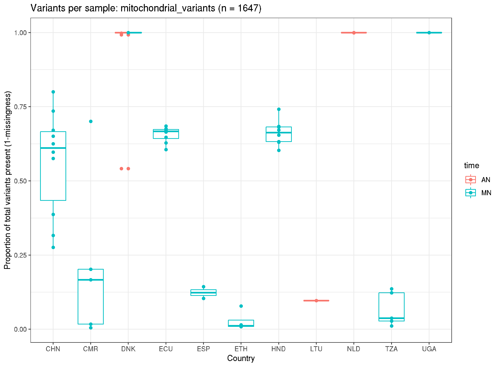
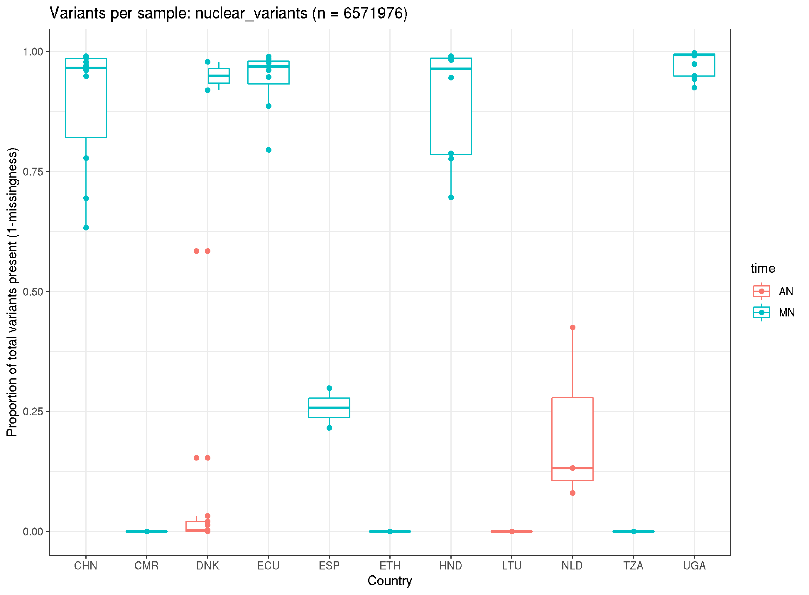


### Per site missingness

```bash
vcftools --vcf Trichuris_trichiura.cohort.mito_variants.final.recode.vcf --missing-site --out mito

```


### TsTv ratio
- deanimation is going to affect this ratio, so would expect it to be more skewed in the ancient samples relative to the modern samples. Best check

```bash
# mtDNA
vcftools --vcf Trichuris_trichiura.cohort.mito_variants.final.recode.vcf --TsTv-summary
#> Ts/Tv ratio: 6.417

# nuclear
vcftools --vcf Trichuris_trichiura.cohort.nuclear_variants.final.recode.vcf --TsTv-summary
#> Ts/Tv ratio: 2.281

```

- higher in the mtDNA but seems pretty "normal" in the nuclear datasets.


```bash
### human + animals + 2 good ancients

vcftools --vcf Trichuris_trichiura.cohort.nuclear_variants.final.recode.vcf --max-missing 0.8 --keep hq_modern.list
#> After filtering, kept 36 out of 61 Individuals
#> After filtering, kept 5801129 out of a possible 6933531 Sites

vcftools --vcf Trichuris_trichiura.cohort.nuclear_variants.final.recode.vcf --max-missing 0.9 --keep hq_modern.list
#> After filtering, kept 36 out of 61 Individuals
#> After filtering, kept 2746370 out of a possible 6933531 Sites

vcftools --vcf Trichuris_trichiura.cohort.nuclear_variants.final.recode.vcf --max-missing 1 --keep hq_modern.list
#> After filtering, kept 36 out of 61 Individuals
#> After filtering, kept 356541 out of a possible 6933531 Sites


### human + 2 good ancients (no animals)

vcftools --vcf Trichuris_trichiura.cohort.nuclear_variants.final.recode.vcf --max-missing 1 --keep hq_modern_humanonly.list
#> After filtering, kept 29 out of 61 Individuals
#> After filtering, kept 1023779 out of a possible 6933531 Sites


vcftools --vcf Trichuris_trichiura.cohort.nuclear_variants.final.recode.vcf --max-missing 0.8 --keep hq_modern_humanonly.list
#> After filtering, kept 29 out of 61 Individuals
#> After filtering, kept 6419884 out of a possible 6933531 Sites

```


### Max-missing

```bash

for i in 0.7 0.8 0.9 1; do
     vcftools --vcf Trichuris_trichiura.cohort.mito_variants.final.recode.vcf --keep mtDNA_3x.list --max-missing ${i} ;
done

# max-missing = 0.7
#> After filtering, kept 51 out of 61 Individuals
#> After filtering, kept 1541 out of a possible 1888 Sites

# max-missing = 0.8
#> After filtering, kept 51 out of 61 Individuals
#> After filtering, kept 1159 out of a possible 1888 Sites

# max-missing = 0.9
#> After filtering, kept 51 out of 61 Individuals
#> After filtering, kept 567 out of a possible 1888 Sites

# max-missing = 1
#> After filtering, kept 51 out of 61 Individuals
#> After filtering, kept 17 out of a possible 1888 Sites


vcftools --gzvcf Trichuris_trichiura.cohort.mito_variants.final.recode.vcf.gz \
     --keep mtDNA_3x.list \
     --max-missing 0.8 \
     --recode --recode-INFO-all \
     --out mito_samples3x_missing0.8

gzip -f mito_samples3x_missing0.8.recode.vcf
#> After filtering, kept 1159 out of a possible 1888 Sites

```

```R
# load libraries
library(tidyverse)
library(gdsfmt)
library(SNPRelate)
library(ggsci)

snpgdsClose(genofile)

vcf.in <- "mito_samples3x_missing0.8.recode.vcf.gz"

gds <- snpgdsVCF2GDS(vcf.in, "mtDNA_1.gds", method="biallelic.only")

genofile <- snpgdsOpen(gds)

pca <- snpgdsPCA(genofile, num.thread=2, autosome.only = F)

samples <- as.data.frame(pca$sample.id)

colnames(samples) <- "name"

metadata <- samples %>% separate(name,c("time", "country","population","host","sampleID"))

data <-
     data.frame(sample.id = pca$sample.id,
          EV1 = pca$eigenvect[,1],  
          EV2 = pca$eigenvect[,2],
          EV3 = pca$eigenvect[,3],
          EV4 = pca$eigenvect[,4],
          EV5 = pca$eigenvect[,5],
          EV6 = pca$eigenvect[,6],    
          TIME = metadata$time,
          COUNTRY = metadata$country,
          POPULATION = metadata$population,
          HOST = metadata$host,
          stringsAsFactors = FALSE)

plot_pca <-
     ggplot(data, aes(EV1, EV2, col = COUNTRY, shape = TIME, label = COUNTRY)) +
     geom_text(size=4) +
     theme_bw() +
     labs(title="mito_samples3x_missing0.8",
          x = paste0("PC1 variance: ",round(pca$varprop[1]*100,digits=2),"%"),
          y = paste0("PC2 variance: ",round(pca$varprop[2]*100,digits=2),"%"))

plot_pca

ggsave("plot_PCA_mito_samples3x_missing0.8.png")

# use this to label with sample names
#ggplot(tab,aes(EV1,EV2, col = COUNTRY, shape = TIME, label = COUNTRY)) + geom_point(size=4)

```


- the CHN LF samples are the outliers in the above plot, so rerunning to remove these

```bash
vcftools \
--gzvcf Trichuris_trichiura.cohort.mito_variants.final.recode.vcf.gz \
--keep mtDNA_3x_noLF.list \
--max-missing 0.8 \
--recode --recode-INFO-all \
--out mito_samples3x_missing0.8_noLF

gzip -f mito_samples3x_missing0.8_noLF*

#> After filtering, kept 48 out of 61 Individuals
#> After filtering, kept 1291 out of a possible 1888 Sites

```

```R
# load libraries
library(tidyverse)
library(gdsfmt)
library(SNPRelate)
library(ggsci)
library(patchwork)

snpgdsClose(genofile)
vcf.in <- "mito_samples3x_missing0.8_noLF.recode.vcf.gz"
gds <- snpgdsVCF2GDS(vcf.in, "mtDNA.gds", method="biallelic.only")

genofile <- snpgdsOpen(gds)

pca <- snpgdsPCA(genofile, num.thread=2, autosome.only = F)
# Working space: 56 samples, 802 SNPs

samples <- as.data.frame(pca$sample.id)
colnames(samples) <- "name"
metadata <- samples %>% separate(name,c("time", "country","population","host","sampleID"))


data <-
     data.frame(sample.id = pca$sample.id,
          EV1 = pca$eigenvect[,1],  
          EV2 = pca$eigenvect[,2],
          EV3 = pca$eigenvect[,3],
          EV4 = pca$eigenvect[,4],
          EV5 = pca$eigenvect[,5],
          EV6 = pca$eigenvect[,6],    
          TIME = metadata$time,
          COUNTRY = metadata$country,
          POPULATION = metadata$population,
          HOST = metadata$host,
          stringsAsFactors = FALSE)

country_colours <-
     c("CHN" = "#E64B35B2", "CMR" = "#4DBBD5B2", "DNK" = "#00A087B2", "ESP" = "#F39B7FB2", "HND" = "#8491B4B2", "NLD" = "#91D1C2B2", "UGA" = "#DC0000B2")

plot_pca_mito <-
     ggplot(data, aes(EV1, EV2, col = COUNTRY, shape = TIME, label = COUNTRY),alpha=1) +
     geom_rect(aes(xmin=-0.125, ymin=-0.01, xmax=-0.05, ymax=0.023), fill=NA, col="black", linetype="dotted", size=0.3) +
     geom_point(size=4, alpha=1) +
     theme_bw() +
     labs(x = paste0("PC1 variance: ",round(pca$varprop[1]*100,digits=2),"%"),
          y = paste0("PC2 variance: ",round(pca$varprop[2]*100,digits=2),"%")) +
     scale_colour_manual(values = country_colours)

plot_pca_mito_zoom <-
     ggplot(data, aes(EV1,EV2, col = COUNTRY, shape = TIME, label = paste0(TIME,"_",COUNTRY,"_",POPULATION,"_",HOST))) +
     geom_point(size=4, alpha=1) +
     theme_bw() +
     labs(x = "PC1",
          y = "PC2") +
     xlim(-0.125,-0.05) + ylim(-0.01, 0.023) +
     scale_colour_manual(values = country_colours)

# note: geom_rect in first plot and zoom coordinates were adjusted manually to show the cluster clearly.


plot_pca_mito + plot_pca_mito_zoom + plot_layout(ncol=2, guides = "collect")

ggsave("plot_PCA_mito_samples3x_missing0.8_noLF.png")
ggsave("plot_PCA_mito_samples3x_missing0.8_noLF.pdf", height = 5, width = 11, useDingbats=FALSE)

```

Figure: [plot_PCA_mito_samples3x_missing0.8_noLF](plot_PCA_mito_samples3x_missing0.8_noLF.pdf)

- will uses this in Figure 1 panels A and B

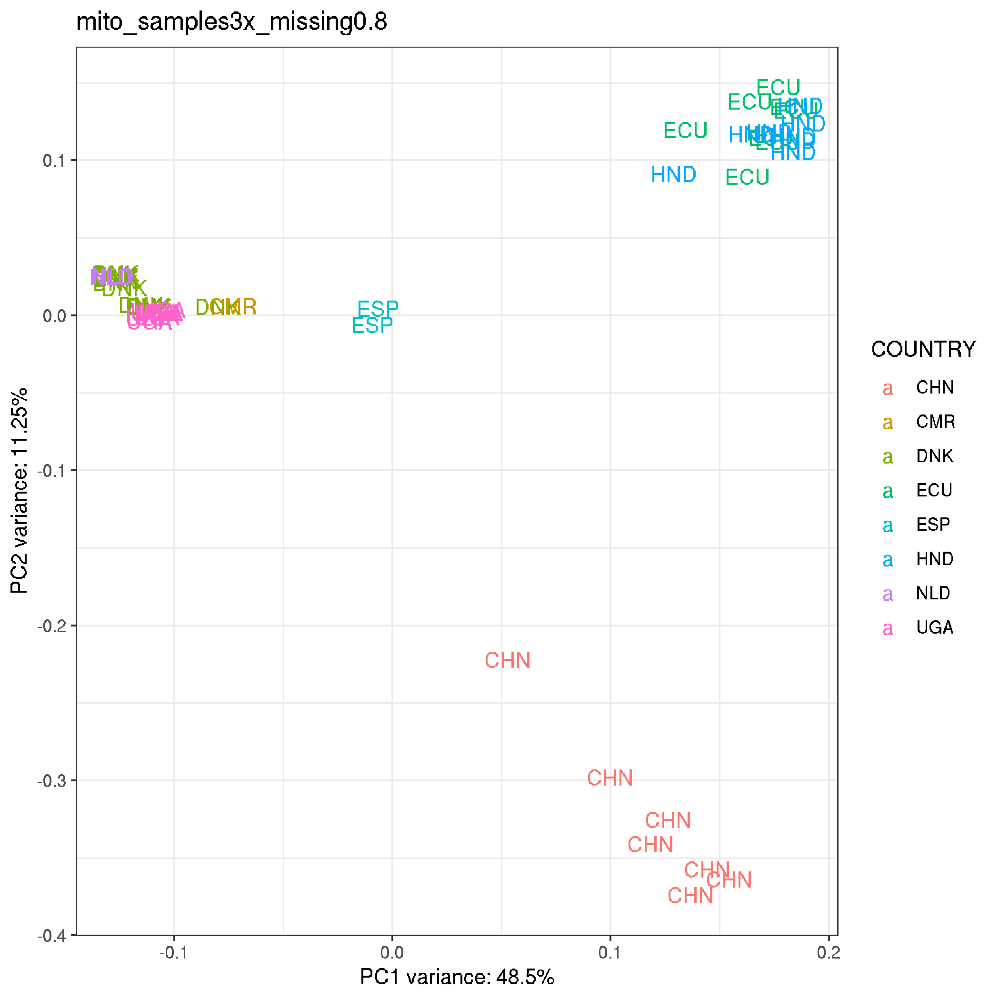


### Nuclear variants
- human + animal + 2 ancients
- "nuclear_3x_animal.list"

```bash
# extract nuclear variants

vcftools \
--gzvcf Trichuris_trichiura.cohort.nuclear_variants.final.recode.vcf.gz \
--keep nuclear_3x_animal.list \
--max-missing 0.8 \
--recode --recode-INFO-all \
--out nuclear_samples3x_missing0.8

gzip -f nuclear_samples3x_missing0.8.recode.vcf

#> After filtering, kept 36 out of 61 Individuals
#> After filtering, kept 5801129 out of a possible 6933531 Sites

```

```R
# load libraries
library(tidyverse)
library(gdsfmt)
library(SNPRelate)
library(patchwork)

snpgdsClose(genofile)

vcf.in <- "nuclear_samples3x_missing0.8.recode.vcf.gz"

gds<-snpgdsVCF2GDS(vcf.in, "nuclear_1.gds", method="biallelic.only")

genofile <- snpgdsOpen(gds)

pca <- snpgdsPCA(genofile, num.thread=2, autosome.only = F)
# Working space: 44 samples, 5,133,662 SNPs

samples <- as.data.frame(pca$sample.id)

colnames(samples) <- "name"

metadata <- samples %>% separate(name,c("time", "country","population","host","sampleID"))

data <-
     data.frame(sample.id = pca$sample.id,
          EV1 = pca$eigenvect[,1],  
          EV2 = pca$eigenvect[,2],
          EV3 = pca$eigenvect[,3],
          EV4 = pca$eigenvect[,4],
          EV5 = pca$eigenvect[,5],
          EV6 = pca$eigenvect[,6],    
          TIME = metadata$time,
          COUNTRY = metadata$country,
          POPULATION = metadata$population,
          HOST = metadata$host,
          stringsAsFactors = FALSE)


plot_pca_nuc <-
     ggplot(data,aes(EV1, EV2, col = COUNTRY, shape = TIME, label = HOST)) +
     geom_text(size=4) +
     theme_bw() +
     labs(title="nuclear_samples3x_missing0.8",
          x = paste0("PC1 variance: ",round(pca$varprop[1]*100,digits=2),"%"),
          y = paste0("PC2 variance: ",round(pca$varprop[2]*100,digits=2),"%"))+
     scale_colour_npg(guide = FALSE)

plot_pca_nuc

ggsave("plot_PCA_nuclear_samples3x_missing0.8.png")
ggsave("plot_PCA_nuclear_samples3x_missing0.8.pdf", height=5, width=5)

```


- main outliers are colobus and leafmonkey, so will remove and rerun

```bash
vcftools \
--gzvcf Trichuris_trichiura.cohort.nuclear_variants.final.recode.vcf.gz \
--keep nuclear_3x_animalPhonly.list \
--max-missing 0.8 \
--recode --recode-INFO-all \
--out nuclear_samples3x_missing0.8_animalPhonly

gzip -f nuclear_samples3x_missing0.8_animalPhonly.recode.vcf

#> After filtering, kept 31 out of 61 Individuals
#> After filtering, kept 6528981 out of a possible 6933531 Sites

```

```R
# load libraries
library(tidyverse)
library(gdsfmt)
library(SNPRelate)
library(ggsci)

snpgdsClose(genofile)

vcf.in <- "nuclear_samples3x_missing0.8_animalPhonly.recode.vcf.gz"

gds <- snpgdsVCF2GDS(vcf.in, "nuclear.gds", method="biallelic.only")

genofile <- snpgdsOpen(gds)

pca <- snpgdsPCA(genofile, num.thread=2, autosome.only = F)
# Working space: 39 samples, 2,544,110 SNPs

samples <- as.data.frame(pca$sample.id)

colnames(samples) <- "name"

metadata <- samples %>% separate(name,c("time", "country","population","host","sampleID"))

data <-
     data.frame(sample.id = pca$sample.id,
          EV1 = pca$eigenvect[,1],  
          EV2 = pca$eigenvect[,2],
          EV3 = pca$eigenvect[,3],
          EV4 = pca$eigenvect[,4],
          EV5 = pca$eigenvect[,5],
          EV6 = pca$eigenvect[,6],    
          TIME = metadata$time,
          COUNTRY = metadata$country,
          POPULATION = metadata$population,
          HOST = metadata$host,
          stringsAsFactors = FALSE)

country_colours <-
     c("CHN" = "#E64B35B2", "CMR" = "#4DBBD5B2", "DNK" = "#00A087B2", "ESP" = "#F39B7FB2", "HND" = "#8491B4B2", "NLD" = "#91D1C2B2", "UGA" = "#DC0000B2")

plot_pca_nuc <-
     ggplot(data,aes(EV1, EV2, col = COUNTRY, shape = TIME, label = COUNTRY)) +
     geom_point(size=4, alpha=1) +
     theme_bw() +
     labs(x = paste0("PC1 variance: ",round(pca$varprop[1]*100,digits=2),"%"),
          y = paste0("PC2 variance: ",round(pca$varprop[2]*100,digits=2),"%")) +
     scale_colour_manual(values = country_colours, guide=FALSE)

plot_pca_nuc

# plot
ggsave("plot_PCA_nuclear_samples3x_missing0.8_animalPhonly.pdf", height = 5, width = 5, useDingbats=FALSE)
ggsave("plot_PCA_nuclear_samples3x_missing0.8_animalPhonly.png")


# ggplot(data,aes(EV1,EV2, col = COUNTRY, shape = TIME, label = paste0(TIME,"_",COUNTRY,"_",POPULATION,"_",HOST))) +
#      geom_text(size=4, alpha=1) +
#      theme_bw() +
#      labs(title="nuclear_samples3x_missing0.8",
#           x = paste0("PC1 variance: ",round(pca$varprop[1]*100,digits=2),"%"),
#           y = paste0("PC2 variance: ",round(pca$varprop[2]*100,digits=2),"%")) +
#           scale_colour_manual(values = country_colours, guide=FALSE)
#
# ggsave("plot_PCA_nuclear_samples3x_missing0.8_animalPhonly_2.png")


plot_pca_mito + plot_pca_mito_zoom + plot_pca_nuc + plot_layout(ncol=3, guides = "collect")

ggsave("plot_PCA_mito_mitozoom_nuc.pdf", height = 4, width = 14, useDingbats=FALSE)
ggsave("plot_PCA_plot_PCA_mito_mitozoom_nuc.png")
```

Figure: [plot_PCA_nuclear_samples3x_missing0.8_animalPhonly](plot_PCA_nuclear_samples3x_missing0.8_animalPhonly.pdf)
- to be used in Figure 1, panel D

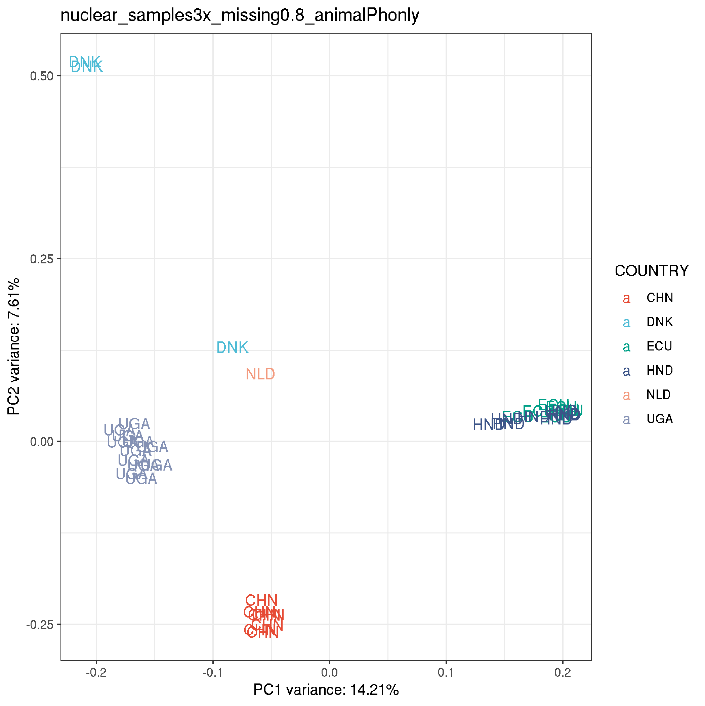
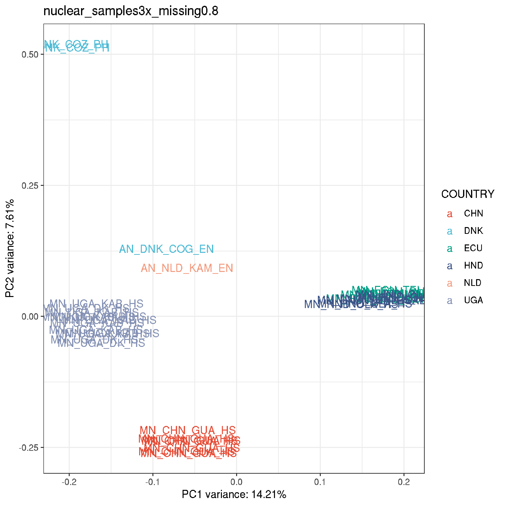


## ANGSD
- exploring the use of ANGSD, whcih can use genotype likelihoods for a number of analyses. Probably good for the low coverage datasets
- started off calculating "identity by state" (IBS), which is another way of showing genetic similarity between samples

```bash

cd /nfs/users/nfs_s/sd21/lustre118_link/trichuris_trichiura/05_ANALYSIS/ANGSD

bsub.py --threads 5 10 angsd "/nfs/users/nfs_s/sd21/lustre118_link/software/ANCIENT/angsd/angsd -bam bam.list -minMapQ 30 -minQ 20 -GL 2 -doMajorMinor 1 -doMaf 1 -SNP_pval 2e-6 -doIBS 1 -doCounts 1 -doCov 1 -makeMatrix 1 -minMaf 0.05 -P 5"

```

```R
# load libraries
library(gplots)

# load data
cov_data <- as.matrix(read.table("angsdput.covMat",header=F))
ibs_data <- as.matrix(read.table("angsdput.ibsMat",header=F))

names <- as.matrix(read.table("sample.names"))
rownames(ibs_data) <- names
colnames(ibs_data) <- names
rownames(cov_data) <- names
colnames(cov_data) <- names


pdf("nuclear_ibs_heatmap.pdf",width=15, height=15)
heatmap.2(ibs_data, trace="none", margins=c(12,12))
dev.off()

pdf("nuclear_covariance_heatmap.pdf",width=15, height=15)
cov_data[cov_data > 1] <- 1
heatmap.2(cov_data, trace="none", margins=c(12,12))
dev.off()

```

Figure: [IBS for nuclear markers](../04_analysis/nuclear_ibs_heatmap.pdf)

Figure: [covariance of IBS for nuclear markers](../04_analysis/nuclear_covariance_heatmap.pdf)


## NGSadmix

```bash

mkdir /nfs/users/nfs_s/sd21/lustre118_link/trichuris_trichiura/05_ANALYSIS/ADMIXTURE

cd /nfs/users/nfs_s/sd21/lustre118_link/trichuris_trichiura/05_ANALYSIS/ADMIXTURE

mkdir CHROMOSOMES_PL

ln -s /nfs/users/nfs_s/sd21/lustre118_link/trichuris_trichiura/04_VARIANTS/GATK_HC_MERGED/nuclear_samples3x_missing0.8_animalPhonly.recode.vcf.gz

cat ../../01_REF/trichuris_trichiura.fa.fai | cut -f1 | grep -v "MITO" | while read -r CHR; do
     vcftools --gzvcf ../../04_VARIANTS/GATK_HC_MERGED/nuclear_samples3x_missing0.8_animalPhonly.recode.vcf.gz  --max-missing 1 --out CHROMOSOMES_PL/${CHR} --BEAGLE-PL --chr ${CHR};
done

# merge the data from individual chromosomes into a single dataset
cd CHROMOSOMES_PL

cat $(ls -1 *PL | head -n1 ) | head -n1 > merged.PL

for i in *BEAGLE.PL; do
     cat ${i} | grep -v "marker" >> merged.PL;
done

# chromosomes=$(cat ../../01_REF/trichuris_trichiura.fa.fai | cut -f1 | grep -v "MITO" | while read -r CHROMOSOME; do printf "$CHROMOSOME,"; done | sed 's/,$//g')
# vcftools --gzvcf ../../04_VARIANTS/GATK_HC_MERGED/nuclear_samples3x_missing0.8_animalPhonly.recode.vcf.gz  --out CHROMOSOMES_PL/all_chromosomes --BEAGLE-PL --chr ${chromosomes}

head -n1 Trichuris_trichiura_3_009.BEAGLE.PL > chromosome.PL

cat Trichuris_trichiura_1_001.BEAGLE.PL Trichuris_trichiura_1_002.BEAGLE.PL Trichuris_trichiura_1_003.BEAGLE.PL Trichuris_trichiura_1_004.BEAGLE.PL Trichuris_trichiura_1_005.BEAGLE.PL Trichuris_trichiura_1_006.BEAGLE.PL Trichuris_trichiura_1_007.BEAGLE.PL Trichuris_trichiura_2_001.BEAGLE.PL Trichuris_trichiura_3_001.BEAGLE.PL Trichuris_trichiura_3_002.BEAGLE.PL Trichuris_trichiura_3_003.BEAGLE.PL Trichuris_trichiura_3_004.BEAGLE.PL Trichuris_trichiura_3_005.BEAGLE.PL Trichuris_trichiura_3_006.BEAGLE.PL Trichuris_trichiura_3_007.BEAGLE.PL Trichuris_trichiura_3_008.BEAGLE.PL Trichuris_trichiura_3_009.BEAGLE.PL Trichuris_trichiura_3_010.BEAGLE.PL | grep -v "marker" | sort -t ":" -k1,1 -k2,2n >> chromosome.PL


cd ../


# run admixture for multiple values of K
for j in 1 2 3 4 5; do
     for i in 2 3 4 5 6 7 8 9 10; do
          bsub.py --queue long --threads 10 3 NGS_admix_multiK_rerun "NGSadmix -likes CHROMOSOMES_PL/chromosome.PL -K ${i} -P 10 -seed ${j} -minMaf 0.05 -misTol 0.9 -o k_${i}_s_${j}_out" ;
     done;
done


```

### make some admixture plots

```R
# load libraries
library(ggsci)
library(patchwork)
library(tidyverse)
library(reshape2)

# make a function
plot_admixture <- function(data,title) {

# get metadata     
samples <- read.delim("nuclear_3x_animalPhonly.list", header=F)
names(samples) <- "sample_ID"
metadata <- samples %>% separate(sample_ID,c("time", "country","population","host","sampleID"))

# read data
data <- read.delim(data, sep=" ", header=F)
names(data) <- paste("ancestral", 1:ncol(data), sep="")

# bring metadata and data together
data <- cbind(samples, metadata,data)
data <- melt(data, id.vars=c("sample_ID","time", "country","population","host","sampleID"))

# make plot
ggplot(data,aes(sample_ID,value,fill=variable)) +
     geom_col(color = "gray", size = 0.1)+
     facet_grid(~fct_inorder(country), switch = "x", scales = "free", space = "free") +
     theme_minimal() + labs(title = title, y = "Ancestry", x = NULL) +
     scale_y_continuous(expand = c(0, 0)) +
     scale_x_discrete(expand = expansion(add = 0.7)) +
     theme(panel.spacing.x = unit(0.1, "lines"),
          axis.text.x = element_blank(),
          #axis.text.x = element_text(angle = 90, vjust = 0.5, hjust=1),
          panel.grid = element_blank()) +
     scale_fill_npg(guide = FALSE)
}

s = 4
# run function for each value of K
k_2_plot <- plot_admixture(paste0("k_2_s_",s,"_out.qopt"), "K = 2")
k_3_plot <- plot_admixture(paste0("k_3_s_",s,"_out.qopt"), "K = 3")
k_4_plot <- plot_admixture(paste0("k_4_s_",s,"_out.qopt"), "K = 4")
k_5_plot <- plot_admixture(paste0("k_5_s_",s,"_out.qopt"), "K = 5")
k_6_plot <- plot_admixture(paste0("k_6_s_",s,"_out.qopt"), "K = 6")
k_7_plot <- plot_admixture(paste0("k_7_s_",s,"_out.qopt"), "K = 7")
k_8_plot <- plot_admixture(paste0("k_8_s_",s,"_out.qopt"), "K = 8")
k_9_plot <- plot_admixture(paste0("k_9_s_",s,"_out.qopt"), "K = 9")
k_10_plot <- plot_admixture(paste0("k_10_s_",s,"_out.qopt"), "K = 10")

# bring the plots together
k_2_plot + k_3_plot + k_4_plot + k_5_plot + k_6_plot + k_7_plot + k_8_plot + k_9_plot + k_10_plot + plot_layout(ncol=1)

# save it
ggsave("admixture_plots_k2-10.png")
ggsave("admixture_plots_k2-10.pdf", height=15, width=10)

k_3_plot
ggsave("admixture_plots_k3.pdf", height=1.5, width=10)

```

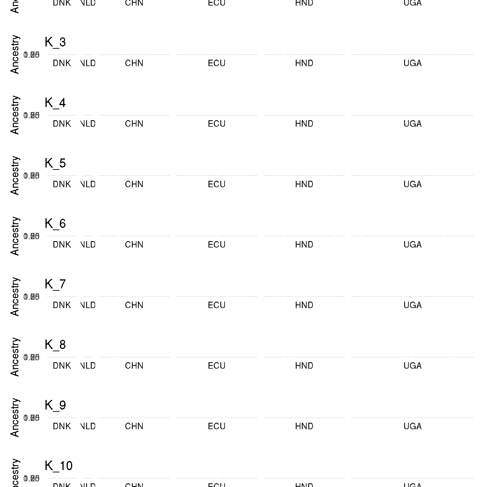

- need to determine the optimal K, at least from what the data suggests.
- usually there is a cross validation approach for tools like STRUCTURE and ADMIXTURE, but there doesnt seem to be one for NGSadmix


### Clumpak
- rather that the above code, I ended up using Clumpak as suggested here: https://github.com/alexkrohn/AmargosaVoleTutorials/blob/master/ngsAdmix_tutorial.md

```bash
(for log in `ls *.log`; do
     grep -Po 'like=\K[^ ]+' $log;
done) > logfile

```

- to collate the data, and generate a clumpak compatible input file

```R

logs <- as.data.frame(read.table("logfile"))

logs$K <- c(rep("10", 5), rep("2", 5), rep("3", 5), rep("4", 5), rep("5", 5), rep("6", 5), rep("7", 5), rep("8", 5), rep("9", 5))

write.table(logs[, c(2, 1)], "logfile_formatted", row.names = F,
    col.names = F, quote = F)

```

- open clumpak and upload the data
- the output suggests k=3 is the optimal ancestral number, which I guess is consistent with the PCA which produces three main clusters.


## Treemix
- https://ppp.readthedocs.io/en/latest/PPP_pages/examples.html
- https://speciationgenomics.github.io/Treemix/

```bash

conda activate py-popgen

export LD_LIBRARY_PATH=/lustre/scratch118/infgen/team133/sd21/software/anaconda2/envs/py-popgen/lib/

mkdir /nfs/users/nfs_s/sd21/lustre118_link/trichuris_trichiura/05_ANALYSIS/TREEMIX
cd /nfs/users/nfs_s/sd21/lustre118_link/trichuris_trichiura/05_ANALYSIS/TREEMIX

vcftools \
--gzvcf Trichuris_trichiura.cohort.nuclear_variants.final.recode.vcf.gz \
--max-missing 1 \
--keep ../../04_VARIANTS/GATK_HC_MERGED/nuclear_3x_animal.list \
--recode --stdout | gzip > treemix.vcf.gz

./ldPruning.sh treemix.vcf.gz

# before pruning
vcftools --gzvcf treemix.vcf.gz
#> After filtering, kept 356541 out of a possible 356541 Sites

# after pruning
vcftools --gzvcf treemix.LDpruned.vcf.gz
#> After filtering, kept 109195 out of a possible 109195 Sites

bcftools query -l treemix.vcf.gz | awk '{split($1,pop,"."); print $1"\t"$1"\t"pop[2]}' > data.clust

# this "data.clust" needs to be edited to put the population in, eg.

"
AN_DNK_COG_EN_0012	AN_DNK_COG_EN_0012	ANCIENT
AN_NLD_KAM_EN_0034	AN_NLD_KAM_EN_0034	ANCIENT
MN_CHN_GUA_HS_001	MN_CHN_GUA_HS_001	CHN
MN_CHN_GUA_HS_002	MN_CHN_GUA_HS_002	CHN
MN_CHN_GUA_HS_003	MN_CHN_GUA_HS_003	CHN
"


cat data.clust | cut -f3 | sort | uniq > populations.list

./vcf2treemix.sh treemix.LDpruned.vcf.gz data.clust


# run treemix, across a range of migration edges, and across a range of seeds
#--- the range of seeds is used by optM below to estimate the optimal number of edges.

for i in {0..5}; do
     for j in {0..10}; do
          treemix -i treemix.LDpruned.treemix.frq.gz -seed $j -m $i -o treemix.m_$i.s_$j -root COLOBUS -bootstrap -k 500  > treemix_${i}_log &
     done;
done

```

- make some plots

```R

# load libraries
library(RColorBrewer)
library(R.utils)

source("plotting_funcs.R")
prefix="treemix"

# plot trees across range of migration edges
par(mfrow=c(1,2))

pdf("treemix_edges_2-6.pdf")
for(edge in 0:5){
     plot_tree(cex=0.8,paste0(prefix,".m_",edge,".s_4"))
     title(paste(edge,"edges"))
}


for(edge in 0:5){
     pdf(paste0("plot_treemix_tree_m-",edge,".pdf"))
     plot_tree(cex=0.8,paste0(prefix,".m_",edge,".s_4"))
     plot_resid(stem=paste0(prefix,".m_",edge,".s_4"),pop_order="populations.list")
     title(paste(edge,"edges"))
     dev.off()
}


# plot residuals across range of migration edges - positive values suggest admixture
for(edge in 0:5){
     pdf(paste0("plot_treemix_residuals_m-",edge,".pdf"))
     plot_resid(stem=paste0(prefix,".m_",edge,".s_4"),pop_order="populations.list")
     title(paste(edge,"edges")
     dev.off()
}

dev.off()

# Estimating the optimal number of migration edges : https://rdrr.io/cran/OptM/#vignettes
# run in the folder with the treemix output files
#install.packages("OptM")

library(OptM)

optM(folder="./")

#> The maximum value for delta m was 10.7624 at m = 3 edges.

# remake the plots, using 2 migration edges
prefix="treemix"

par(mfrow=c(1,1))

plot_tree(cex=0.8,paste0(prefix,".m_3.s_4"))
title(paste(1,"edges"))

plot_resid(stem=paste0(prefix,".",2),pop_order="populations.list")
title(paste(1,"edges"))

```

### calculate the variance explained by the data
- https://github.com/darencard/RADpipe/blob/master/treemixVarianceExplained.R

```bash

Rscript treemixVarianceExplained.R treemix.m_1.s_2

#> Standard error for all entries in the covariance matrix estimated from the data	0.000566063693877551
#> Variance of relatedness between populations explained by the model	0.997250751108934

```


## ADMIXTOOLS
- ADMIXTOOLS is a widely used software package for calculating admixture statistics and testing population admixture hypotheses.
- need to convert vcf to eigenstrat format first
     - followed workflow from here: https://speciationgenomics.github.io/ADMIXTOOLS_admixr/
     - needed additional scripts
          - "convertVCFtoEigenstrat.sh" found here: https://github.com/joanam/scripts/tree/e8c6aa4b919b58d69abba01e7b7e38a892587111
               - NOTE: I modified this file to allow non-standard chromosomes names, by indicating a "chom-map.txt" file in the vcftools command
               - new file called "convertVCFtoEigenstrat_sd.sh"

     - also need in path
          - vcftools
          - convertf (from eigensoft package)
               - conda install -c bioconda eigensoft
          - admixtools
               - conda install -c bioconda admixtools


### Prepared data and run admixtools

```bash

mkdir ~/lustre118_link/trichuris_trichiura/05_ANALYSIS/FSTATS
cd ~/lustre118_link/trichuris_trichiura/05_ANALYSIS/FSTATS

ln -s ../../04_VARIANTS/GATK_HC_MERGED/nuclear_samples3x_missing0.8_animalPhonly.recode.vcf.gz

# need to generate a list of scaffold ids, to generate a file called "chrom-map.txt". This is important to make the the scaffold names are parsed properly downstream
bcftools view -H nuclear_samples3x_missing0.8_animalPhonly.recode.vcf.gz | cut -f 1 | uniq | awk '{print $0"\t"$0}' > chrom-map.txt

# run the conversion script.
#--- note have to drop the "vcf.gz" suffix

zcat nuclear_samples3x_missing0.8_animalPhonly.recode.vcf.gz > nuclear_samples3x_missing0.8_animalPhonly.recode.vcf

./convertVCFtoEigenstrat_sd.sh nuclear_samples3x_missing0.8_animalPhonly.recode

# need to manually modify the ".ind" file - the thrid column shows "control" where they should show population IDs
# simply cat the file, copy into a text editor, change it, then move it back


# make a new populations file
> admixtools_pops.txt

# set the outgroup
OUTGROUP=BABOON

# loop throguh the populations to generate the pop file as input to admixtools
for i in BABOON CHN HND UGA ANCIENT; do
     for j in  BABOON CHN HND UGA ANCIENT; do
          if [[ "$i" == "$j" ]] || [[ "$i" == "$OUTGROUP" ]] || [[ "$j" == "$OUTGROUP" ]]; then
               :
               else
               echo -e "${i}\t${j}\t${OUTGROUP}" >> admixtools_pops.txt;
          fi;
     done;
done

# I manually removed duplicates here

# after looking at the data from the first analysis in R, also decided to set HND as an outgroup.
OUTGROUP=HND

for i in BABOON CHN HND UGA ANCIENT; do
     for j in  BABOON CHN HND UGA ANCIENT; do
          if [[ "$i" == "$j" ]] || [[ "$i" == "$OUTGROUP" ]] || [[ "$j" == "$OUTGROUP" ]]; then
               :
               else
               echo -e "${i}\t${j}\t${OUTGROUP}" >> admixtools_pops.txt;
          fi;
     done;
done


# run admixtools to generate f3 stats
qp3Pop -p PARAMETER_FILE > qp3Pop.out

# parse the output so it is user friendly to plot
grep "result" qp3Pop.out | awk '{print $2,$3,$4,$5,$6,$7,$8}' OFS="\t" > qp3Pop.clean.out

```

- where "PARAMETER_FILE":

```bash

genotypename:   nuclear_samples3x_missing0.8_animalPhonly.recode.eigenstratgeno (in eigenstrat format)
snpname:        nuclear_samples3x_missing0.8_animalPhonly.recode.snp      (in eigenstrat format)
indivname:      nuclear_samples3x_missing0.8_animalPhonly.recode.ind    (in eigenstrat format)
popfilename:    admixtools_pops.txt
inbreed: YES

```

- make a plot

```R
# load libraries
library(tidyverse)

# read data
data <- read.delim("qp3Pop.clean.out", header=F, sep="\t")

# fix headings
colnames(data) <- c("Source_1", "Source_2", "Outgroup", "f_3", "std_err", "Z_score", "SNPs")

# make a plot
ggplot(data,aes(f_3, reorder(paste0(Source_1,",",Source_2), -f_3))) +
     geom_point(size = 2) +
     geom_segment(aes(x = f_3-std_err, y = paste0(Source_1,",",Source_2), xend = f_3+std_err, yend = paste0(Source_1,",",Source_2))) +
     theme_bw() + xlim(0,1) +
     labs(x = "f3(Source1,Source2;Outgroup)" , y = "") +
     facet_grid(Outgroup~., scale="free_y", space = "free_y")

# save it
ggsave("plot_admixtools_f3_statistics.png")
ggsave("plot_admixtools_f3_statistics.pdf", height = 4, width = 5, useDingbats = FALSE)

```

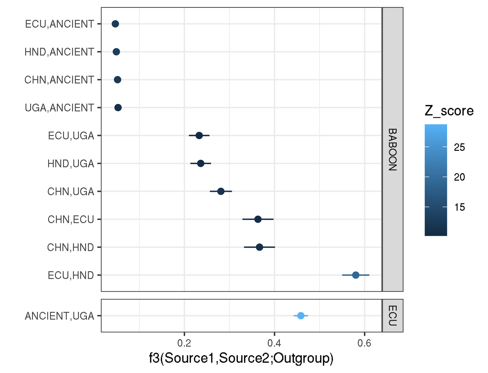


## SMC++
- want to calculate historical population sizes
- also want to follow up on question posed in Soe draft on the relationship between UGA and DNK samples

```bash

mkdir /nfs/users/nfs_s/sd21/lustre118_link/trichuris_trichiura/05_ANALYSIS/SMC

cd /nfs/users/nfs_s/sd21/lustre118_link/trichuris_trichiura/05_ANALYSIS/SMC

mkdir SMC_DATA

ln -s /nfs/users/nfs_s/sd21/lustre118_link/trichuris_trichiura/04_VARIANTS/GATK_HC_MERGED/nuclear_samples3x_missing0.8_animalPhonly.recode.vcf

conda activate smcpp

export LD_LIBRARY_PATH=/lustre/scratch118/infgen/team133/sd21/software/anaconda2/envs/smcpp/lib/

module load common-apps/htslib/1.9.229

cat ../../01_REF/trichuris_trichiura.fa.fai | cut -f1 | grep -v "MITO" > chromosomes.list

#--- plot per populations
# HND
vcftools --gzvcf nuclear_samples3x_missing0.8_animalPhonly.recode.vcf.gz \
--indv MN_HND_OLA_HS_001 \
--indv MN_HND_OLA_HS_002 \
--indv MN_HND_OLA_HS_003 \
--indv MN_HND_OLA_HS_004 \
--indv MN_HND_OLA_HS_005 \
--indv MN_HND_OLA_HS_006 \
--indv MN_HND_OLA_HS_007 \
--indv MN_HND_SAL_HS_001 \
--max-missing 1 --recode --out HND
bgzip -f HND.recode.vcf
tabix HND.recode.vcf.gz

# first estimate each population marginally using estimate:
while read CHROMOSOME; do
     smc++ vcf2smc HND.recode.vcf.gz SMC_DATA/HND.${CHROMOSOME}.smc.gz ${CHROMOSOME} HND:MN_HND_OLA_HS_001,MN_HND_OLA_HS_002,MN_HND_OLA_HS_003,MN_HND_OLA_HS_004,MN_HND_OLA_HS_005,MN_HND_OLA_HS_006,MN_HND_OLA_HS_007,MN_HND_SAL_HS_001;
done < chromosomes.list

# mutation rate (C.elegans) = 2.7e-9 (https://doi.org/10.1073/pnas.0904895106)
smc++ estimate -o HND/ 2.7e-9 SMC_DATA/HND.*.smc.gz

# plot
smc++ plot -g 0.33 -c SMCPP_HND.pdf HND/model.final.json


#--- CHN
vcftools --gzvcf nuclear_samples3x_missing0.8_animalPhonly.recode.vcf.gz \
--indv MN_CHN_GUA_HS_001 \
--indv MN_CHN_GUA_HS_002 \
--indv MN_CHN_GUA_HS_003 \
--indv MN_CHN_GUA_HS_004 \
--indv MN_CHN_GUA_HS_005 \
--indv MN_CHN_GUA_HS_006 \
--indv MN_CHN_GUA_HS_007 \
--max-missing 1 --recode --out CHN
bgzip -f CHN.recode.vcf
tabix CHN.recode.vcf.gz

# first estimate each population marginally using estimate:
while read CHROMOSOME; do
     smc++ vcf2smc CHN.recode.vcf.gz SMC_DATA/CHN.${CHROMOSOME}.smc.gz ${CHROMOSOME} CHN:MN_CHN_GUA_HS_001,MN_CHN_GUA_HS_002,MN_CHN_GUA_HS_003,MN_CHN_GUA_HS_004,MN_CHN_GUA_HS_005,MN_CHN_GUA_HS_006,MN_CHN_GUA_HS_007;
done < chromosomes.list

# mutation rate (C.elegans) = 2.7e-9 (https://www.pnas.org/content/106/38/163100)
smc++ estimate -o CHN/ 2.7e-9 SMC_DATA/CHN.*.smc.gz

# plot
smc++ plot -g 0.33 -c SMCPP_CHN.pdf CHN/model.final.json


#--- ANCIENT
vcftools --gzvcf nuclear_samples3x_missing0.8_animalPhonly.recode.vcf.gz \
--indv AN_DNK_COG_EN_0012 \
--indv AN_NLD_KAM_EN_0034 \
--max-missing 1 --recode --out ANCIENT
bgzip -f ANCIENT.recode.vcf
tabix ANCIENT.recode.vcf.gz

# first estimate each population marginally using estimate:
while read CHROMOSOME; do
     smc++ vcf2smc ANCIENT.recode.vcf.gz SMC_DATA/ANCIENT.${CHROMOSOME}.smc.gz ${CHROMOSOME} ANCIENT:AN_DNK_COG_EN_0012,AN_NLD_KAM_EN_0034;
done < chromosomes.list

# mutation rate (C.elegans) = 2.7e-9 (https://www.pnas.org/content/106/38/163100)
smc++ estimate -o ANCIENT/ 2.7e-9 SMC_DATA/ANCIENT.*.smc.gz

# plot
smc++ plot -g 0.33 -c SMCPP_ANCIENT.pdf ANCIENT/model.final.json


#--- Baboon
vcftools --gzvcf nuclear_samples3x_missing0.8_animalPhonly.recode.vcf.gz \
--indv MN_DNK_COZ_PH_001 \
--indv MN_DNK_COZ_PH_002 \
--max-missing 1 --recode --out BABOON

bgzip -f BABOON.recode.vcf
tabix BABOON.recode.vcf.gz

# first estimate each population marginally using estimate:
while read CHROMOSOME; do
     smc++ vcf2smc BABOON.recode.vcf.gz SMC_DATA/BABOON.${CHROMOSOME}.smc.gz ${CHROMOSOME} BABOON:MN_DNK_COZ_PH_001,MN_DNK_COZ_PH_002;
done < chromosomes.list

# mutation rate (C.elegans) = 2.7e-9 (https://www.pnas.org/content/106/38/163100)
smc++ estimate -o BABOON/ 2.7e-9 SMC_DATA/BABOON.*.smc.gz

# plot
smc++ plot -g 0.33 -c SMCPP_BABOON.pdf BABOON/model.final.json


#--- UGA
vcftools --gzvcf nuclear_samples3x_missing0.8_animalPhonly.recode.vcf.gz \
--indv MN_UGA_DK_HS_001 \
--indv MN_UGA_DK_HS_002 \
--indv MN_UGA_DK_HS_003 \
--indv MN_UGA_KAB_HS_001 \
--indv MN_UGA_KAB_HS_002 \
--indv MN_UGA_KAB_HS_003 \
--indv MN_UGA_KAB_HS_004 \
--indv MN_UGA_KAB_HS_005 \
--indv MN_UGA_KAB_HS_006 \
--indv MN_UGA_KAB_HS_007 \
--indv MN_UGA_KAB_HS_008 \
--indv MN_UGA_KAB_HS_009 \
--max-missing 1 --recode --out UGA

bgzip -f UGA.recode.vcf
tabix UGA.recode.vcf.gz

# first estimate each population marginally using estimate:
while read CHROMOSOME; do
     smc++ vcf2smc UGA.recode.vcf.gz SMC_DATA/UGA.${CHROMOSOME}.smc.gz ${CHROMOSOME} UGA:MN_UGA_DK_HS_001,MN_UGA_DK_HS_002,MN_UGA_DK_HS_003,MN_UGA_KAB_HS_001,MN_UGA_KAB_HS_002,MN_UGA_KAB_HS_003,MN_UGA_KAB_HS_004,MN_UGA_KAB_HS_005,MN_UGA_KAB_HS_006,MN_UGA_KAB_HS_007,MN_UGA_KAB_HS_008,MN_UGA_KAB_HS_009;
done < chromosomes.list

# mutation rate (C.elegans) = 2.7e-9 (https://www.pnas.org/content/106/38/163100)
smc++ estimate -o UGA/ 2.7e-9 SMC_DATA/UGA.*.smc.gz

# plot
smc++ plot -g 0.33 -c SMCPP_UGA.pdf UGA/model.final.json

```

- plot all smcpp plots together

```R
# load libraries
library(tidyverse)
library(patchwork)
library(ggsci)

# load data
HND_data <- read.delim("SMCPP_HND.csv", header = T , sep = ",")
HND_data$ID <- "HND"
CHN_data <- read.delim("SMCPP_CHN.csv", header = T , sep = ",")
CHN_data$ID <- "CHN"
#ANCIENT_data <- read.delim("SMCPP_ANCIENT.csv", header = T , sep = ",")
#ANCIENT_data$ID <- "ANCIENT"
BABOON_data <- read.delim("SMCPP_BABOON.csv", header = T , sep = ",")
BABOON_data$ID <- "BABOON"
UGA_data <- read.delim("SMCPP_UGA.csv", header = T , sep = ",")
UGA_data$ID <- "UGA"

data <- bind_rows(HND_data, CHN_data, BABOON_data, UGA_data)


ggplot(data,aes(x,y,col=ID)) +
     geom_rect(aes(xmin=50000,ymin=0,xmax=60000,ymax=1.0E6), fill="grey95", col=NA) +
     geom_line(size=1) +
     labs(x = "Years before present", y = "Effective population size (Ne)", col="Population") +
     theme_bw() +
     scale_x_log10(labels = prettyNum) +
     ylim(0,1e6) +
     scale_colour_npg()

ggsave("plot_smcpp_all_populations.png")
ggsave("plot_smcpp_all_populations.pdf", height = 4, width = 5, useDingbats = FALSE)

```

Figure: [plot_smcpp_all_populations](plot_smcpp_all_populations.pdf)
- use this in Figure 2 panel D

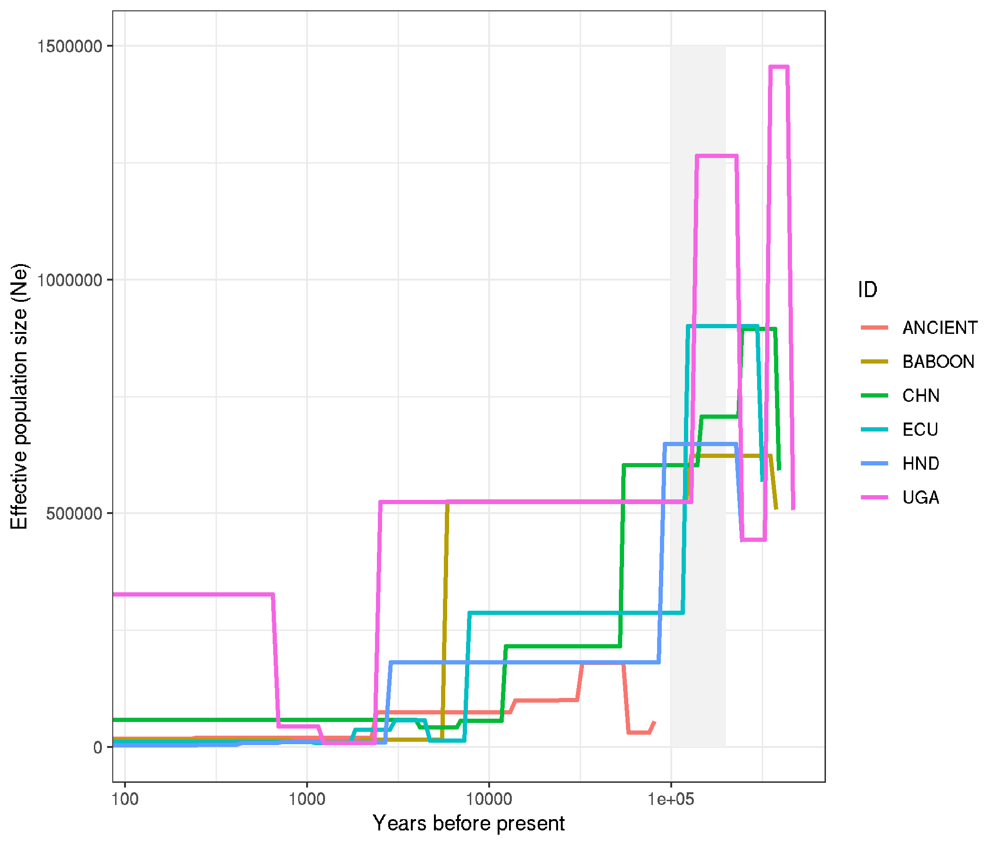


## Nucleotide diversity and Tajima's D

```bash
# extract scaffolds in chromosome linkage groups
#- this represents 72375426 of 80573711, or 89.83% of genome
cat ../../01_REF/trichuris_trichiura.fa.fai | grep -v "Trichuris_trichiura_00_*" | grep -v "MITO" | awk '{print $1,1,$2}' OFS="\t" > chromosome_scaffolds.bed

# extract nucleotide diversity for each group
for i in ancient_x_nuclear_3x_animalPhonly.list \
     CHN_x_nuclear_3x_animalPhonly.list \
     BABOON_x_nuclear_3x_animalPhonly.list \
     HND_x_nuclear_3x_animalPhonly.list \
     UGA_x_nuclear_3x_animalPhonly.list; do \
          vcftools --gzvcf nuclear_samples3x_missing0.8_animalPhonly.recode.vcf.gz --keep ${i} --bed chromosome_scaffolds.bed --window-pi 50000 --out ${i%.list}_50k;
          vcftools --gzvcf nuclear_samples3x_missing0.8_animalPhonly.recode.vcf.gz --keep ${i} --bed chromosome_scaffolds.bed --TajimaD 50000 --out ${i%.list}_50k;
     done

# summary stats for Pi
for i in *_50k.windowed.pi;
     do echo ${i}; cat ${i} | datamash --headers mean 5 sstdev 5;
done

# summary stats for TajD
for i in *_50k.Tajima.D;
     do echo ${i}; cat ${i} | datamash --headers mean 4 sstdev 4 --narm;
done

_50k.Tajima.D

# other random vcftools analyses
vcftools --gzvcf nuclear_samples3x_missing0.8_animalPhonly.recode.vcf.gz --indv-freq-burden --out nuclear_samples3x_missing0.8_animalPhonly

vcftools --gzvcf nuclear_samples3x_missing0.8_animalPhonly.recode.vcf.gz --het --out nuclear_samples3x_missing0.8_animalPhonly

vcftools --gzvcf nuclear_samples3x_missing0.8_animalPhonly.recode.vcf.gz --relatedness --out nuclear_samples3x_missing0.8_animalPhonly

vcftools --gzvcf nuclear_samples3x_missing0.8_animalPhonly.recode.vcf.gz --FILTER-summary --out nuclear_samples3x_missing0.8_animalPhonly

```


### plot nucleotide diversities

```R
# load libraries
library(tidyverse)
library(ggsci)

# list file names
file_names <- list.files(path = "./",pattern = "_x_nuclear_3x_animalPhonly_50k.windowed.pi")

# load data using file names, and make a formatted data frame
data <-
     purrr::map_df(file_names, function(x) {
	data <- read.delim(x, header = T, sep="\t")
     data <- tibble::rowid_to_column(data, "NUM")
	cbind(pop_id = gsub("_x_nuclear_3x_animalPhonly_50k.windowed.pi","",x), data)
	})

ggplot(data,aes(pop_id,PI,col=pop_id)) +
     geom_jitter() +
     geom_boxplot(fill=NA, col="black") +
     labs(x = "Population" , y = "Nucleotide diversity (Pi)", colour = "Population") +
     theme_bw() +
     theme(axis.text.x = element_text(angle = 90, vjust = 0.5, hjust=1)) +
     scale_color_npg()

ggsave("plot_nucleotide_diversity_boxplot.png")
ggsave("plot_nucleotide_diversity_boxplot.pdf", useDingbats=F, height=5, width=5)


ggplot(data,aes(NUM*50000,PI,col=CHROM, group=pop_id)) +
     geom_point() +
     labs(x = "Population" , y = "Nucleotide diversity (Pi)", col=NA) +
     theme_bw() +
     facet_grid(pop_id~.) +
     theme(legend.position = "none")


ggplot(data,aes(NUM*50000,PI,col=CHROM, group=pop_id)) +
     geom_point() +
     labs(x = "Population" , y = "Tajima's D", col=NA) +
     theme_bw() +
     facet_grid(pop_id~.) +
     theme(legend.position = "none") +
     scale_color_npg()

ggsave("plot_nucleotide_diversity_genomewide.png")

```


### plot Tajimas D

```R

library(tidyverse)
library(ggsci)

# list file names
file_names <- list.files(path = "./",pattern = "_x_nuclear_3x_animalPhonly_50k.Tajima.D")

# load data using file names, and make a formatted data frame
data <-
     purrr::map_df(file_names, function(x) {
	data <- read.delim(x, header = T, sep="\t")
     data <- tibble::rowid_to_column(data, "NUM")
	cbind(pop_id = gsub("_x_nuclear_3x_animalPhonly_50k.Tajima.D","",x), data)
	})

# plot boxplots and distributions of Tajima's D
ggplot(data,aes(pop_id,TajimaD,col=pop_id)) +
     geom_jitter() +
     geom_boxplot(fill=NA, col="black") +
     labs(x = "Population" , y = "Tajima's D") +
     theme_bw() +
     theme(axis.text.x = element_text(angle = 90, vjust = 0.5, hjust=1)) +
     scale_color_npg()

ggsave("plot_tajimaD_boxplot.png")
ggsave("plot_tajimaD_boxplot.pdf", useDingbats=F, width=8, height=5)


ggplot(data,aes(NUM*50000,TajimaD,col=CHROM, group=pop_id)) +
     geom_point() +
     labs(x = "Population" , y = "Tajima's D", col=NA) +
     theme_bw() +
     facet_grid(pop_id~.) +
     theme(legend.position = "none") +
     scale_color_npg()

ggsave("plot_tajimaD_genomewide.png")
ggsave("plot_tajimaD_genomewide.pdf", useDingbats=F, width=7, height=7)


plot_tajD <-
     ggplot(data,aes(NUM*50000,TajimaD,col=pop_id, group=pop_id)) +
     geom_smooth(span = 0.1, se = FALSE) +
     labs(x = "Population" , y = "Tajima's D", col= "Population") +
     theme_bw() +
     theme() +
     scale_color_npg()

plot_Pi + plot_tajD + plot_layout(ncol = 1, guides = "collect")

```


## Genome wide genetic differentiation

```bash

# run vcftools weir-fst-pop for all pairwise combinations of populatiions
for i in ancient_x_nuclear_3x_animalPhonly.list \
BABOON_x_nuclear_3x_animalPhonly.list \
CHN_x_nuclear_3x_animalPhonly.list \
HND_x_nuclear_3x_animalPhonly.list \
UGA_x_nuclear_3x_animalPhonly.list; do \
     for j in ancient_x_nuclear_3x_animalPhonly.list \
     BABOON_x_nuclear_3x_animalPhonly.list \
     CHN_x_nuclear_3x_animalPhonly.list \
     HND_x_nuclear_3x_animalPhonly.list \
     UGA_x_nuclear_3x_animalPhonly.list; do \
          if [[ "$i" == "$j" ]] || [[ -f ${i%_x_nuclear_3x_animalPhonly.list}_v_${j%_x_nuclear_3x_animalPhonly.list}_50k.windowed.weir.fst ]] || [[ -f ${j%_x_nuclear_3x_animalPhonly.list}_v_${i%_x_nuclear_3x_animalPhonly.list}_50k.windowed.weir.fst ]]; then
               echo "Same, same, move on"
               else
               vcftools --gzvcf nuclear_samples3x_missing0.8_animalPhonly.recode.vcf.gz --bed chromosome_scaffolds.bed --weir-fst-pop ${i} --weir-fst-pop ${j} --fst-window-size 50000 --out ${i%_x_nuclear_3x_animalPhonly.list}_v_${j%_x_nuclear_3x_animalPhonly.list}_50k;
          fi;
     done;
done


```

- make some plots

```R
# load libraries
library(tidyverse)
library(ggsci)
library(patchwork)

# list file names
file_names <- list.files(path = "./",pattern = "_50k.windowed.weir.fst")

# load data using file names, and make a formatted data frame
data <-
     purrr::map_df(file_names, function(x) {
	data <- read.delim(x, header = T, sep="\t")
     data <- tibble::rowid_to_column(data, "NUM")
	cbind(sample_pair = gsub("_50k.windowed.weir.fst","",x), data)
	})

# plot boxplots and distributions of pairwise Fst analyses
ggplot(data,aes(sample_pair,WEIGHTED_FST,col=sample_pair)) +
     geom_jitter() +
     geom_boxplot(fill=NA, col="black") +
     labs(x = "Population" , y = "WEIGHTED_FST") +
     theme_bw() +
     theme(axis.text.x = element_text(angle = 90, vjust = 0.5, hjust=1))

# save it
ggsave("plot_human_pop_pairwise_FST_boxplot.png")


# plot genome-wide distributions of pairwise Fst analyses
ggplot(data, aes(NUM*50000, WEIGHTED_FST, col=CHROM, group=sample_pair)) +
     geom_point() +
     labs(x = "Population" , y = "WEIGHTED_FST", col=NA) +
     theme_bw() +
     facet_grid(sample_pair~.) +
     theme(legend.position = "none") +
     scale_color_npg()

ggsave("plot_human_pop_pairwise_FST__genomewide.png")


# function to load specific datasets to make multipanel figures
plot_pairwise_fst <- function(file) {
     # load and prep data
     data <- read.delim(file, header=T, sep="\t")
     data <- tibble::rowid_to_column(data, "NUM")
     data$COMPARISON <- gsub("_50k.windowed.weir.fst","",file)
     # plot
     ggplot(data, aes(NUM*50000, WEIGHTED_FST, col=CHROM)) +
     geom_point(size=0.5) +
     labs(x = "Genomic position (bp)" , y = "Weighted FST", col=NA) +
     theme_bw() + ylim(0,1) +
     facet_grid(COMPARISON~.) +
     theme(legend.position = "none", text = element_text(size = 10))+
     scale_color_npg()
}

# for main text
CHN_v_UGA_fst <- plot_pairwise_fst("CHN_v_UGA_50k.windowed.weir.fst")
HND_v_UGA <- plot_pairwise_fst("HND_v_UGA_50k.windowed.weir.fst")
CHN_v_HND <- plot_pairwise_fst("CHN_v_HND_50k.windowed.weir.fst")
BABOON_v_UGA_fst <- plot_pairwise_fst("BABOON_v_UGA_50k.windowed.weir.fst")

CHN_v_UGA_fst + HND_v_UGA + CHN_v_HND + BABOON_v_UGA_fst + plot_layout(ncol=1)

ggsave("plot_pairwise_FST_genomewide.pdf", width=170, height=150, units="mm")

# BABOON_v_UGA_fst <- plot_pairwise_fst("BABOON_v_UGA_50k.windowed.weir.fst")
# human_vs_LMCG_fst <- plot_pairwise_fst("human_vs_LMCG_50k.windowed.weir.fst")
#
# BABOON_v_UGA_fst + human_vs_LMCG_fst + plot_layout(ncol=1)
# ggsave("plot_humananimal_pop_pairwise_FST_genomewide.png")
#
# # for supplementary data
# CHN_v_UGA_fst <- plot_pairwise_fst("CHN_v_UGA_50k.windowed.weir.fst")
#
# CHN_v_UGA_fst + CHN_v_ECU_fst + ECU_v_UGA_fst + plot_layout(ncol=1)
# ggsave("plot_human_pop_pairwise_FST_genomewide.png")
#

```

- boxplot summaries


- genomewide - human populations


- genomewide - human v animal populations


### extracting top 1% of Fst values for each comparison

```R

extract_top_1 <- function(file){
     require(tidyverse)
     data <- read.table(file, header=T)
     data_top1 <- data %>% filter(WEIGHTED_FST > quantile(WEIGHTED_FST, 0.99)) %>% select(CHROM:BIN_END,WEIGHTED_FST)
     write.table(data_top1, file=paste0(file,".top1.coords"), row.names = F, col.names = F, quote = F, sep = '\t')
}

extract_top_1("HND_v_UGA_50k.windowed.weir.fst")
extract_top_1("CHN_v_UGA_50k.windowed.weir.fst")
extract_top_1("CHN_v_HND_50k.windowed.weir.fst")
extract_top_1("BABOON_v_UGA_50k.windowed.weir.fst")

```

```bash
# extract the overlapping genes in the top 1% datasets  
for i in *top1.coords; do
     bedtools intersect -b ${i} -a liftover_annotation.gff3 -wb |\
     awk '$3=="gene" {print $9}' | cut -f1 -d ";" | cut -f2 -d ":" \
     > ${i%.coords}.genes;
done

for i in *top1.coords; do
     bedtools intersect -b ${i} -a liftover_annotation.gff3 -wb |\
     awk -F '[\t]' '$3=="gene" {print $10,$11,$12,$13,$4,$5,$9}' OFS="\t" | cut -f1 -d ";" | sed 's/ID=gene://g' \
     > ${i%.coords}.intersect;
done

# extract all gene IDs
cat liftover_annotation.gff3 |\
     awk '$3=="gene" {print $9}' |\
     cut -f1 -d ";" | cut -f2 -d ":" \
     > liftover_annotation.genelist

# use gProfiler to determine intersection
#>> no enriched genes found for any comparison

```

- testing correlation of Fst between UGA-CHN and UGA-Americas to see if there is variation shared by UGA-Americas that is not shared by UGA-China. If true, this might support independent migration into the Americas

```R
# load libraries
library(tidyverse)
library(patchwork)

uga_chn <- read.table("CHN_v_UGA_50k.windowed.weir.fst", header=T)
uga_chn$pair <- "UGAvCHN"
chn_americas <-read.table("CHN_v_AMERICAS_50k.windowed.weir.fst", header=T)
chn_americas$pair <- "CHNvAMERICAS"
uga_americas <-read.table("UGA_v_AMERICAS_50k.windowed.weir.fst", header=T)
uga_americas <- "UGAvAMERICAS"

data <- dplyr::bind_rows(uga_chn,chn_americas)
data <- dplyr::bind_rows(data,chn_americas)

uga_chn <- read.table("CHN_v_UGA_50k.windowed.weir.fst", header=T)
chn_americas <-read.table("CHN_v_AMERICAS_50k.windowed.weir.fst", header=T)
uga_americas <-read.table("UGA_v_AMERICAS_50k.windowed.weir.fst", header=T)

data <- dplyr::inner_join(uga_chn,chn_americas,by=c("CHROM","BIN_START"))
data <- dplyr::inner_join(data,uga_americas,by=c("CHROM","BIN_START"))
data <- data %>% select(CHROM,BIN_START,WEIGHTED_FST.x,WEIGHTED_FST.y,WEIGHTED_FST)
colnames(data) <- c("CHROM", "BIN_START", "FST_UGAvCHN", "FST_CHNvAMERICAS", "FST_UGAvAMERICAS")


plot_1 <-
     ggplot(data, aes(FST_UGAvCHN, FST_UGAvAMERICAS)) +
     geom_smooth(method = "lm", se = FALSE) +
     geom_point(size=0.5) +
     xlim(0,1) +
     ylim(0,1) +
     theme_bw()

plot_2 <-
     ggplot(data, aes(FST_UGAvCHN, FST_CHNvAMERICAS)) +
     geom_smooth(method = "lm", se = FALSE) +
     geom_point(size=0.5) +
     xlim(0,1) +
     ylim(0,1)+
     theme_bw()

plot_3 <-
     ggplot(data, aes(FST_UGAvAMERICAS, FST_CHNvAMERICAS)) +
     geom_smooth(method = "lm", se = FALSE) +
     geom_point(size=0.5) +
     xlim(0,1) +
     ylim(0,1)+
     theme_bw()

plot_1 + plot_2 + plot_3 + plot_layout(ncol=3)

```

```bash
cd /nfs/users/nfs_s/sd21/lustre118_link/trichuris_trichiura/04_VARIANTS/GATK_HC_MERGED

# extract data from UGA_CHN_AMERICAS samples, no missing data, to calculate per site allele freq, whcih will be used to calculate private and shared site frequencies
vcftools \
--gzvcf Trichuris_trichiura.cohort.nuclear_variants.final.recode.vcf.gz \
--max-missing 1 \
--keep UGA_x_nuclear_3x_animalPhonly.list \
--keep CHN_x_nuclear_3x_animalPhonly.list \
--keep AMERICAS_x_nuclear_3x_animalPhonly.list \
--recode \
--out UGA_CHN_AMERICAS

#> After filtering, kept 2430928 out of a possible 6571976 Sites


vcftools --vcf UGA_CHN_AMERICAS.recode.vcf --keep UGA_x_nuclear_3x_animalPhonly.list --freq --out UGA
vcftools --vcf UGA_CHN_AMERICAS.recode.vcf --keep CHN_x_nuclear_3x_animalPhonly.list --freq --out CHN
vcftools --vcf UGA_CHN_AMERICAS.recode.vcf --keep AMERICAS_x_nuclear_3x_animalPhonly.list --freq --out AMERICAS

paste UGA.frq CHN.frq AMERICAS.frq > UGA_CHN_AMERICAS.freq

# alt freq columns
#UGA_ALT = 8
#CHR_ALT = 16
#AMERICAS_ALT = 24

sed 's/:/\t/g' UGA_CHN_AMERICAS.freq | grep -v "CHROM" | cut -f8,16,24 > tmp; mv tmp UGA_CHN_AMERICAS.freq

```

- make some plots, and summary data

```R
# load libraries
library(tidyverse)
library(UpSetR)

data <- read.table("UGA_CHN_AMERICAS.freq",header=F)
colnames(data) <- c("UGA", "CHN", "AMERICAS")
data <- data %>% mutate_if(is.numeric, ~1 * (. > 0.05))

pdf(file="UGA_CHN_AMERICAS_shared_v_private_variants.pdf", onefile=FALSE)
upset(data,sets.bar.color = "#56B4E9", point.size = 3.5, mainbar.y.label = "Shared variants above freq(alt) = 0.05", sets.x.label = "Variants")
dev.off()

png(file="UGA_CHN_AMERICAS_shared_v_private_variants.png")
upset(data,sets.bar.color = "#56B4E9", point.size = 3.5, mainbar.y.label = "Shared variants above freq(alt) = 0.05", sets.x.label = "Variants")
dev.off()

data %>% group_by_all() %>% summarise(COUNT = n()) %>% mutate(freq = COUNT / sum(COUNT))

```

| UGA | CHN | AMERICAS | COUNT | FREQ |
| --- | --- | ---   | --- |
|    0    |    0    |    0    |    1811631   |
|    0    |    0    |    1    |    148234 |
|    0    |    1   |    0    |     116536     |
|    0    |    1    |    1    |    83018     |
|    1    |    0   |    0    |  226805     |
|    1    |    0    |    1    |    33990 |
|    1    |    1    |    0    |    164206 |
|    1    |    1    |    1    |    282751    |

- note: 0,0,0 are positions in whihc the freq is very low in all populaitons. These variants are not used in calculating totals.

- private = (148234+116536+226805) / total = 46.57094947%
- shared by all three = 282751 / total = 26.7873316%
- shared by UGA and Americas, not China = 33990 / total = 3.220152718%


## Analysis of variation within beta tubulin
```bash
vcftools \
     --gzvcf Trichuris_trichiura.cohort.nuclear_variants.final.recode.vcf.gz \
     --bed btubulin.exons.bed \
     --site-pi \
     --keep mod_human_samples.list \
     --maf 0.01

#> After filtering, kept 42 out of 73 Individuals
#> After filtering, kept 9 out of a possible 6571976 Sites

```

```R
# load library
library(tidyverse)
library(ggsci)
library(patchwork)

# load data
exons <- read.table("btubulin.exons.bed", header=T)
nuc <- read.table("out.sites.pi", header=T)
resistant_snps <- read.table("btubulin.canonicalresistantSNPs.bed",header=T)

allele_freq <- read.table("BZ_allele_freq.frq2", header=F, sep="\t", skip=1)
colnames(allele_freq) <- c("chrom", "pos", "alleles", "total_alleles", "ref", "ref_freq", "var", "var_freq")

# original
# ggplot() +
#      geom_segment(data=exons, aes(x=min(start),xend=max(end),y=0.5,yend=0.5),col="black", size=2) +
#      geom_rect(data=exons,aes(xmin=start,ymin=0,xmax=end,ymax=1),fill="grey80") +
#      ylim(-0.5,1.5) +
#      labs(title="Beta-tubulin (TTRE_0000877201)",x="Genomic position (bp)", y="") +
#      geom_segment(data=resistant_snps, aes(x=start,xend=end,y=0,yend=1),col="orange", size=1) +
#      geom_segment(data=nuc, aes(x=POS,xend=POS,y=0,yend=1,col=PI), size=2) +
#      theme_bw() + theme(axis.title.y=element_blank(),
#           axis.text.y=element_blank(),
#           axis.ticks.y=element_blank())

# post peer review
ggplot() +
     geom_segment(data=exons, aes(x=min(start),xend=max(end),y=0,yend=0),col="black", size=2) +
     geom_rect(data=exons,aes(xmin=start,ymin=-0.1,xmax=end,ymax=0.1),fill="grey80") +
     ylim(-1,1) +
     labs(title="Beta-tubulin (TTRE_0000877201)",x="Genomic position (bp)", y="") +
     geom_segment(data=resistant_snps, aes(x=start,xend=end,y=-0.1,yend=0.1),col="orange", size=1) +
     geom_segment(data=nuc, aes(x=POS, xend=POS, y=0, yend=PI, col=PI), size=1) +
     geom_point(data=nuc, aes(x=POS, y=PI), stat='identity', fill="black", size=3) +
     geom_segment(data=allele_freq, aes(x=pos, xend=pos, y=0, yend=-var_freq, col=var_freq), size=1) +
     geom_point(data=allele_freq, aes(x=pos, y=-var_freq), stat='identity', fill="black", size=3) +
     theme_bw() + theme(axis.title.y=element_blank(),
           axis.text.y=element_blank(),
           axis.ticks.y=element_blank())


ggsave("btubulin_variation_gene.png")
ggsave("btubulin_variation_gene.pdf", height=2, width=5)


file_names <-
     list.files(path = "./",pattern = "_x_nuclear_3x_animalPhonly_50k.windowed.pi")

      # load data using file names, and make a formatted data frame
nucdiv <-
     purrr::map_df(file_names, function(x) {
 	data <- read.delim(x, header = T, sep="\t")
     data <- tibble::rowid_to_column(data, "NUM")
 	cbind(pop_id = gsub("_x_nuclear_3x_animalPhonly_50k.windowed.pi","",x), data)
 	})

nucdiv <-
     dplyr::filter(nucdiv, grepl('Trichuris_trichiura_1_001', CHROM))


plot_btub_pi <-
     ggplot(nucdiv,aes(NUM*50000,PI,col=CHROM, group=pop_id)) +
     geom_point() +
     labs(x = "Genomic position (bp)" , y = "Nucleotide diversity (Pi)", col=NA) +
     facet_grid(pop_id~.) +
     theme_bw() + theme(legend.position = "none") +
     geom_vline(xintercept=c(10684531,10686350))


file_names <- list.files(path = "./",pattern = "_x_nuclear_3x_animalPhonly_50k.Tajima.D")

tajD <-
     purrr::map_df(file_names, function(x) {
          data <- read.delim(x, header = T, sep="\t")
          data <- tibble::rowid_to_column(data, "NUM")
      	cbind(pop_id = gsub("_x_nuclear_3x_animalPhonly_50k.Tajima.D","",x), data)
      	})

tajD <- dplyr::filter(tajD, grepl('Trichuris_trichiura_1_001', CHROM))


plot_btub_taj <-
     ggplot(tajD,aes(NUM*50000,TajimaD,col=CHROM, group=pop_id)) +
     geom_point() +
     labs(x = "Genomic position (bp)" , y = "Tajimas D", col=NA) +
     facet_grid(pop_id~.) +
     theme_bw() + theme(legend.position = "none") +
     geom_vline(xintercept=c(10684531,10686350))

plot_btub_pi + plot_btub_taj + plot_layout(ncol=2)

ggsave("btubulin_variation_scaffold.png")
ggsave("btubulin_variation_scaffold.pdf")

```


# Liftoff
- need to identify genes in new genome assembly, which does not yet have a stable annotations
- propose to simply lift over gene models from original annotation, simply for the purpose of asking, what genes are present
- doesnt have to be perfect
- using / trying the new "liftoff" tool - https://github.com/agshumate/Liftoff; https://doi.org/10.1093/bioinformatics/btaa1016


```bash

conda activate py37

pip3 install liftoff --user

conda install -c bioconda minimap2


wget ftp://ftp.ebi.ac.uk/pub/databases/wormbase/parasite/releases/WBPS15/species/trichuris_trichiura/PRJEB535/trichuris_trichiura.PRJEB535.WBPS15.annotations.gff3.gz

wget ftp://ftp.ebi.ac.uk/pub/databases/wormbase/parasite/releases/WBPS15/species/trichuris_trichiura/PRJEB535/trichuris_trichiura.PRJEB535.WBPS15.genomic.fa.gz

liftoff -g trichuris_trichiura.PRJEB535.WBPS15.annotations.gff3.gz trichuris_trichiura.fa trichuris_trichiura.PRJEB535.WBPS15.genomic.fa -o newversion.gff -u unmapped_features.txt


wc -l unmapped_features.txt
#> 1199 unmapped_features.txt

awk $3="gene" '{print}' newversion.gff
#> 8451 genes


# to be cross-compatible with Apollo, which has the same genome version but with updated scaffold names (changed by Faye after I had started the analysis), had to run the following on the genome and annotation

perl rename_scaffolds.pl trichuris_trichiura.fa > trichuris_trichiura.renamed.fa

perl rename_scaffolds.pl newversion.gff > newversion.renamed.gff

# where "rename_scaffolds.pl" is:

#!/usr/bin/env perl
use strict;
use warnings;
while (<>){
    s/Trichuris_trichiura/TTRE/;
    s/_00_/_unplaced_/;
    s/_1_/_chr1_/;
    s/_2_001/_chr2/;
    s/_3_/_chr3_/;
    s/_[0]+/_scaffold/;
    print $_;
}

# found that, becasue the original version has been annotated interpro descriptions etc, the liftover has misformatted some of the lines (in the same way that apollo dumps of the Haemonchus annotations were misformatted). To fix, ran the following:

cat newversion.renamed.gff | while read LINE; do
     if [[ $LINE =~ (^TTRE*|\#) ]]; then
          echo -ne "\n${LINE} ";
          else
          echo -n "${LINE} ";
     fi;
done > newversion.renamed.v2.gff3


cat newversion.gff | while read LINE; do
     if [[ $LINE =~ (^Trichuris*|\#) ]]; then
          echo -ne "\n${LINE} ";
          else
          echo -n "${LINE} ";
     fi;
done > newversion.v2.gff3

echo -e "##gff-version 3" > UPDATED_annotation.gff3
cat newversion.renamed.v2.gff3 | sort -k1,1 -k4,4n | sed '/^$/d' >> UPDATED_annotation.gff3

```

- ran really quickly, maybe a few minutes at most
- shows 1199 features in the "unmapped_features.txt" - have not idea how "bad" this is, but possible ok(?) coming from a draft assembly to something that is more complete. Very likely some at least are errors, but possibly not a big deal for my use.
- 8451 genes

- will attempt to map protein sequences back to genome with exonerate

```bash
# extract protein sequences
gffread <(zcat trichuris_trichiura.PRJEB535.WBPS15.annotations.gff3.gz) -g trichuris_trichiura.PRJEB535.WBPS15.genomic.fa -y old_proteins.fa
gffread <(zcat trichuris_trichiura.PRJEB535.WBPS15.annotations.gff3.gz) -g trichuris_trichiura.PRJEB535.WBPS15.genomic.fa -x old_cds.fa

# fix line lengths
fastaq to_fasta -l0 old_proteins.fa tmp; mv tmp old_proteins.fa
fastaq to_fasta -l0 old_cds.fa tmp; mv tmp old_cds.fa

# extract protein sequences for the unmapped genes
cat unmapped_features.txt | sed 's/'gene:'//g' | while read -r GENE; do
     grep -A1 ${GENE} old_proteins.fa >> unmapped_proteins.fa;
done

cat unmapped_features.txt | sed 's/'gene:'//g' | while read -r GENE; do
     grep -A1 ${GENE} old_cds.fa >> unmapped_cds.fa;
done

~sd21/bash_scripts/run_exonerate_splitter trichuris_trichiura.fa unmapped_proteins.fa

cat split_exonerate*out | Exonerate_to_evm_gff3.pl - > merged_exonerate.output

rm split_exonerate*out
rm x*
rm run_split*

```


# run diamond to query species
```bash
# load diamond
module load diamond/0.9.24--ha888412_1

diamond blastp \
--db /nfs/users/nfs_s/sd21/lustre118_link/databases/diamond/uniprot_ref_proteomes.dmnd \
--query unmapped_proteins.fa \
--outfmt 6 qseqid sseqid pident length mismatch gapopen qstart qend sstart send evalue bitscore staxids \
--taxonnodes /nfs/users/nfs_s/sd21/lustre118_link/databases/diamond/nodes.dmp \
--tmpdir /dev/shm \
--taxonmap /nfs/users/nfs_s/sd21/lustre118_link/databases/diamond/prot.accession2taxid \
--max-target-seqs 1 > unmapped_proteins.diamond.out

diamond blastx \
--db /nfs/users/nfs_s/sd21/lustre118_link/databases/diamond/uniprot_ref_proteomes.dmnd \
--query unmapped_cds.fa \
--outfmt 6 qseqid sseqid pident length mismatch gapopen qstart qend sstart send evalue bitscore staxids \
--taxonnodes /nfs/users/nfs_s/sd21/lustre118_link/databases/diamond/nodes.dmp \
--tmpdir /dev/shm \
--taxonmap /nfs/users/nfs_s/sd21/lustre118_link/databases/diamond/prot.accession2taxid \
--max-target-seqs 1 > unmapped_cds.diamond.out


cut -f4 unmapped_proteins.diamond.out | sort | uniq -c | sort -k1nr

```

796 of 1000 hits classified as contaminants
204 not in uniprot refseq database

588 83333 Escherichia coli K-12   
204  No hit
161 224308     Bacillus subtilis
13 6239   Caenorhabditis elegans
 3 10090  Mus musculus
 3 224911 Bradyrhizobium diazoefficiens
 3 243274 Thermotoga maritima
 2 100226 Streptomyces coelicolor
 2 1111708     Synechocystis sp
 2 122586 Neisseria meningitidis
 2 190304 Fusobacterium nucleatum
 2 208964 Pseudomonas aeruginosa
 2 224324 Aquifex aeolicus
 2 7955   Danio rerio
 1 243090 Rhodopirellula baltica
 1 243230 Deinococcus radiodurans
 1 243232 Methanocaldococcus jannaschii
 1 273057 Saccharolobus solfataricus
 1 44689 Dictyostelium discoideum
 1 515635 Dictyoglomus turgidum
 1 7227 Drosophila melanogaster
 1 83332 Mycobacterium tuberculosis
 1 8364 Xenopus tropicalis
 1 85962 Helicobacter pylori
 1 9913 Bos taurus

 cut -f13 unmapped_cds.diamond.out | sort | uniq -c | sort -k1nr
     598 83333 Escherichia coli K-12   
     206
     161 224308  Bacillus subtilis
      13 6239
       3 10090
       3 224911
       3 243274
       2 100226
       2 1111708
       2 122586
       2 190304
       2 208964
       2 224324
       2 7955
       1 243090
       1 243230
       1 243232
       1 273057
       1 44689
       1 515635
       1 7227
       1 83332
       1 8364
       1 85962
       1 9913


## Running interproscan on liftoff annotation and making a list of Go terms per gene

```bash
# make a proteins file from annotation
gffread -y PROTEINS.fa -g trichuris_trichiura.fa liftover_annotation.gff3

# remove stop codons from protein sequences - IPS doesnt like it
sed -e 's/\.//g' PROTEINS.fa > tmp; mv tmp PROTEINS.fa

# load module
module load interproscan/5.39-77.0-W01

# run IPS
farm_interproscan -a PROTEINS.fa -o IPS.output.gff

# lift over GO terms from interproscan to GFF
extract_interproscan_go_terms -i IPS.output.gff -e liftover_annotation.gff3


# extract GO terms from mRNAs in GFF
awk '$3=="mRNA" {print $0}' OFS="\t" liftover_annotation.gff3.go.gff | grep "Ontology_term" | cut -f 9 | cut -f3,4 -d ";" | sed -e 's/;/\t/g' -e 's/Name=//g' -e 's/"//g' -e 's/Ontology_term=//g' -e 's/-.*\t/\t/g' -e 's/,/\t/g' -e 's/\..*\t/\t/g' > annotation_GO_per_gene.txt

# work through columns to split multiple go terms per gene into one term per gene, repeating the gene name if multiple GO terms present
awk '{for(i=2; i<=NF; i++) {print $1,$i}}' OFS="\t" annotation_GO_per_gene.txt > annotation_GO_per_gene_split.txt

```


# busco


```bash

export PATH="/nfs/users/nfs_s/sd21/lustre118_link/software/anaconda2/pkgs/augustus-3.1-0/bin:$PATH"
export PATH="/nfs/users/nfs_s/sd21/lustre118_link/software/anaconda2/pkgs/augustus-3.1-0/scripts:$PATH"
export AUGUSTUS_CONFIG_PATH="/nfs/users/nfs_s/sd21/lustre118_link/software/anaconda2/pkgs/augustus-3.1-0/config"

bsub.py --threads 20 --queue long 20 busco_tt_new "busco -i trichuris_trichiura.fa -l /nfs/users/nfs_s/sd21/lustre118_link/databases/busco/metazoa_odb9 -o new_assembly_metazoa --mode genome --long -sp caenorhabditis -f --cpu 20"

bsub.py --threads 20 --queue long 20 busco_tt_old "busco -i trichuris_trichiura.PRJEB535.WBPS12.genomic.fa -l /nfs/users/nfs_s/sd21/lustre118_link/databases/busco/metazoa_odb9 -o old_assembly_metazoa --mode genome --long -sp caenorhabditis -f --cpu 20"

```

- Summarized benchmarking in BUSCO notation for file trichuris_trichiura.PRJEB535.WBPS12.genomic.fa
- BUSCO was run in mode: genome
     - C:81.9%[S:79.8%,D:2.1%],F:1.8%,M:16.3%,n:978
          - 801	Complete BUSCOs (C)
          - 780	Complete and single-copy BUSCOs (S)
          - 21	Complete and duplicated BUSCOs (D)
          - 18	Fragmented BUSCOs (F)
          - 159	Missing BUSCOs (M)
          - 978	Total BUSCO groups searched


- Summarized benchmarking in BUSCO notation for file trichuris_trichiura.fa
- BUSCO was run in mode: genome
     - C:81.4%[S:79.3%,D:2.1%],F:1.7%,M:16.9%,n:978
          - 797	Complete BUSCOs (C)
          - 776	Complete and single-copy BUSCOs (S)
          - 21	Complete and duplicated BUSCOs (D)
          - 17	Fragmented BUSCOs (F)
          - 164	Missing BUSCOs (M)
          - 978	Total BUSCO groups searched


## mitochondrial Genome annotation
- first, want to map get protein coding gene annotations onto reference assembly, which doesnt have any annotations
- using liftoff () to transfer from
- didnt realise this, but the mito genome in the assembly is quite different to Foth et al.
     - only about 81% similarity
- blastn at NCBI identified KT449826.1 as a much better match
     - this had an annotation, so using that as the liftover
     - downloaded both the fasta and GFF3 from NCBI

```bash
cd /nfs/users/nfs_s/sd21/lustre118_link/trichuris_trichiura/01_REF

conda activate liftoff

liftoff -g KT449826.1.gff3 Trichuris_trichiura_MITO.fasta KT449826.1.fa -o Trichuris_trichiura_MITO.gff3

```

# make a mask of non-protein-coding regions
```bash
cat Trichuris_trichiura_MITO.fasta.fai | cut -f1,2 > mito.genome

bedtools complement -i Trichuris_trichiura_MITO.gff3 -g mito.genome > mito.mask.bed

```


```bash
cd /nfs/users/nfs_s/sd21/lustre118_link/trichuris_trichiura/05_ANALYSIS/PHYLOGENY

# downloaded reference fastas from ENA/ncbi
KT449822.1_Trichuris_suis.fa
KT449823.1_Trichuris_suis.fa
KT449824.1_Trichuris_sp._baboon.fa
KT449825.1_Trichuris_sp.TTB2.fa
KT449826.1_Trichuris_trichiura.fa
NC_002681.1_Trichinella_spiralis.fa
NC_017747.1_Trichuris_suis.fa
NC_017750.1_Trichuris_trichiura.fa
NC_018596.1_Trichuris_discolor.fa
NC_018597.1_Trichuris_ovis.fa
NC_028621.1_Trichuris_muris.fa


ln -s ../../04_VARIANTS/GATK_HC_MERGED/mito_samples3x_missing0.8.recode.vcf

bgzip mito_samples3x_missing0.8.recode.vcf
tabix -p vcf mito_samples3x_missing0.8.recode.vcf.gz

bcftools query --list-samples mito_samples3x_missing0.8.recode.vcf > samples.list

REF=../../01_REF/trichuris_trichiura.fa
MITO_REF=Trichuris_trichiura_MITO
VCF=mito_samples3x_missing0.8.recode.vcf.gz

while read SAMPLE; do \
     samtools faidx ${REF} ${MITO_REF} | bcftools consensus ${VCF} --missing N --output ${SAMPLE}.mito.fa --sample ${SAMPLE};
done < samples.list

# # mask to only include protein coding regions
# while read SAMPLE; do \
#      samtools faidx ${REF} ${MITO_REF} | bcftools consensus ${VCF} --mask /nfs/users/nfs_s/sd21/lustre118_link/trichuris_trichiura/01_REF/mito.mask.bed --missing N --output ${SAMPLE}.mito.fa --sample ${SAMPLE};
# done < samples.list


# fix sample names in the file
for i in *.mito.fa; do \
     sed -i "s/Trichuris_trichiura_MITO/${i%.mito.fa}/" ${i};
done

# bring all of the pseudoreferences together with the ENA/NCBI references
cat *mito.fa > all_pseudoreferences.fa


module load mafft/7.407=1-c1

bsub.py --threads 20 10 mafft "mafft --thread 20 --maxiterate 1000 --globalpair all_pseudoreferences.fa \> AN_MN_pseudomtDNA.aln"

bsub.py --threads 20 10 mafft_refs "mafft --thread 20 --maxiterate 1000 --globalpair refs.fa \> refs.aln"

```

```bash
for i in *trimmed.bam; do
     bcftools mpileup -C 50 --min-MQ 20 --min-BQ 30 --skip-indels ${i} --fasta-ref ../01_REF/trichuris_trichiura.fa --regions Trichuris_trichiura_MITO | bcftools call --ploidy 1 -c -Oz -o ${i%.trimmed.bam}.vcf.gz

     tabix ${i%.trimmed.bam}.vcf.gz

     bedtools complement -i ${i%.trimmed.bam}.vcf.gz -g mito.genome > mask.bed

     bcftools consensus --mask mask.bed --missing N -f ../01_REF/Trichuris_trichiura_MITO.fasta ${i%.trimmed.bam}.vcf.gz -o ${i%.trimmed.bam}.fa

     sed -i "s/Trichuris_trichiura_MITO/${i%.trimmed.bam}/g" ${i%.trimmed.bam}.fa;
done

```


# Other analyses performed, but didnt make it into the paper - keeping them for a rainy day


## F stats using treemix
- ended up using q3stats rather than this
- could run 4 pop analyses, but didnt make sense with so few populations

```bash
threepop -i treemix.LDpruned.treemix.frq.gz -k 500 > threepop.out
fourpop -i treemix.LDpruned.treemix.frq.gz -k 500 > fourpop.out

cat threepop.out | grep ";" | grep -v "COLOBUS" | grep -v "LEAF" > threepop.out_2
cat fourpop.out | grep ";" | grep -v "COLOBUS" | grep -v "LEAF" > fourpop.out_2
```
- plots
```R
# load libraries
library(tidyverse)

# load data
data <- read.table("threepop.out_2",header=F)
colnames(data) <- c("three_populations", "f_3", "std_error", "z_score")

# plot f_3 (sorted) for each three population test
#-
ggplot(data, aes(f_3, reorder(three_populations, -f_3), col = z_score)) +
     geom_point(size = 2) +
     geom_segment(aes(x = f_3-std_error, y = three_populations, xend = f_3+std_error, yend = three_populations)) +
     theme_bw() +
     labs(x = "f3 statistic" , y = "")

ggsave("plot_treemix_f3_statistics.png")


# load data
data <- read.table("fourpop.out_2",header=F)
colnames(data) <- c("four_populations", "f_4", "std_error", "z_score")

# plot f_4 (sorted) for each three population test
#-
ggplot(data, aes(f_4, reorder(four_populations, -f_4), col = z_score)) +
     geom_point(size = 2) +
     geom_segment(aes(x = f_4-std_error, y = four_populations, xend = f_4+std_error, yend = four_populations)) +
     theme_bw() +
     labs(x = "f4 statistic" , y = "")

ggsave("plot_treemix_f4_statistics.png")

```
- f3 stats


- f4 stats


### Relatedness and kinship between samples in a population
- Want to know to what degree individual worms from a population are related to each other.
- can do this via calculating kinship coefficients, to determine 1st, 2nd, 3rd degree relatives  


```bash
# run vcftools to calculated relatedness
vcftools --gzvcf nuclear_samples3x_missing0.8_animalPhonly.recode.vcf.gz --relatedness2 --max-missing 1

# extract relevant pairwise comparisons for making the network.
#--- note only want within population comparisons, rather than between populations
#--- also want to remove self v self.
>allpops.relatedness2
for i in CHN DNK_COZ_PH HND UGA_DK UGA_KAB ; do
     awk -v name=$i '$1~name && $2~name {print $0,name}' OFS="\t" out.relatedness2 |\
     awk '{if($1!=$2) print $8,$1,$2,$7}' OFS="\t" >> allpops.relatedness2;
done

# make a file with population groups for colouring the network in
cut -f 1,2 allpops.relatedness2 | sort | uniq > metadata.txt
```


```R
# load libraries
# https://briatte.github.io/ggnet/
library(tidyverse)
library(GGally)
library(network)
library(sna)
library(ggplot2)


# read data
data <- read.table("allpops.relatedness2")
metadata <- read.table("metadata.txt")


# convert kinship coefficients into a coded 1st, 2nd, 3rd degree relatives
data_1 <-
     data %>%
     mutate(V4 = if_else(V4 >= 0.05 & V4 < 0.10125, 0.5,
               if_else(V4 >= 0.10125 & V4 < 0.1925, 1,
               if_else(V4 >= 0.1925 & V4 < 0.375, 2, 0))))

# coding:
#0 degree = 0.5
#1st degree = 0.25 (0.1925-0.375)
#2nd degree = 0.125 (0.10125-0.1925)
#3rd degree = 0.0675 (0.05-0.10125)
#4th degree = 0.03375

# convert data from paired observations to a matrix of observations
data_2 <-
     data_1 %>%
     unique() %>%
     pivot_wider(., id_cols=V2, names_from=V3, values_from=V4, values_fill=0)

data_3 <- as.data.frame(data_2, row.names=F)            

# clean up matrix
data_4 <-
     data_3 %>%
     remove_rownames %>%
     column_to_rownames(var="V2")

# make the network
data_5 = network(data_4, ignore.eval = FALSE, names.eval = "kinship")

# add the population metaddata
data_5 %v% "Population" = metadata$V1

# set colours for populations
col =  c("CHN" = "#E64B35B2", "DNK_COZ_PH" = "#00A087B2", "HND" = "#8491B4B2", "NLD" = "#91D1C2B2", "UGA_KAB" = "#DC0000B2", "UGA_DK" = "#DC0000B8")

#set.edge.attribute(data_5, "lty", ifelse(data_5 %e% "kinship" = 3, 1, ifelse(data_5 %e% "kinship" = 2, 2, 3)))

# plot the network
ggnet2(data_5, edge.size = "kinship", color = "Population", palette = "Set1", size=4)

# save it
ggsave("kinship_network.pdf", useDingbats=F, height=8, width=8)
ggsave("kinship_network.png")

```


### Check depth per genotype per sample, and mask low coverage gts
```
bsub.py 1 select_mitoSNPs_GT \
"gatk VariantsToTable \
 --reference ${REFERENCE} \
 --variant ${VCF%.vcf.gz}.mitoALL.filtered.vcf \
 --fields CHROM --fields POS --genotype-fields GT --genotype-fields DP \
 --output ${VCF%.vcf.gz}.mitoALL.filtered.DP.table"

 bsub.py 1 select_nuclearSNPs_GT \
 "gatk VariantsToTable \
  --reference ${REFERENCE} \
  --variant ${VCF%.vcf.gz}.nuclearALL.filtered.vcf \
  --fields CHROM --fields POS --genotype-fields GT --genotype-fields DP \
  --output ${VCF%.vcf.gz}.nuclearALL.filtered.DP.table"


# make per sample depth datasets
ncol=$(awk 'NR==1{print NF}' ${VCF%.vcf.gz}.mitoALL.filtered.DP.table)
for ((i=3; i<=${ncol}; i +=2)); do cut -f $i,$((i+1)) ${VCF%.vcf.gz}.mitoALL.filtered.DP.table | awk '$1 != "./." {print $2}' > $i.mito.DP; done

ncol=$(awk 'NR==1{print NF}' ${VCF%.vcf.gz}.nuclearALL.filtered.DP.table)
for ((i=3; i<=${ncol}; i +=2)); do cut -f $i,$((i+1)) ${VCF%.vcf.gz}.nuclearALL.filtered.DP.table | awk '$1 != "./." {print $2}' > $i.nuclear.DP; done
```

```R
nameList <- c()
for (i in 3:147) { # 21 - odd number for 10 samples
  if (i %% 2==1) nameList <- append(nameList,paste0(i,".mito.DP"))
}

qlist <- matrix(nrow = 73, ncol = 3) # define number of samples (10 samples here)
qlist <- data.frame(qlist, row.names=nameList)
colnames(qlist)<-c('5%', '10%', '99%')

for (i in 1:73) {
  DP <- read.table(nameList[i], header = T)
  qlist[i,] <- quantile(DP[,1], c(.05, .1, .99), na.rm=T)
  d <- density(DP[,1], from=0, to=100, bw=1, na.rm=T)
  ggplot(DP,aes(x=DP[,1])) +
       geom_density() +
       geom_vline(xintercept=c(qlist[i,1],qlist[i,3]), col='red', lwd=1) +
       theme_bw() +
       labs(title = paste0("Sample: ",colnames(DP)), x= "Coverage")
       ggsave(paste0(colnames(DP),"mitoALL.filtered.DP.png"))
}

```
- example of depth plot - these plots have been made for all samples.
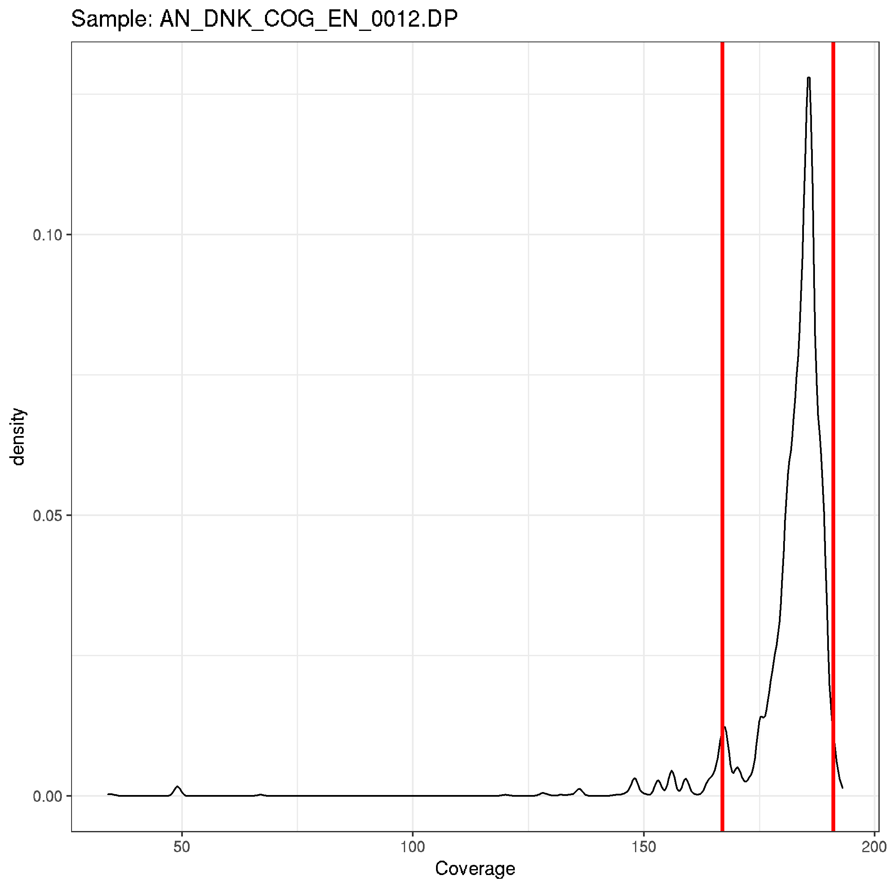


### Calculating MAD for admix plots
- Guillaume Salle used a MAD approach, calculating admixture for the population, leaving one chromosome out a time.
- Will try this, using scaffolds longer than 1 Mb to make it manageable.

- NOTE: I did not end up using the following code, hence hashed out, but I am keeping it for future reference

```bash
mkdir ~/lustre118_link/trichuris_trichiura/05_ANALYSIS/ADMIXTURE/VALIDATION

cat ../../01_REF/trichuris_trichiura.fa.fai | cut -f1 | grep -v "MITO" > chromosomes.list

# merge the data from individual chromosomes into a single dataset
while read CHROMOSOME; do
     cat $(ls -1 CHROMOSOMES_PL/*BEAGLE.PL | head -n1 | sed 's/CHROMOSOMES_PL\///g') | head -n1 > VALIDATION/no_${CHROMOSOME}.merged.validation.PL;
     cat CHROMOSOMES_PL/*BEAGLE.PL | grep -v "marker" | grep -v "${CHROMOSOME}" >> VALIDATION/no_${CHROMOSOME}.merged.validation.PL;
done < chromosomes.list

# run admixture for multiple values of K

while read CHROMOSOME; do
     for i in 2 3 4 5 6 7 8 9 10; do
     bsub.py --threads 4 2 NGS_admix_multiK "NGSadmix -likes VALIDATION/no_${CHROMOSOME}.merged.validation.PL -K ${i} -P 4 -o VALIDATION/no_${CHROMOSOME}_k_${i}_out -minMaf 0.05" ;
     done;
done  < chromosomes.list

# remove unneeded files
rm *log *gz
```

```R
library(tidyverse)

rep="./"
prefix="no"
k=seq(2,10,1)
chrl=c('Trichuris_trichiura_3_004','Trichuris_trichiura_1_001','Trichuris_trichiura_3_001','Trichuris_trichiura_3_002','Trichuris_trichiura_1_002','Trichuris_trichiura_3_003','Trichuris_trichiura_1_003','Trichuris_trichiura_00_001','Trichuris_trichiura_1_004','Trichuris_trichiura_1_005','Trichuris_trichiura_3_004')
cv1 = array(-1,length(k))
cv2 = array(-1,length(k))
for(K in k){
  for(chr in chrl){
    infile=paste(rep,prefix,"_",chr,"_k_",K,"_out.qopt",sep="")

    # Admixture
    assign(paste0('admix.',chr),t(as.matrix(read.table(infile))))
  }
  # Med absolute deviation
  cv1[K-1] <- mad(c(admix.Trichuris_trichiura_3_004,admix.Trichuris_trichiura_1_001,admix.Trichuris_trichiura_3_001,admix.Trichuris_trichiura_3_002,admix.Trichuris_trichiura_1_002,admix.Trichuris_trichiura_3_003,admix.Trichuris_trichiura_1_003,admix.Trichuris_trichiura_00_001,admix.Trichuris_trichiura_1_004,admix.Trichuris_trichiura_1_005,admix.Trichuris_trichiura_3_004))
  # Jackniffing variance
  cv2[K-1] <- var(c(admix.Trichuris_trichiura_3_004,admix.Trichuris_trichiura_1_001,admix.Trichuris_trichiura_3_001,admix.Trichuris_trichiura_3_002,admix.Trichuris_trichiura_1_002,admix.Trichuris_trichiura_3_003,admix.Trichuris_trichiura_1_003,admix.Trichuris_trichiura_00_001,admix.Trichuris_trichiura_1_004,admix.Trichuris_trichiura_1_005,admix.Trichuris_trichiura_3_004))
  rm(admix.GW_ld.CV1,admix.GW_ld.CV2,admix.GW_ld.CV3,admix.GW_ld.CV4,admix.GW_ld.CV5)
}
```
- ran Guillaumes approach dropping on chromosome at a time, which was ok.
- also reran to generate using different seeds on whole data, and so this is the code to generate the MAD on those data
```R
rep="./"
k=seq(2,10,1)
s=seq(1,5,1)
cv1 = array(-1,length(k))
cv2 = array(-1,length(k))
for(K in k){
  for(S in s){
    infile=paste(rep,"k_",K,"_s_",S,"_out.qopt",sep="")

    # Admixture
    assign(paste0('admix.',S),t(as.matrix(read.table(infile))))
  }
  # Med absolute deviation
  cv1[K-1] <- mad(c(admix.1,admix.2,admix.3,admix.4,admix.5))
  # Jackniffing variance
}

# make a plot
ggplot() +
     geom_point(aes(k,log10(cv1))) +
     geom_line(aes(k,log10(cv1))) +
     theme_bw() +
     labs(x = "Ancestral populations (k)", y = "Median absolute deviation")

# save it     
ggsave("plot_admixture_validation_MAD.png")
ggsave("plot_admixture_validation_MAD.pdf", height = 5, width = 5, useDingbats=FALSE)

```

```
