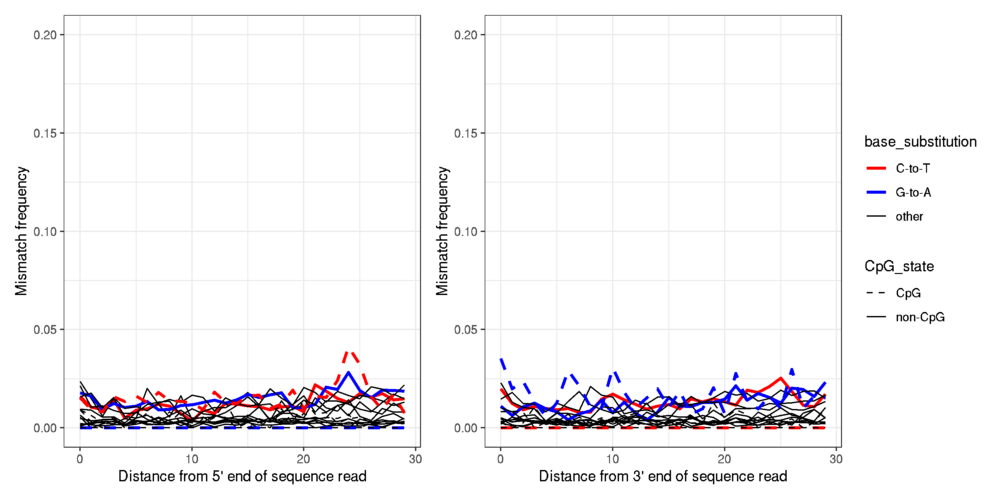
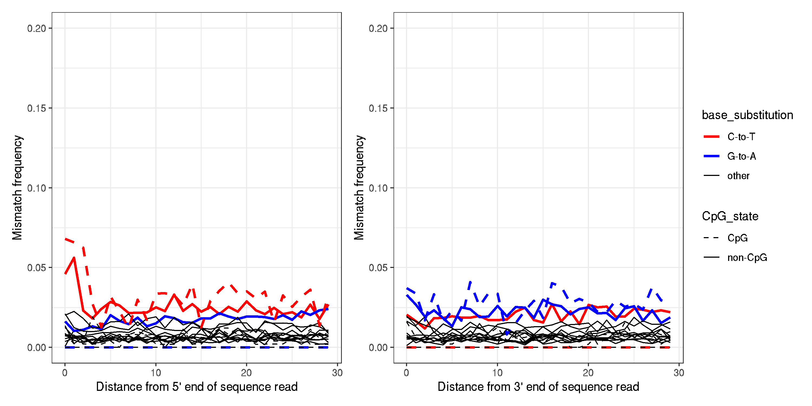
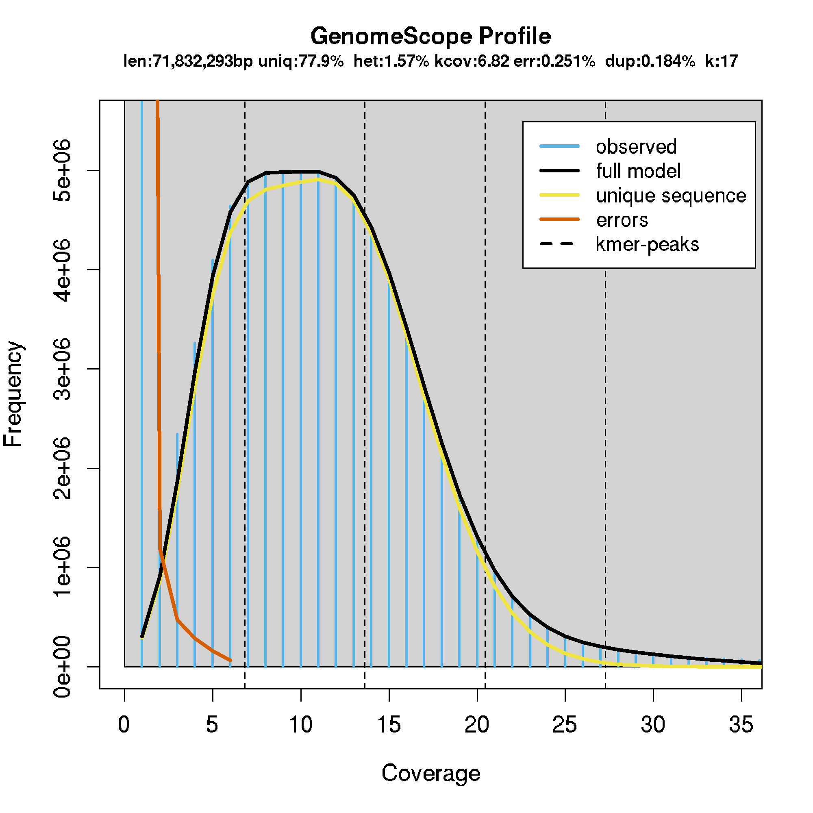
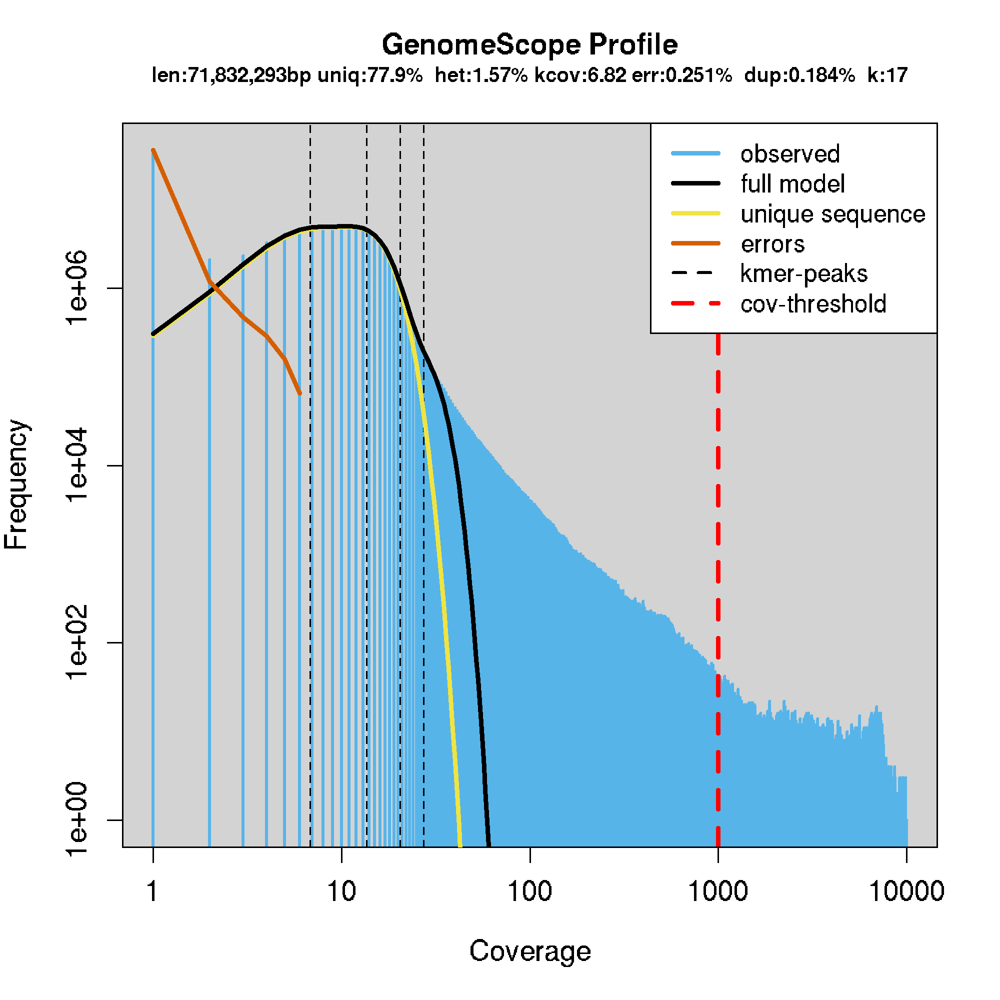
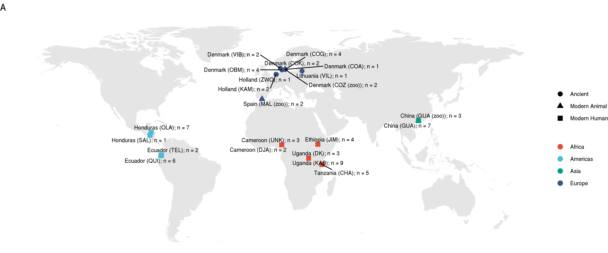
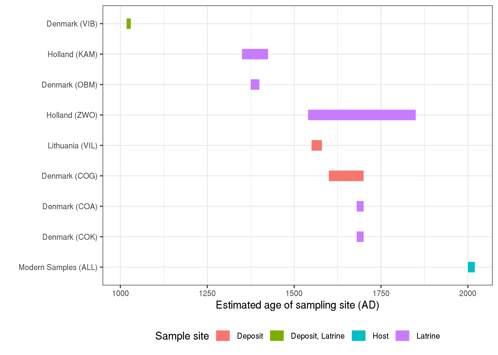
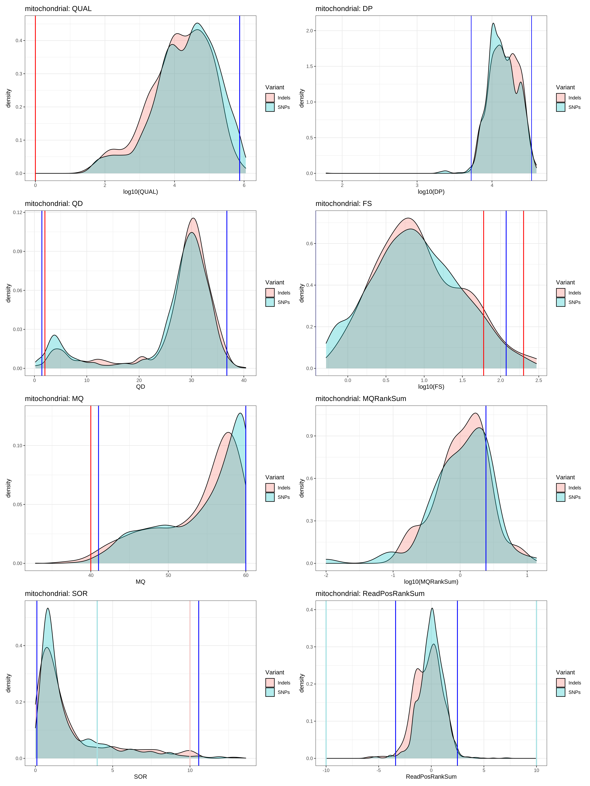
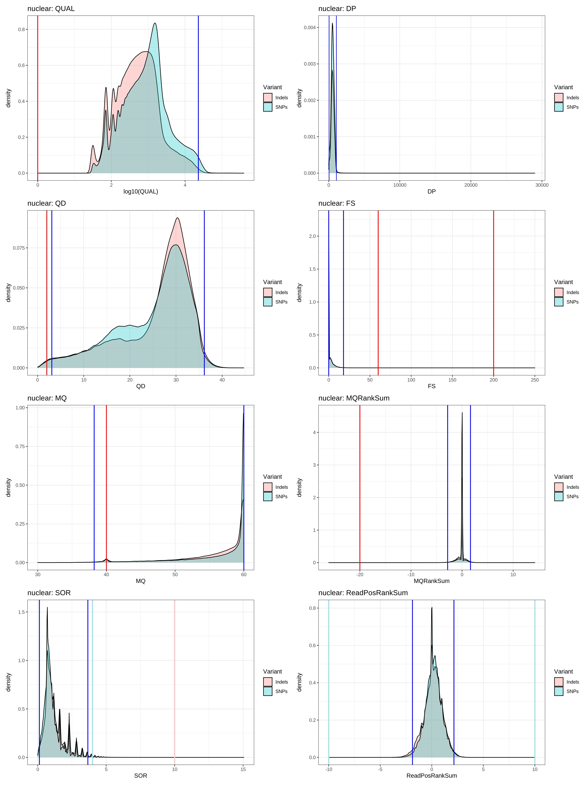
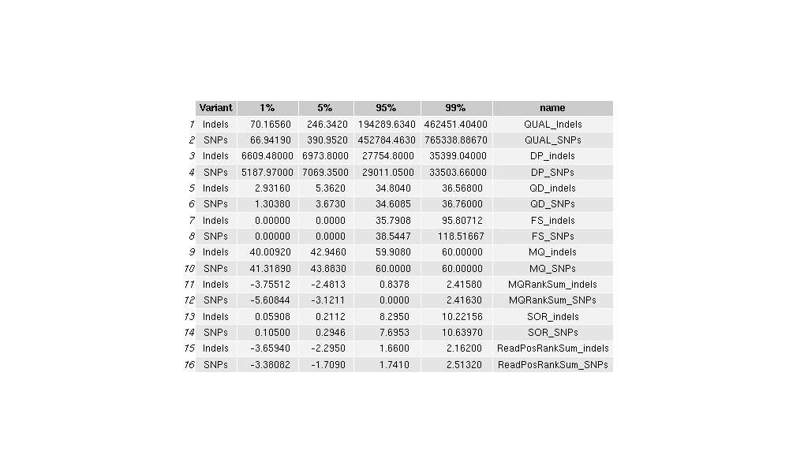
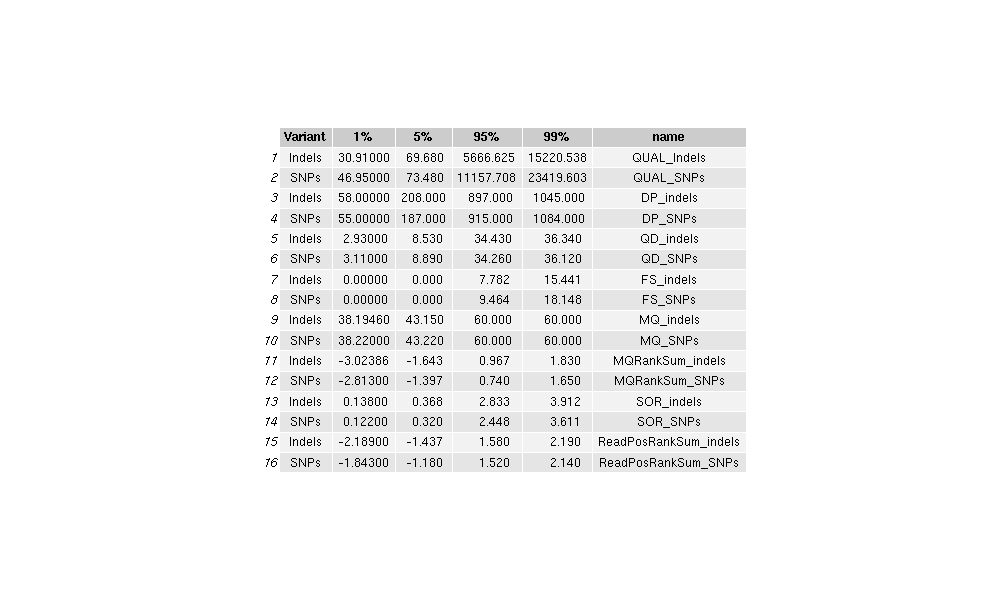

# Population genomics of modern and ancient Trichuris trichiura

## Contents

1. Background
2. Reference
3. Processing raw reads
     - trimming
4. mapping
     - kraken check of raw reads post mapping
     - deamination damage
     - trim bams to correct for damage
5. Variant calling
     - Step 1
     - Step 2
     - Step 3


***
## Background


### Sampling (from martins slides - need to check this against samples i have)
- Modern genomes  from human hosts (49)
     - Human worm isolates (35)
          - Uganda (12), China (7), Ecuador (8), Honduras (8)
     - Human egg isolates (14)
          - Cameroon (5), Ethiopia (4), Tanzania (5)

- Modern genomes  from non-human hosts (7)
     - Worm isolates (7)
          - Baboon – Denmark (2), Colobus - Spain (2), Leaf-Monkey – China (3)

- Ancient samples (19 samples from 10 sites)
     - 4-500 BC: Qala’at al-Bahrain (1) –  in analysis - **can't find this data**
     - 300 BC: Tollundmanden, DK (1) – in analysis - **can't find this data**
     - 1000 AD: Viborg, DK (2) – 2x Mito + 0,01x/0,16x NG
     - 1350 AD : Kampen, Netherlands (2) – 2x Mito + 1,8x/4,7x NG - yes
     - 1350-1400 AD: Odense, DK (4) – in analysis - yes
     - 1500-1600 AD: Zwolle, Netherlands (1) – Mito + 2,3x NG - yes
     - 1550-1580 AD: Vilnius, Lithuania (1) – in analysis - yes
     - 1600-1800 AD: Gl. Strand, CPH, DK (4) – in analysis - yes
     - 1680 AD: Kultorvet, CPH, DK (2) – in analysis - yes
     - 1700 AD: Adelgade, CPH, DK (1) – in analysis - yes


### Overarching questions
- describe new genome?
     - basic assembly stats
- global population structure
     - worldmap
     - PCA (nuclear / mtDNA)
     - structure
     - dispersal - MSMC (difference in popn size between human and animals?)
- admixture
     - from ancient to modern
     - from humans to animals
          - treemix / admixture / D-statistics
- genome-wide diversity
     - similar to oncho popgen paper
          - nucleotide diversity (https://www.ncbi.nlm.nih.gov/pmc/articles/PMC5512550/; Fig2)
               - human vs animals (nucleotide div, Tajimas D)
               - Fst (human vs animal)
               - Fst (two clades of human Tt)

- evidence of selection around beta-tubulin?
     - might apply to some modern samples


### Downstream analyses
- relatedness
     - PCA https://speciationgenomics.github.io/pca/
          - whole genomes modern
          - mtDNA genomes all
     - faststructure
- admixture
     - treemix
          - tutorial: https://speciationgenomics.github.io/Treemix/
     - admixtools https://github.com/uqrmaie1/admixtools
          - D statistics
- population history
     - MSMC / SMC++ (https://github.com/popgenmethods/smcpp)
- genome-wide patterns of genetic diversity
     - Pi
     - Tajimas D
     - Fst


***
## working directory
```bash
cd /nfs/users/nfs_s/sd21/lustre118_link/trichuris_trichiura
WORKING_DIR=/nfs/users/nfs_s/sd21/lustre118_link/trichuris_trichiura

```


## Project setup
```shell
mkdir 00_SCRIPTS 01_REF 02_RAW 03_MAPPING
```
---

## Reference
- the reference is the unpublished Trichuris trichiura assembly
- genome stats
     - sum = 80573711, n = 113, ave = 713041.69, largest = 29164577
     - N50 = 11299416, n = 2
     - N60 = 9167782, n = 3
     - N70 = 5100676, n = 5
     - N80 = 2017282, n = 7
     - N90 = 643749, n = 14
     - N100 = 1808, n = 113
     - N_count = 250000
     - Gaps = 25

```shell
cd /nfs/users/nfs_s/sd21/lustre118_link/trichuris_trichiura/01_REF

# make a generic bwa index for mapping later on
bwa index trichuris_trichiura.fa

# make a generic dict file for SNP calling later on
samtools dict trichuris_trichiura.fa > trichuris_trichiura.dict
```
---

## get the raw data
- I received the raw sequnecing data from Peter on a hard drive, and copied all to the lustre environment as is into the directory 02_RAW
- want to collect all of the fastq files into one place, and then begin processing them

```shell
cd ${WORKING_DIR}/02_RAW

for i in *gz; do echo ${i%_???.fastq.gz}; done | sort | uniq  |  while read NAME; do cat ${NAME}* > ${NAME}.merged.fastq.gz; done &

# sample used in the Foth 2014 genome paper
pf data --type lane --id 6929_8 -l ./ --filetype fastq

```
- this generated a total of 130 R1 files and 60 R2 files
- the difference in number reflects the fact that the "modern" samples have been sequenced using PE reads whereas the "ancient" samples have been sequenced using SE reads. Will need to treat these a little differently later on.
- there is also a difference in the number of samples with useable data (based on some sample informaiton spreadsheets from MS / PJ), and the total number
     - some samples are controls
     - some samples presumably didnt work, and so we excluded from the preliminary analyses
     - some samples are duplicates, and so will need to be merged at some point too.
---

## metadata
- I have begun to curate the metadata, to get a better idea of what data is actually available, and to ensure that I have consistent informaiton for all samples.
- The existing naming scheme is not very informative to me at least, and so will rename everything with a simple format
- GoogleSheet:  https://docs.google.com/spreadsheets/d/1PiapiaZZw0g0i3lN0feXxqEVupvaAuOm0IViXnZPFqk/edit?usp=sharing

---
## trimming
- trimming using AdapterRemoval, which seems to be used for a few different ancient DNA projects. I think it is because it trims and merges, which generally improves the mapping scores off some poor qual end of reads.
- Tool: https://buildmedia.readthedocs.org/media/pdf/adapterremoval/latest/adapterremoval.pdf

```bash
cd ${WORKING_DIR}/02_RAW

### run the trimming
```shell
# main samples
while read OLD_NAME NEW_NAME; do bsub.py --threads 4 20 adapter_remove_modern "${WORKING_DIR}/00_SCRIPTS/run_adapter_remove_PE.sh ${OLD_NAME} ${NEW_NAME}"; done < ${WORKING_DIR}/modern.sample_list
while read OLD_NAME NEW_NAME; do bsub.py --threads 4 20 adapter_remove_ancient "${WORKING_DIR}/00_SCRIPTS/run_adapter_remove_SE.sh ${OLD_NAME} ${NEW_NAME}"; done < ${WORKING_DIR}/ancient.sample_list

# other samples
while read OLD_NAME NEW_NAME; do bsub.py --threads 4 20 adapter_remove_others_PE "${WORKING_DIR}/00_SCRIPTS/run_adapter_remove_PE.sh ${OLD_NAME} ${NEW_NAME}"; done < ${WORKING_DIR}/others_PE.sample_list
while read OLD_NAME NEW_NAME; do bsub.py --threads 4 20 adapter_remove_others_SE "${WORKING_DIR}/00_SCRIPTS/run_adapter_remove_SE.sh ${OLD_NAME} ${NEW_NAME}"; done < ${WORKING_DIR}/others_SE.sample_list

```
where "run_adapter_remove_PE.sh" is:
```bash
#!/bin/bash
# adaptor remove PE - modern samples
OLD_NAME=${1}
NEW_NAME=${2}

/nfs/users/nfs_s/sd21/lustre118_link/software/ANCIENT/adapterremoval/bin/AdapterRemoval \
--file1 ${OLD_NAME}_R1.merged.fastq.gz \
--file2 ${OLD_NAME}_R2.merged.fastq.gz \
--basename ${NEW_NAME}_PE \
--trimns --trimqualities --collapse --threads 4

```

and where "run_adapter_remove_SE.sh" is:
```bash
#!/bin/bash
# single end - ancient samples
OLD_NAME=${1}
NEW_NAME=${2}

/nfs/users/nfs_s/sd21/lustre118_link/software/ANCIENT/adapterremoval/bin/AdapterRemoval \
--file1 ${OLD_NAME}_R1.merged.fastq.gz \
--basename ${NEW_NAME}_SE \
--trimns --trimqualities --threads 4
```


### FIX: merge duplicate ancient read sets
These seem to have been a single sample, extracted twice (or in two ways, perhaps two washes of a column) and sequenced individually. Given the low coverage, these should be merged (I think).
```bash
# merge the duplicated set, renaming with a unique name that refers to both the originals, and then remove the originals
cat AN_DNK_COG_EN_001_SE.truncated AN_DNK_COG_EN_002_SE.truncated > AN_DNK_COG_EN_0012_SE.truncated; rm AN_DNK_COG_EN_001_SE.truncated AN_DNK_COG_EN_002_SE.truncated
cat AN_DNK_COG_EN_003_SE.truncated AN_DNK_COG_EN_004_SE.truncated > AN_DNK_COG_EN_0034_SE.truncated; rm AN_DNK_COG_EN_003_SE.truncated AN_DNK_COG_EN_004_SE.truncated
cat AN_DNK_COG_EN_005_SE.truncated AN_DNK_COG_EN_006_SE.truncated > AN_DNK_COG_EN_0056_SE.truncated; rm AN_DNK_COG_EN_005_SE.truncated AN_DNK_COG_EN_006_SE.truncated
cat AN_DNK_COG_EN_007_SE.truncated AN_DNK_COG_EN_008_SE.truncated > AN_DNK_COG_EN_0078_SE.truncated; rm AN_DNK_COG_EN_007_SE.truncated AN_DNK_COG_EN_008_SE.truncated
cat AN_DNK_COK_EN_001_SE.truncated AN_DNK_COK_EN_002_SE.truncated > AN_DNK_COK_EN_0012_SE.truncated; rm AN_DNK_COK_EN_001_SE.truncated AN_DNK_COK_EN_002_SE.truncated
cat AN_DNK_COK_EN_003_SE.truncated AN_DNK_COK_EN_004_SE.truncated > AN_DNK_COK_EN_0034_SE.truncated; rm AN_DNK_COK_EN_003_SE.truncated AN_DNK_COK_EN_004_SE.truncated
cat AN_DNK_OBM_EN_001_SE.truncated AN_DNK_OBM_EN_002_SE.truncated > AN_DNK_OBM_EN_0012_SE.truncated; rm AN_DNK_OBM_EN_001_SE.truncated AN_DNK_OBM_EN_002_SE.truncated
cat AN_DNK_OBM_EN_003_SE.truncated AN_DNK_OBM_EN_004_SE.truncated > AN_DNK_OBM_EN_0034_SE.truncated; rm AN_DNK_OBM_EN_003_SE.truncated AN_DNK_OBM_EN_004_SE.truncated
cat AN_DNK_OBM_EN_005_SE.truncated AN_DNK_OBM_EN_006_SE.truncated > AN_DNK_OBM_EN_0056_SE.truncated; rm AN_DNK_OBM_EN_005_SE.truncated AN_DNK_OBM_EN_006_SE.truncated
cat AN_DNK_OBM_EN_007_SE.truncated AN_DNK_OBM_EN_008_SE.truncated > AN_DNK_OBM_EN_0078_SE.truncated; rm AN_DNK_OBM_EN_007_SE.truncated AN_DNK_OBM_EN_008_SE.truncated
cat AN_DNK_OBM_EN_009_SE.truncated AN_DNK_OBM_EN_010_SE.truncated > AN_DNK_OBM_EN_0910_SE.truncated; rm AN_DNK_OBM_EN_009_SE.truncated AN_DNK_OBM_EN_010_SE.truncated
cat AN_LTU_VIL_EN_001_SE.truncated AN_LTU_VIL_EN_002_SE.truncated > AN_LTU_VIL_EN_0012_SE.truncated; rm AN_LTU_VIL_EN_001_SE.truncated AN_LTU_VIL_EN_002_SE.truncated
cat AN_NLD_KAM_EN_001_SE.truncated AN_NLD_KAM_EN_002_SE.truncated > AN_NLD_KAM_EN_0012_SE.truncated; rm AN_NLD_KAM_EN_001_SE.truncated AN_NLD_KAM_EN_002_SE.truncated
cat AN_NLD_KAM_EN_003_SE.truncated AN_NLD_KAM_EN_004_SE.truncated > AN_NLD_KAM_EN_0034_SE.truncated; rm AN_NLD_KAM_EN_003_SE.truncated AN_NLD_KAM_EN_004_SE.truncated
cat AN_NLD_ZWO_EN_001_SE.truncated AN_NLD_ZWO_NA_002_SE.truncated > AN_NLD_ZWO_EN_0012_SE.truncated; rm AN_NLD_ZWO_EN_001_SE.truncated AN_NLD_ZWO_NA_002_SE.truncated

# make a new sample list to work from using new names
ls -1 AN* | cut -c-18 > ../ancient.sample_list_v2
```

### FIX: additional samples to include
```bash

# found some additional samples I had not initially included - they were misclassified in the "other", so correcting them and add to the "ancient.sample_list_v2"
mv OTHER_MSOE43_027_SE.truncated AN_DNK_VIB_EN_001_SE.truncated
mv OTHER_MSOE44_028_SE.truncated AN_DNK_VIB_EN_002_SE.truncated
mv OTHER_MSOE45_029_SE.truncated AN_DNK_VIB_EN_003_SE.truncated
mv OTHER_MSOE46B_030_SE.truncated AN_DNK_VIB_EN_004_SE.truncated
mv OTHER_MSOE46C_031_SE.truncated AN_DNK_VIB_EN_005_SE.truncated

cat AN_DNK_VIB_EN_001_SE.truncated AN_DNK_VIB_EN_002_SE.truncated > AN_DNK_VIB_EN_0012_SE.truncated; rm AN_DNK_VIB_EN_001_SE.truncated AN_DNK_VIB_EN_002_SE.truncated
cat AN_DNK_VIB_EN_003_SE.truncated AN_DNK_VIB_EN_004_SE.truncated AN_DNK_VIB_EN_005_SE.truncated > AN_DNK_VIB_EN_345_SE.truncated; rm AN_DNK_VIB_EN_003_SE.truncated AN_DNK_VIB_EN_004_SE.truncated AN_DNK_VIB_EN_005_SE.truncated

ls -1 AN_DNK_VIB_EN_0012_SE.truncated AN_DNK_VIB_EN_345_SE.truncated | cut -c-18 > ../ancient.sample_list_v2
```


```bash
# clean up
rm *discarded *settings

```


---


## mapping
Need to map them a little differently. Below are two mapping scripts for each approach.

### script for mapping the ancient samples - these are all single end (SE) reads
```shell
#!/bin/bash
# map SE reads
OLD_NAME=${1}
NEW_NAME=${2}

# map the SE reads
bwa mem -t 4 -R $(echo "@RG\tRG:${NEW_NAME}\tID:${NEW_NAME}\tSM:${NEW_NAME}") -Y -M ${WORKING_DIR}/01_REF/trichuris_trichiura.fa ${WORKING_DIR}/02_RAW/${NEW_NAME}_SE.truncated |\
     samtools view --threads 4 -b - |\
     samtools sort --threads 4 -o ${NEW_NAME}.tmp.sort.SE.bam - ;

# mark duplicate reads
java -Xmx20g -jar /nfs/users/nfs_s/sd21/lustre118_link/software/picard-tools-2.5.0/picard.jar MarkDuplicates INPUT=${NEW_NAME}.tmp.sort.SE.bam OUTPUT=${NEW_NAME}.tmp2.bam METRICS_FILE=${NEW_NAME}.tmp.metrics TMP_DIR=$PWD/${NEW_NAME}.tmp;

# generate mapping stats from unfilted bam
samtools flagstat ${NEW_NAME}.tmp2.bam > ${NEW_NAME}.flagstat;

# filter bam to only contain mapped reads
samtools view --threads 4 -F 4 -b -o ${NEW_NAME}.bam ${NEW_NAME}.tmp2.bam;

# index the filtered bam
samtools index -b ${NEW_NAME}.bam;

# clean up unnecessary tmp files
rm -r ${NEW_NAME}.*tmp*
```


### script for mapping modern samples - these are all paired-end (PE) reads
```shell
#!/bin/bash
# map PE reads
OLD_NAME=${1}
NEW_NAME=${2}

# map the PE reads
bwa mem -t 4 -R $(echo "@RG\tRG:${NEW_NAME}\tID:${NEW_NAME}\tSM:${NEW_NAME}") -Y -M ${WORKING_DIR}/01_REF/trichuris_trichiura.fa ${WORKING_DIR}/02_RAW/${NEW_NAME}_PE.pair1.truncated ${WORKING_DIR}/02_RAW/${NEW_NAME}_PE.pair2.truncated |\
     samtools view --threads 4 -b - |\
     samtools sort --threads 4 -o ${NEW_NAME}.tmp.sort.PE.bam - ;

#merge SE reads that are either merged PE reads, or singletons after adapter filtering
cat ${WORKING_DIR}/02_RAW/${NEW_NAME}_PE.singleton.truncated ${WORKING_DIR}/02_RAW/${NEW_NAME}_PE.collapsed.truncated ${WORKING_DIR}/02_RAW/${NEW_NAME}_PE.collapsed > ${NEW_NAME}_SE.tmp.fastq ;

# map SE reads
bwa mem -t 4 -R $(echo "@RG\tRG:${NEW_NAME}\tID:${NEW_NAME}\tSM:${NEW_NAME}") -Y -M ${WORKING_DIR}/01_REF/trichuris_trichiura.fa ${NEW_NAME}_SE.tmp.fastq | \
     samtools view --threads 4 -b - |\
     samtools sort --threads 4 -o ${NEW_NAME}.tmp.sort.SE.bam - ;

# merge PE and SE bams
samtools merge ${NEW_NAME}.tmp.bam ${NEW_NAME}.tmp.sort.PE.bam ${NEW_NAME}.tmp.sort.SE.bam;

# mark duplicate reads
java -Xmx20g -jar /nfs/users/nfs_s/sd21/lustre118_link/software/picard-tools-2.5.0/picard.jar MarkDuplicates INPUT=${NEW_NAME}.tmp.bam OUTPUT=${NEW_NAME}.tmp2.bam METRICS_FILE=${NEW_NAME}.tmp.metrics TMP_DIR=$PWD/${NEW_NAME}.tmp;

# generate mapping stats from unfilted bam
samtools flagstat ${NEW_NAME}.tmp2.bam > ${NEW_NAME}.flagstat;

# filter bam to only contain mapped reads
samtools view --threads 4 -F 4 -b -o ${NEW_NAME}.bam ${NEW_NAME}.tmp2.bam;

# index the filtered bam
samtools index -b ${NEW_NAME}.bam;

# clean up unnecessary tmp files
rm -r ${NEW_NAME}.*tmp*
```


```shell
cd ${WORKING_DIR}/03_MAPPING

# run the mapping jobs for modern and ancient samples
while read OLD_NAME NEW_NAME; do bsub.py --threads 4 20 mapping_modern "${WORKING_DIR}/00_SCRIPTS/run_map_modern_PE.sh ${OLD_NAME} ${NEW_NAME}" ; done < ${WORKING_DIR}/modern.sample_list
while read OLD_NAME NEW_NAME; do bsub.py --threads 4 20 mapping_otherPE "${WORKING_DIR}/00_SCRIPTS/run_map_modern_PE.sh ${OLD_NAME} ${NEW_NAME}" ; done < ${WORKING_DIR}/others_PE.sample_list

# run the mapping jobs for the control and other samples
#while read OLD_NAME NEW_NAME; do bsub.py --threads 4 20 mapping_ancient "${WORKING_DIR}/00_SCRIPTS/run_map_ancient_SE.sh ${OLD_NAME} ${NEW_NAME}" ; done < ${WORKING_DIR}/ancient.sample_list_v2
while read OLD_NAME NEW_NAME; do bsub.py --threads 4 20 mapping_otherSE "${WORKING_DIR}/00_SCRIPTS/run_map_ancient_SE.sh ${OLD_NAME} ${NEW_NAME}" ; done < ${WORKING_DIR}/others_SE.sample_list

mkdir MAPPED_OTHER
mv OTHER_M* MAPPED_OTHER

mkdir MAPPED_CONTROL
mv CONTROL_* MAPPED_CONTROL


# rerun of ancient samples due to name change
while read NEW_NAME; do bsub.py --threads 4 20 mapping_ancient "${WORKING_DIR}/00_SCRIPTS/run_map_ancient_SE.sh NULL ${NEW_NAME}" ; done < ${WORKING_DIR}/ancient.sample_list_v2


multiqc *flagstat --title mapping
```
[Mapping MultiQC report](../04_analysis/mapping_multiqc_report.html)


<!-- ```shell
# generate bamstats
for i in *.bam; do
     bsub.py --queue small --threads 4 2 stats "samtools stats -r ${WORKING_DIR}/01_REF/trichuris_trichiura.fa --threads 4 ${i} \> ${i}.stats" ; done
``` -->


### Kraken of trimmed reads post mapping
The mapping shows that there is variable mapping rates, and that for some samples there is very poor mapping. This is particularly the case for the ancient samples, which is to be expected to a degree, given they are both old and collected from the environment. Kraken might give some insight into this, given they might be heavily contaminated with bacteria etc.

```bash
module load kraken2/2.0.8_beta=pl526h6bb024c_0-c1

# run kraken on the modern PE trimmed reads
while read OLD_NAME NEW_NAME; do
     bsub.py 10 kraken2 "kraken2 --db /lustre/scratch118/infgen/pathogen/pathpipe/kraken/minikraken_20190423/minikraken2_v1_8GB \
     --report ${WORKING_DIR}/02_RAW/${NEW_NAME}.kraken2report \
     --paired ${WORKING_DIR}/02_RAW/${NEW_NAME}_PE.pair1.truncated \
     ${WORKING_DIR}/02_RAW/${NEW_NAME}_PE.pair2.truncated";
done < ${WORKING_DIR}/modern.sample_list

# run kraken on the ancient SE trimmed reads
# while read OLD_NAME NEW_NAME; do
#      bsub.py 10 kraken2_SE "kraken2 --db /lustre/scratch118/infgen/pathogen/pathpipe/kraken/minikraken_20190423/minikraken2_v1_8GB
#      --report ${WORKING_DIR}/02_RAW/${NEW_NAME}.kraken2report
#      ${WORKING_DIR}/02_RAW/${NEW_NAME}_SE.truncated";
# done < ${WORKING_DIR}/ancient.sample_list

while read NEW_NAME; do
     bsub.py 5 kraken2_SE "kraken2 --db /lustre/scratch118/infgen/pathogen/pathpipe/kraken/minikraken_20190423/minikraken2_v1_8GB \
     --report ${WORKING_DIR}/02_RAW/${NEW_NAME}.kraken2report \
     ${WORKING_DIR}/02_RAW/${NEW_NAME}_SE.truncated";
done < ${WORKING_DIR}/ancient.sample_list_v2

# once the kraken runs have completed, run multiqc .
multiqc *kraken2report --title kraken
```
[Kraken MultiQC report](../04_analysis/kraken_multiqc_report.html)
- the output shows most samples have a small degree of contamination based on hits in the kraken database
- non have a lot of contamination, which is slightly surprising
- this alone doesnt explain the mismapping, althoguh, it simply may mean that the putative contaminant is not present in the kraken databased
- could try
     - blasting some sequences
     - mapping to other reference - are there other nematodes in these environmental ancient samples?


## Damage
```bash
# To view deamination-derived damage patterns in a simple table, without separating CpG sites
#samtools view AN_DNK_COG_EN_002.bam | python pmdtools.0.60.py --deamination

mkdir ${WORKING_DIR}/03_MAPPING/DEAMINATION

# modern samples
while read -r OLD_NAME NEW_NAME; do
# To compute deamination-derived damage patterns separating CpG and non-CpG sites
samtools view ${NEW_NAME}.bam | head -n 10000 | pmdtools --platypus --requirebaseq 30 > PMD_temp.txt ;

R CMD BATCH ${WORKING_DIR}/00_SCRIPTS/plotPMD.R ;

mv deamination_plot.png ${WORKING_DIR}/03_MAPPING/DEAMINATION/${NEW_NAME}.deamination_plot.png ; done < ${WORKING_DIR}/modern.sample_list

# ancient samples
while read -r NEW_NAME; do
# To compute deamination-derived damage patterns separating CpG and non-CpG sites
samtools view ${NEW_NAME}.bam | head -n 10000 | pmdtools --platypus --requirebaseq 30 > PMD_temp.txt ;

R CMD BATCH ${WORKING_DIR}/00_SCRIPTS/plotPMD.R ;

mv deamination_plot.png ${WORKING_DIR}/03_MAPPING/DEAMINATION/${NEW_NAME}.deamination_plot.png ; done < ancient.sample_list_v2


# once finished, move all the plots into a new directory
mkdir ${WORKING_DIR}/04_ANALYSES/deamination && mv ${WORKING_DIR}/03_MAPPING/*deamination_plot.png ${WORKING_DIR}/04_ANALYSES/deamination
```

where "plotPMD.R" is:
```R
# script to make deamination frequency plots from PMD data

# load libraries
require(reshape2)
require(patchwork)
require(ggplot2)
require(dplyr)
require(tidyverse)

# read data from PMD, example "samtools view AN_DNK_COG_EN_002.bam | head -n 100000 | pmdtools --platypus --requirebaseq 30 > PMD_temp.txt"
data <- read.table("PMD_temp.txt", header=T)

data2 <- melt(data,id.vars="z")

# split into 5' and 3' datasets, and add some variables for plotting
data_5 <- data2 %>%
     filter(str_detect(variable, "5")) %>%
     mutate(base_substitution = if_else(str_detect(variable,"GA"), "G-to-A", if_else(str_detect(variable,"CT"), "C-to-T", "other"))) %>%
     mutate(CpG_state = if_else(str_detect(variable,"CpG"), "CpG", "non-CpG"))

data_3 <- data2 %>%
     filter(str_detect(variable, "3")) %>%
     mutate(base_substitution = if_else(str_detect(variable,"GA"), "G-to-A", if_else(str_detect(variable,"CT"), "C-to-T", "other"))) %>%
     mutate(CpG_state = if_else(str_detect(variable,"CpG"), "CpG", "non-CpG"))

# make plots
plot_5 <- ggplot(data_5, aes(z, value, colour = base_substitution, group = variable, linetype = CpG_state, size = base_substitution)) +
     geom_line() +
     ylim(0, 0.2) +
     theme_bw() +
     scale_colour_manual(values = c("other" = "black", "C-to-T" = "red" , "G-to-A" = "blue"))+
     scale_size_manual(values=c("other" = 0.5, "C-to-T" = 1 , "G-to-A" = 1))+
     scale_linetype_manual(values = c("CpG" = "dashed", "non-CpG" = "solid")) +
     labs(x="Distance from 5' end of sequence read", y="Mismatch frequency")

plot_3 <- ggplot(data_3, aes(z, value, colour = base_substitution, group = variable, linetype = CpG_state, size = base_substitution)) +
     geom_line() +
     ylim(0, 0.2) +
     theme_bw() +
     scale_colour_manual(values = c("other" = "black", "C-to-T" = "red" , "G-to-A" = "blue"))+
     scale_size_manual(values=c("other" = 0.5, "C-to-T" = 1 , "G-to-A" = 1))+
     scale_linetype_manual(values = c("CpG" = "dashed", "non-CpG" = "solid")) +
     labs(x="Distance from 3' end of sequence read", y="Mismatch frequency")

# bring it together
plot_5 + plot_3 + plot_layout(guides = "collect")

# save it
ggsave("deamination_plot.png", height=5, width=10)

```

- Example of a modern sample (MN_CHN_GUA_HS_001)

- Example of a ancient sample (AN_DNK_COG_EN_002)  


- clearly a CT bias in the first two bases of the ancient sample, that doesnt seem to be present in the modern sample
     - not present in all samples I dont think, but in quite a few that I have checked.
- simplest solution is to remove the first two bases from all reads before moving forward


### trim bases from reads in bam
Using "bamUtils trimBam" to remove the 5' and 3' 2 bp from mapped reads
```bash
# trim modern samples
while read -r OLD_NAME NEW_NAME; do
     bsub.py 5 --threads 4 trim_bams "${WORKING_DIR}/00_SCRIPTS/run_trimreads_in_bam.sh ${NEW_NAME}";
done < ${WORKING_DIR}/modern.sample_list

# trim ancient samples
while read -r NEW_NAME; do
     bsub.py 5 --threads 4 trim_bams "${WORKING_DIR}/00_SCRIPTS/run_trimreads_in_bam.sh ${NEW_NAME}";
done < ${WORKING_DIR}/ancient.sample_list_v2


# once done, clean up
rm *[0-9].bam*
```

where "run_trimreads_in_bam.sh" is:
```
#!/bin/bash

# trim left and right bases from reads in a bam.

NAME=${1}

bamutils_clip_left=2
bamutils_clip_right=2

bamUtils trimBam ${NAME}.bam ${NAME}.tmp.bam -L ${bamutils_clip_left} -R ${bamutils_clip_right}
samtools sort -@ 4 ${NAME}.tmp.bam -o ${NAME}.trimmed.bam
samtools index ${NAME}.trimmed.bam
rm ${NAME}.tmp.bam

```

### Genome coverage
```bash
# run coverage stats
bsub.py --queue long 5 cov "~sd21/bash_scripts/run_cov_stats 100000"

# extract mtDNA and nuclear (mean & stddev) data
for i in *trimmed.chr.cov; do
     name=${i%.trimmed.chr.cov};
     nuc=$(grep -v "MITO" ${i%.trimmed.chr.cov}.100000_window.cov | datamash mean 5 sstdev 5 );
     mtDNA=$(grep "MITO" ${i} | cut -f5 );
     echo -e "${name}\t${nuc}\t${mtDNA}";
done > nuc_mtDNA_coverage.stat

```
where "run_cov_stats" is:
```bash
##########################################################################################
# run_cov_stats
##########################################################################################

# Usage: ~sd21/bash_scripts/run_cov_stats < window size >

module load bamtools/2.5.1--he860b03_5

WINDOW=$1

for i in *.bam
do

bamtools header -in ${i} | grep "^@SQ" | awk -F'[:\t]' '{printf $3"\t"1"\t"$5"\n"}' OFS="\t" > ${i%.bam}.chr.bed
bamtools header -in ${i} | grep "^@SQ" | awk -F'[:\t]' '{printf $3"\t"$5"\n"}' OFS="\t" > ${i%.bam}.chr.genome

bedtools makewindows -g ${i%.bam}.chr.genome -w ${WINDOW} > ${i%.bam}.${WINDOW}_window.bed

samtools bedcov -Q 20 ${i%.bam}.chr.bed ${i} | awk -F'\t' '{printf $1"\t"$2"\t"$3"\t"$4"\t"$4/($3-$2)"\n"}' OFS="\t" > ${i%.bam}.chr.cov
samtools bedcov -Q 20 ${i%.bam}.${WINDOW}_window.bed ${i} | awk -F'\t' '{printf $1"\t"$2"\t"$3"\t"$4"\t"$4/($3-$2)"\n"}' OFS="\t" > ${i%.bam}.${WINDOW}_window.cov

rm ${i%.bam}.chr.bed ${i%.bam}.${WINDOW}_window.bed ${i%.bam}.chr.genome

done

for i in *.chr.cov; do printf "${i}\n" > ${i}.tmp | awk '{print $5}' OFS="\t" ${i} >> ${i}.tmp; done
paste *.tmp > coverage_stats.summary
rm *.tmp
```

- this data will go into a supplementary table


## SNP calling
- Using GATK haplotypecaller to call SNPs
- First pass QC: --min-base-quality-score 20 --minimum-mapping-quality 30
- scripts below split jobs by sample and by sequence, generating GVCFs, and then once done, merging them back together again. It does this by generating small jobs submitted in arrays to perform tasks in parallel, greatly speeding up the overall job time.


### Genome scope
Using genomescope to estimate heterozygosity from a couple of samples which can be used as an input to GATK genotyping
```bash
WORKING_DIR=/nfs/users/nfs_s/sd21/lustre118_link/trichuris_trichiura

mkdir ${WORKING_DIR}/02_RAW/GENOMESCOPE
cd  ${WORKING_DIR}/02_RAW/GENOMESCOPE


jellyfish=/nfs/users/nfs_s/sd21/lustre118_link/software/COMPARATIVE_GENOMICS/jellyfish-2.2.6/bin/jellyfish
export LD_LIBRARY_PATH=${LD_LIBRARY_PATH}:/nfs/users/nfs_s/sd21/lustre118_link/software/COMPARATIVE_GENOMICS/jellyfish-2.2.6/lib
genomescope=/nfs/users/nfs_s/sd21/lustre118_link/software/COMPARATIVE_GENOMICS/genomescope/genomescope.R

echo -e "
export LD_LIBRARY_PATH=${LD_LIBRARY_PATH}:/nfs/users/nfs_s/sd21/lustre118_link/software/COMPARATIVE_GENOMICS/jellyfish-2.2.6/lib" > run_jellyfish2genomescope

while read OLD_NAME NEW_NAME; do
     echo -e "
     # run jellyfish to count kmers
     ${jellyfish} count -C -m 17 -s 1000000000 -t 10 ${WORKING_DIR}/02_RAW/${NEW_NAME}_PE.pair*.truncated -o ${NEW_NAME}.jellyfish.kmercount; \\
     # run jellyfish to make a histogram of kmers for input to genomescope
     ${jellyfish} histo -t 10 ${NEW_NAME}.jellyfish.kmercount > ${NEW_NAME}.jellyfish.histo;
     # run genomescope
     Rscript ${genomescope} ${NEW_NAME}.jellyfish.histo 17 100 ${NEW_NAME}.genomescope_out 1000" >> run_jellyfish2genomescope
done < ${WORKING_DIR}/modern.sample_list

chmod a+x run_jellyfish2genomescope

bsub.py --queue long --threads 10 20 jellyfish "./run_jellyfish2genomescope"

```
- once completed, opened histo files in genomescope (http://qb.cshl.edu/genomescope/)
- generally, the sequencing coverage was too low for this to work well. For most samples, the model failed to converge. However, some did work, shown below.
- heterozygosities:
     - MN_UGA_DK_HS_001: 0.0157
          - Model converged het:0.0157 kcov:6.82 err:0.00251 model fit:0.184 len:71832293
     - MN_UGA_KAB_HS_001:  0.0229
          - Model converged het:0.0229 kcov:7.33 err:0.00403 model fit:0.442 len:71863652
     - MN_UGA_KAB_HS_006: 0.0175
          - Model converged het:0.0175 kcov:8.87 err:0.0138 model fit:0.431 len:77034118
- GATK uses a heterozygosity default of 0.001, which is at least 10-fold lower than data here. Worth changing.

eg.




### GATK

```bash
# working dir
WORKING_DIR=/nfs/users/nfs_s/sd21/lustre118_link/trichuris_trichiura

# load gatk
module load gatk/4.1.4.1

# also need htslib for tabix
module load common-apps/htslib/1.9.229
```
### Step 1. make GVCFs per sample
```bash

mkdir ${WORKING_DIR}/04_VARIANTS/GVCFS
cd ${WORKING_DIR}/04_VARIANTS/GVCFS

# create bam list using full path to bams - this allows bams to be anywhere
ls ${WORKING_DIR}/03_MAPPING/*.trimmed.bam > ${WORKING_DIR}/04_VARIANTS/bam.list_new

#new bams
#   ls ${WORKING_DIR}/03_MAPPING/AN_DNK_VIB_EN_0012.trimmed.bam ${WORKING_DIR}/03_MAPPING/AN_DNK_VIB_EN_345.trimmed.bam > ${WORKING_DIR}/04_VARIANTS/bam.list_new
#  ls ${WORKING_DIR}/03_MAPPING/AN_DNK_COA_EN_012.trimmed.bam  > ${WORKING_DIR}/04_VARIANTS/bam.list_new

BAM_LIST=${WORKING_DIR}/04_VARIANTS/bam.list

# rerun with new bams
#BAM_LIST=${WORKING_DIR}/04_VARIANTS/bam.list_new

REFERENCE=${WORKING_DIR}/01_REF/trichuris_trichiura.fa

# make a sequences list to allow splitting jobs per scaffold/contig
grep ">" ${WORKING_DIR}/01_REF/trichuris_trichiura.fa | sed -e 's/>//g' > ${WORKING_DIR}/04_VARIANTS/sequences.list

ulimit -c unlimited

# make jobs
while read BAM; do \
	n=1
	SAMPLE=$( echo ${BAM} | awk -F '/' '{print $NF}' | sed -e 's/.trimmed.bam//g' )  
	mkdir ${SAMPLE}_GATK_HC_GVCF
	mkdir ${SAMPLE}_GATK_HC_GVCF/LOGFILES
	echo "gatk GatherVcfsCloud \\" > ${SAMPLE}_GATK_HC_GVCF/run_gather_${SAMPLE}_gvcf
	while read SEQUENCE; do
	echo -e "gatk HaplotypeCaller \\
          --input ${BAM} \\
          --output ${SAMPLE}_GATK_HC_GVCF/${n}.${SAMPLE}.${SEQUENCE}.tmp.gvcf.gz \\
          --reference ${REFERENCE} \\
          --intervals ${SEQUENCE} \\
          --heterozygosity 0.015 \\
          --indel-heterozygosity 0.01 \\
          --annotation DepthPerAlleleBySample --annotation Coverage --annotation ExcessHet --annotation FisherStrand --annotation MappingQualityRankSumTest --annotation StrandOddsRatio --annotation RMSMappingQuality --annotation ReadPosRankSumTest --annotation DepthPerSampleHC --annotation QualByDepth \\
          --min-base-quality-score 20 --minimum-mapping-quality 30 --standard-min-confidence-threshold-for-calling 30 \\
          --emit-ref-confidence GVCF " > ${SAMPLE}_GATK_HC_GVCF/run_hc_${SAMPLE}.${SEQUENCE}.tmp.job_${n};
	echo -e "--input ${PWD}/${SAMPLE}_GATK_HC_GVCF/${n}.${SAMPLE}.${SEQUENCE}.tmp.gvcf.gz \\" >> ${SAMPLE}_GATK_HC_GVCF/run_gather_${SAMPLE}_gvcf;
	let "n+=1"; done < ${WORKING_DIR}/04_VARIANTS/sequences.list;

	echo -e "--output ${PWD}/${SAMPLE}_GATK_HC_GVCF/${SAMPLE}.gvcf.gz; tabix -p vcf ${PWD}/${SAMPLE}_GATK_HC_GVCF/${SAMPLE}.gvcf.gz" >> ${SAMPLE}_GATK_HC_GVCF/run_gather_${SAMPLE}_gvcf;

	echo -e "rm ${PWD}/${SAMPLE}_GATK_HC_GVCF/*.tmp.* && \\
          mv ${PWD}/${SAMPLE}_GATK_HC_GVCF/*.[oe] ${PWD}/${SAMPLE}_GATK_HC_GVCF/LOGFILES && \\
          cd ${PWD} && \\
          mv ${PWD}/${SAMPLE}_GATK_HC_GVCF ${PWD}/${SAMPLE}_GATK_HC_GVCF_complete" > ${SAMPLE}_GATK_HC_GVCF/run_clean_${SAMPLE};

	chmod a+x ${SAMPLE}_GATK_HC_GVCF/run_*

	# setup job conditions
	JOBS=$( ls -1 ${SAMPLE}_GATK_HC_GVCF/run_hc_* | wc -l )
	ID="U$(date +%s)"

	#submit job array to call variants put scaffold / contig
	bsub -q long -R'span[hosts=1] select[mem>15000] rusage[mem=15000]' -n 6 -M15000 -J GATK_HC_${ID}_[1-${JOBS}]%100 -e ${SAMPLE}_GATK_HC_GVCF/GATK_HC_${ID}_[1-${JOBS}].e -o ${SAMPLE}_GATK_HC_GVCF/GATK_HC_${ID}_[1-${JOBS}].o "./${SAMPLE}_GATK_HC_GVCF/run_hc_${SAMPLE}.*job_\$LSB_JOBINDEX"

	#submit job to gather gvcfs into a single, per sample gvcf
	bsub -q normal -w "done(GATK_HC_${ID}_[1-$JOBS])" -R'span[hosts=1] select[mem>500] rusage[mem=500]' -n 1 -M500 -J GATK_HC_${ID}_gather_gvcfs -e ${SAMPLE}_GATK_HC_GVCF/GATK_HC_${ID}_gather_gvcfs.e -o ${SAMPLE}_GATK_HC_GVCF/GATK_HC_${ID}_gather_gvcfs.o "./${SAMPLE}_GATK_HC_GVCF/run_gather_${SAMPLE}_gvcf"

	# clean up
	bsub -q normal -w "done(GATK_HC_${ID}_gather_gvcfs)" -R'span[hosts=1] select[mem>500] rusage[mem=500]' -n 1 -M500 -J GATK_HC_${ID}_clean -e ${SAMPLE}_GATK_HC_GVCF/GATK_HC_${ID}_clean.e -o ${SAMPLE}_GATK_HC_GVCF/GATK_HC_${ID}_clean.o "./${SAMPLE}_GATK_HC_GVCF/run_clean_${SAMPLE}"

	sleep 1
done < ${BAM_LIST}
```


### Step 2. Gather the GVCFs to generate a merged GVCF
```bash
# make a new directory for the merged GVCFS
mkdir ${WORKING_DIR}/04_VARIANTS/GATK_HC_MERGED
cd ${WORKING_DIR}/04_VARIANTS/GATK_HC_MERGED

# make a list of GVCFs to be merged
ls -1 ${WORKING_DIR}/04_VARIANTS/GVCFS/*complete/*gz > ${WORKING_DIR}/04_VARIANTS/GATK_HC_MERGED/gvcf.list

GVCF_LIST=${WORKING_DIR}/04_VARIANTS/GATK_HC_MERGED/gvcf.list
REFERENCE=${WORKING_DIR}/01_REF/trichuris_trichiura.fa


# setup the run files
n=1
while read SEQUENCE; do
echo -e "gatk CombineGVCFs -R ${REFERENCE} --intervals ${SEQUENCE} \\" > ${n}.run_merge_gvcfs.tmp.${SEQUENCE}
while read SAMPLE; do
echo -e "--variant ${SAMPLE} \\" >> ${n}.run_merge_gvcfs.tmp.${SEQUENCE};
   done < ${GVCF_LIST}
   echo -e "--output ${SEQUENCE}.cohort.g.vcf.gz" >> ${n}.run_merge_gvcfs.tmp.${SEQUENCE};
   let "n+=1"; done < ${WORKING_DIR}/04_VARIANTS/sequences.list

chmod a+x *.run_merge_gvcfs.tmp.*

# run
for i in *.run_merge_gvcfs.tmp.*; do
bsub.py --queue long --threads 4 10 merge_vcfs "./${i}"; done
# threads make a big difference, even thoguh they are not a parameter in the tool
```


### Step 3. Split merged GVCF into individual sequences, and then genotype to generate a VCF
```bash
# split each chromosome up into separate jobs, and run genotyping on each individually.   
n=1
while read SEQUENCE; do
echo -e "gatk GenotypeGVCFs \
-R ${REFERENCE} \
-V ${SEQUENCE}.cohort.g.vcf.gz \
--intervals ${SEQUENCE} \
--heterozygosity 0.015 \
--indel-heterozygosity 0.01 \
--annotation DepthPerAlleleBySample --annotation Coverage --annotation ExcessHet --annotation FisherStrand --annotation MappingQualityRankSumTest --annotation StrandOddsRatio --annotation RMSMappingQuality --annotation ReadPosRankSumTest --annotation DepthPerSampleHC --annotation QualByDepth \
-O ${n}.${SEQUENCE}.cohort.vcf.gz" > run_hc_genotype.${SEQUENCE}.tmp.job_${n};
let "n+=1"; done < ${WORKING_DIR}/04_VARIANTS/sequences.list

chmod a+x run_hc_genotype*

mkdir LOGFILES

# setup job conditions
JOBS=$( ls -1 run_hc_* | wc -l )
ID="U$(date +%s)"

# run
bsub -q long -R'span[hosts=1] select[mem>10000] rusage[mem=10000]' -n 4 -M10000 -J GATK_HC_GENOTYPE_${ID}_[1-$JOBS] -e LOGFILES/GATK_HC_GENOTYPE_${ID}_[1-$JOBS].e -o LOGFILES/GATK_HC_GENOTYPE_${ID}_[1-$JOBS].o "./run_hc_*\$LSB_JOBINDEX"

```


### Step 4. Bring the files together
```bash
# make list of vcfs
ls -1 *.cohort.vcf.gz | sort -n > vcf_files.list

# merge them
vcf-concat --files vcf_files.list > Trichuris_trichiura.cohort.vcf;
bgzip Trichuris_trichiura.cohort.vcf;
tabix -p vcf Trichuris_trichiura.cohort.vcf.gz

# clean up
rm run*
rm ^[0-9]*
rm *.g.vcf.gz*

```


### Step 5. Filter the VCF
#### SNPable
Using Heng Li's "SNPable regions" to identify unique regions fo the genome in which mapping tends to be more reliable. Martin did this, so thought i'd give it a go to be consistent

http://lh3lh3.users.sourceforge.net/snpable.shtml
```bash
cd ~/lustre118_link/trichuris_trichiura/01_REF/SNPABLE

cp ../trichuris_trichiura.fa .

# make reads from the reference genome
~sd21/lustre118_link/software/SNP_CALLING/seqbility-20091110/splitfa trichuris_trichiura.fa 35 | split -l 20000000

# index the reference
bwa index trichuris_trichiura.fa

# map the reads generated from the reference back to the reference
echo -e 'for i in x*; do bwa aln -R 1000000 -O 3 -E 3 trichuris_trichiura.fa ${i} > ${i}.sai; done' > run_bwa
chmod a+x run_bwa
bsub.py 10 bwaaln ./run_bwa

# once mapping is completed, compress to save space
gzip *out.sam

# make the raw mask
gzip -dc x??.out.sam.gz | ~/lustre118_link/software/SNP_CALLING/seqbility-20091110/gen_raw_mask.pl > rawMask_35.fa

# make the final mask
~/lustre118_link/software/SNP_CALLING/seqbility-20091110/gen_mask -l 35 -r 0.5 rawMask_35.fa > mask_35_50.fa

# make bed files per chromosome of the category 3 positions,
python makeMappabilityMask.py

# position categories
# c=3: the majortiy of overlapping 35-mers are mapped uniquely and without 1-mismatch (or 1-difference, depending on the BWA command line) hits.
# c=2: the majority of overlapping 35-mers are unique and c!=3.
# c=1: the majority of overlapping 35-mers are non-unique.
# c=0: all the 35-mers overlapping x cannot be mapped due to excessive ambiguous bases.

# count how many positions for each position in the genome
for i in 0 1 2 3; do
echo -e "SNPtype: ${i}";  
cat mask_35_50.fa | grep -v ">" | grep -o "${i}" | wc -l;
done

#SNPtype: 0
#249900

#SNPtype: 1
#13754267

#SNPtype: 2
#6119809

#SNPtype: 3
#60449735

```
- given the genome is 80573711 bp, the proportion of type 3 postions (n = 60449735) is 75.02%
- this is an interesting strategy - perhaps worth exploring for other projects, esp when just popgen SNPs are being used (not every position for, eg, SNPeff).


#### Hard filters
```bash
mkdir ${WORKING_DIR}/04_VARIANTS/SNP_FILTER
cd ${WORKING_DIR}/04_VARIANTS/SNP_FILTER

# run hard filter
${WORKING_DIR}/00_SCRIPTS/run_variant-hardfilter.sh TT ${WORKING_DIR}/01_REF/trichuris_trichiura.fa ${WORKING_DIR}/04_VARIANTS/04_VARIANTS/Trichuris_trichiura.cohort.vcf.gz

vcftools --vcf TT.filtered-2.vcf.recode.vcf
#> After filtering, kept 73 out of 73 Individuals
#> After filtering, kept 9240001 out of a possible 9240001 Sites

# apply the SNPable mask
vcftools --vcf TT.filtered-2.vcf.recode.vcf --bed ${WORKING_DIR}/01_REF/SNPABLE/mask.bed

# After filtering, kept 8371588 out of a possible 9240001 Sites
```


## Sampling sites
### World map
Given it is a "global diversity" study, worth having a world map with sampling sites, distinction between ancient and modern samples, and the fact that some some from humans, animals, and the environment (ancient).
```R
setwd("/nfs/users/nfs_s/sd21/lustre118_link/trichuris_trichiura/05_ANALYSIS/MAP")

# load libraries
library(ggplot2)
library(dplyr)
require(maps)
require(viridis)
library(ggrepel)
library(patchwork)

# load world data
world_map <- map_data("world")

# load metadata
data <- read.delim("map_metadata.txt", sep="\t", header=T)

# make a map
ggplot() +
  geom_polygon(data = world_map, aes(x = world_map$long, y = world_map$lat, group = world_map$group), fill="grey90") +
  geom_point(data = data, aes(x = LONGITUDE, y = LATITUDE, colour = SAMPLE_AGE, shape = SAMPLE_LOCATION), size=3) +
  geom_text_repel(data = data, aes(x = LONGITUDE, y = LATITUDE, label = paste0(COUNTRY," (",REGION_ID,"); n = ", SAMPLE_N)), size=3) +        
  theme_void() +
  ylim(-55,85) +
  labs(title="A", colour="", shape="")

# save it
ggsave("worldmap_samplingsites.png", height=5, width=12)
#ggsave("worldmap_samplingsites.pdf", height=5, width=12)
```


### Sampling timepoints
```R
library(ggplot2)

data <- read.delim("ancient_times.txt",header=F,sep="\t")

ggplot(data, aes(x=V11,xend=V12,y=reorder(paste0(V1," (",V4,")"),V11,FUN=mean),yend=paste0(V1," (",V4,")"), colour=V10)) +
     geom_segment(size=5) +
     xlim(1000,2020) +
     labs(x = "Estimated age of sampling site (AD)", y = "", colour = "Sample site") +
     scale_y_discrete(limits=rev) +
     theme_bw() + theme(legend.position="bottom")

ggsave("samplingsites_time.png", height=5, width=5)
```



### PCA of mtDNA genotypes
```bash
#--- filter
bcftools-1.9 view -e 'FORMAT/DP[0]<10 | MQ[*]<30' 7.hcontortus_chr_mtDNA_arrow_pilon.cohort.vcf.gz | bcftools-1.9 view -i 'TYPE="snp" & AF>0.01' -O z -o allsamples.mtDNA.filtered.vcf.gz

awk -F '[_]' '{print $0,$1,$2}' OFS="\t" samples.list > samples.pops.list
```


```R
# load libraries
library(gdsfmt)
library(SNPRelate)
library(ggplot2)

vcf.in <- "allsamples.mtDNA.filtered.vcf.gz"
gds<-snpgdsVCF2GDS(vcf.in, "mtDNA.gds", method="biallelic.only")

genofile <- snpgdsOpen(gds)

pca	<-	snpgdsPCA(genofile, num.thread=2,autosome.only = F)

pops<-	read.table("samples.pops.list",header=F)

tab <- data.frame(sample.id = pca$sample.id,
                  EV1 = pca$eigenvect[,1],    # the first eigenvector
                  EV2 = pca$eigenvect[,2],
                  EV3 = pca$eigenvect[,3],
                  EV4 = pca$eigenvect[,4],
                  EV5 = pca$eigenvect[,5],
                  EV6 = pca$eigenvect[,6],    # the second eigenvector
                  COUNTRY = pops$V2,
                  POP = pops$V3,
                  stringsAsFactors = FALSE)

plot(tab$EV2, tab$EV1, xlab="eigenvector 2", ylab="eigenvector 1",pch=20,cex=2,col=pops$V2)
```

```R
# load libraries
library(vcfR)
library(poppr)
library(ape)
library(RColorBrewer)
library(dplyr)
library(ggplot2)
library(ggrepel)
library(patchwork)

metadata<-read.table("sample_metadata_colours.list",header=T,comment.char="",sep="\t")

rubi.VCF <- read.vcfR("allsamples.mtDNA.filtered.vcf.gz")
pop.data <- read.table("samples.pops.list", sep = "\t", header = F)
gl.rubi <- vcfR2genlight(rubi.VCF)
ploidy(gl.rubi) <- 1

pop(gl.rubi) <- metadata$country

# distance matrix from genlight object
#x.dist <- poppr::bitwise.dist(gl.rubi)

# make a tree
#tree <- aboot(gl.rubi, tree = "upgma", distance = bitwise.dist, sample = 100, showtree = F, cutoff = 50, quiet = T)
#write.tree(tree, file="MyNewickTreefile.nwk")

#cols <- brewer.pal(n = nPop(gl.rubi), name = "Dark2")
#plot.phylo(tree, cex = 0.3, font = 2, adj = 0)
#nodelabels(tree$node.label, adj = c(1.3, -0.5), frame = "n", cex = 0.3,font = 3, xpd = TRUE)
#legend(35,10,c("CA","OR","WA"),cols, border = FALSE, bty = "n")
#legend('topleft', legend = c("CA","OR","WA"),fill = cols, border = FALSE, bty = "n", cex = 2)
#axis(side = 1)
#title(xlab = "Genetic distance (proportion of loci that are different)")

# pca
rubi.pca <- glPca(gl.rubi, nf = 10)
var_frac <- rubi.pca$eig/sum(rubi.pca$eig)*100
rubi.pca.scores <- as.data.frame(rubi.pca$scores)
rubi.pca.scores$pop <- pop(gl.rubi)
rubi.pca.scores$strain <- metadata$strain
set.seed(9)


#--- plot eigenvectors
barplot(100*rubi.pca$eig/sum(rubi.pca$eig), col = heat.colors(50), main="PCA Eigenvalues")
title(ylab="Percent of variance\nexplained", line = 2)
title(xlab="Eigenvalues", line = 1)


#--- plot PCA
#p12 <- ggplot(rubi.pca.scores, aes(x=PC1, y=PC2, colour=pop, label=pop)) + geom_point(size=2)+ theme_bw() + geom_text_repel(data = subset(rubi.pca.scores, pop == "ZAI" ))
#p34 <- ggplot(rubi.pca.scores, aes(x=PC3, y=PC4, colour=pop, label=pop)) + geom_point(size=2)+ theme_bw() + geom_text_repel(data = subset(rubi.pca.scores, pop == "ZAI" ))
#p56 <- ggplot(rubi.pca.scores, aes(x=PC5, y=PC6, colour=pop, label=pop)) + geom_point(size=2)+ theme_bw() + geom_text_repel(data = subset(rubi.pca.scores, pop == "ZAI" ))
#p12 + p34 + p56

country_colours_shapes1 <- c("#31A197","#E15956","#EF724B","#D35E5C","#606EB8","#6570B0","#34AFE7","#6973A8","#3C9C93","#6E75A0","#C56462","#B76968","#A64EB4","#727898","#A96F6E","#9B7474","#3FA8D8","#8D7A7A")
country_colours_shapes2 <-c("16","16","16","16","17","16","16","17","16","16","16","16","17","16","16","16","17","16")
country_colours_shapes3 <-c("0.5","0.5","0.5","0.5","1","0.5","0.5","1","0.5","0.5","0.5","0.5","1","0.5","0.5","0.5","1","0.5")

country_colours_shapes <- rbind(country_colours_shapes1,country_colours_shapes2,country_colours_shapes3)

#add names to the data
colnames(country_colours_shapes) <- c("Australia","Benin","Brazil","Cape_Verde","Switzerland","France","Guadeloupe","United_Kingdom","Indonesia","Italy","Morocco","Namibia","Pakistan","Portugal","South_Africa","São_Tomé","USA","DRC")

# sort the columns by name - this is really important.
country_colours_shapes <- country_colours_shapes[ , order(names(as.data.frame(country_colours_shapes)))]

PC1_variance <- formatC(head(rubi.pca$eig)[1]/sum(rubi.pca$eig)*100)
PC2_variance <- formatC(head(rubi.pca$eig)[2]/sum(rubi.pca$eig)*100)
#--- note: formatC() limits output to two decimal places

ggplot(rubi.pca.scores, aes(x=PC1, y=PC2, colour=pop, label=pop, shape=pop)) +
          geom_point(data = subset(rubi.pca.scores, pop == "Australia" | pop == "Benin" | pop == "Brazil" | pop == "Cape_Verde" | pop == "France" | pop == "Guadeloupe" | pop == "Indonesia" | pop == "Italy" | pop == "Morocco" | pop == "Namibia" | pop == "Portugal" | pop == "South_Africa" | pop == "São_Tomé"| pop == "DRC"), size=3,alpha=0.8)+
          geom_point(data = subset(rubi.pca.scores, pop == "Switzerland" | pop == "USA" | pop== "Pakistan" | pop == "United_Kingdom"), size=3,alpha=0.8)+
          theme_bw()+
          scale_colour_manual(values = country_colours_shapes[1,])+
          scale_shape_manual(values = as.numeric(country_colours_shapes[2,]))+
          labs(x=paste("PC1: ",PC1_variance,"% variance"),y=paste("PC2: ",PC2_variance,"% variance"))+
          geom_text_repel(data = subset(rubi.pca.scores[grep("^GB_ISEN1_001", row.names(rubi.pca.scores)),]),label="ISE.N1",show.legend = FALSE,point.padding=1)

ggsave("global_diversity_mtDNA_SNPs.pdf",height=6,width=7.5,useDingbats = FALSE)
ggsave("global_diversity_mtDNA_SNPs.png",height=6,width=7.5)

```


### Querying SNP and INDEL QC profiles to determine thresholds for filters
Adapted from https://evodify.com/gatk-in-non-model-organism/

```bash
# load gatk
module load gatk/4.1.4.1

WORKING_DIR=/nfs/users/nfs_s/sd21/lustre118_link/trichuris_trichiura

cd ${WORKING_DIR}/04_VARIANTS/GATK_HC_MERGED/FILTER

# set reference, vcf, and mitochondrial contig
REFERENCE=${WORKING_DIR}/01_REF/trichuris_trichiura.fa
VCF=${WORKING_DIR}/04_VARIANTS/GATK_HC_MERGED/Trichuris_trichiura.cohort.vcf.gz
MITOCHONDRIAL_CONTIG=Trichuris_trichiura_MITO

# select nuclear SNPs
bsub.py 1 select_nuclearSNPs "gatk SelectVariants \
--reference ${REFERENCE} \
--variant ${VCF} \
--select-type-to-include SNP \
--exclude-intervals ${MITOCHONDRIAL_CONTIG} \
--output ${VCF%.vcf.gz}.nuclearSNPs.vcf"

# select nuclear INDELs
bsub.py 1 select_nuclearINDELs "gatk SelectVariants \
--reference ${REFERENCE} \
--variant ${VCF} \
--select-type-to-include INDEL \
--exclude-intervals ${MITOCHONDRIAL_CONTIG} \
--output ${VCF%.vcf.gz}.nuclearINDELs.vcf"

# select mitochondrial SNPs
bsub.py 1 select_mitoSNPs "gatk SelectVariants \
--reference ${REFERENCE} \
--variant ${VCF} \
--select-type-to-include SNP \
--intervals ${MITOCHONDRIAL_CONTIG} \
--output ${VCF%.vcf.gz}.mitoSNPs.vcf"

# select mitochondrial INDELs
bsub.py 1 select_mitoINDELs "gatk SelectVariants \
--reference ${REFERENCE} \
--variant ${VCF} \
--select-type-to-include INDEL \
--intervals ${MITOCHONDRIAL_CONTIG} \
--output ${VCF%.vcf.gz}.mitoINDELs.vcf"


# make a table of nuclear SNP data
bsub.py --done "select_nuclearSNPs" 1 select_nuclearSNPs_table "gatk VariantsToTable \
--reference ${REFERENCE} \
--variant ${VCF%.vcf.gz}.nuclearSNPs.vcf \
--fields CHROM --fields POS --fields QUAL --fields QD --fields DP --fields MQ --fields MQRankSum --fields FS --fields ReadPosRankSum --fields SOR \
--output GVCFall_nuclearSNPs.table"

# make a table of nuclear INDEL data data
bsub.py --done "select_nuclearINDELs"  1 select_nuclearINDELs_table "gatk VariantsToTable \
--reference ${REFERENCE} \
--variant ${VCF%.vcf.gz}.nuclearINDELs.vcf \
--fields CHROM --fields POS --fields QUAL --fields QD --fields DP --fields MQ --fields MQRankSum --fields FS --fields ReadPosRankSum --fields SOR \
--output GVCFall_nuclearINDELs.table"

# make a table of mito SNP data
bsub.py --done "select_mitoSNPs" 1 select_mitoSNPs_table "gatk VariantsToTable \
--reference ${REFERENCE} \
--variant ${VCF%.vcf.gz}.mitoSNPs.vcf \
--fields CHROM --fields POS --fields QUAL --fields QD --fields DP --fields MQ --fields MQRankSum --fields FS --fields ReadPosRankSum --fields SOR \
--output GVCFall_mitoSNPs.table"

# make a table of mito INDEL data data
bsub.py --done "select_mitoINDELs"  1 select_mitoINDELs_table "gatk VariantsToTable \
--reference ${REFERENCE} \
--variant ${VCF%.vcf.gz}.mitoINDELs.vcf \
--fields CHROM --fields POS --fields QUAL --fields QD --fields DP --fields MQ --fields MQRankSum --fields FS --fields ReadPosRankSum --fields SOR \
--output GVCFall_mitoINDELs.table"


# make some density plots of the data
bsub.py --done "select_mitoSNPs_table" --done "select_INDELs_table" 1 mito_variant_summaries "Rscript ${WORKING_DIR}/00_SCRIPTS/generate_variant_summaries.R"
```

where "generate_variant_summaries.R" is
```R

library('ggplot2')
library(patchwork)
require(data.table)
library(tidyverse)
library(gridExtra)

VCF_nuclear_snps <- fread('GVCFall_nuclearSNPs.table', header = TRUE, fill=TRUE, na.strings=c("","NA"), sep = "\t")
VCF_nuclear_snps <- sample_frac(VCF_nuclear_snps, 0.2)
VCF_nuclear_indels <- fread('GVCFall_nuclearINDELs.table', header = TRUE, fill=TRUE, na.strings=c("","NA"), sep = "\t")
VCF_nuclear_indels <- sample_frac(VCF_nuclear_indels, 0.2)
dim(VCF_nuclear_snps)
dim(VCF_nuclear_indels)
VCF_nuclear <- rbind(VCF_nuclear_snps, VCF_nuclear_indels)
VCF_nuclear$Variant <- factor(c(rep("SNPs", dim(VCF_nuclear_snps)[1]), rep("Indels", dim(VCF_nuclear_indels)[1])))

VCF_mito_snps <- fread('GVCFall_mitoSNPs.table', header = TRUE, fill=TRUE, na.strings=c("","NA"), sep = "\t")
VCF_mito_indels <- fread('GVCFall_mitoINDELs.table', header = TRUE, fill=TRUE, na.strings=c("","NA"), sep = "\t")
dim(VCF_mito_snps)
dim(VCF_mito_indels)
VCF_mito <- rbind(VCF_mito_snps, VCF_mito_indels)
VCF_mito$Variant <- factor(c(rep("SNPs", dim(VCF_mito_snps)[1]), rep("Indels", dim(VCF_mito_indels)[1])))


snps <- '#A9E2E4'
indels <- '#F4CCCA'

fun_variant_summaries <- function(data, title){
# gatk hardfilter: SNP & INDEL QUAL < 0
QUAL_quant <- quantile(data$QUAL, c(.01,.99), na.rm=T)
QUAL <- ggplot(data, aes(x=log10(QUAL), fill=Variant)) + geom_density(alpha=.3) +
          geom_vline(xintercept=0, size=0.7, col="red") +
           geom_vline(xintercept=c(log10(QUAL_quant[2]), log10(QUAL_quant[3])), size=0.7, col="blue") +
           #xlim(0,10000) +
           theme_bw() + labs(title=paste0(title,": QUAL"))


# DP doesnt have a hardfilter
DP_quant <- quantile(data$DP, c(.01,.99), na.rm=T)
DP <- ggplot(data, aes(x=log10(DP), fill=Variant)) + geom_density(alpha=0.3) +
          geom_vline(xintercept=log10(DP_quant), col="blue") +
          theme_bw() + labs(title=paste0(title,": DP"))

# gatk hardfilter: SNP & INDEL QD < 2
QD_quant <- quantile(data$QD, c(.01,.99), na.rm=T)
QD <- ggplot(data, aes(x=QD, fill=Variant)) + geom_density(alpha=.3) +
          geom_vline(xintercept=2, size=0.7, col="red") +
           geom_vline(xintercept=QD_quant, size=0.7, col="blue") +
           theme_bw() + labs(title=paste0(title,": QD"))

# gatk hardfilter: SNP FS > 60, INDEL FS > 200
FS_quant <- quantile(data$FS, c(.01,.99), na.rm=T)
FS <- ggplot(data, aes(x=log10(FS), fill=Variant)) + geom_density(alpha=.3) +
          geom_vline(xintercept=c(log10(60), log10(200)), size=0.7, col="red") +
          geom_vline(xintercept=log10(FS_quant), size=0.7, col="blue") +
          #xlim(0,250) +
          theme_bw() + labs(title=paste0(title,": FS"))

# gatk hardfilter: SNP & INDEL MQ < 30
MQ_quant <- quantile(data$MQ, c(.01,.99), na.rm=T)
MQ <- ggplot(data, aes(x=MQ, fill=Variant)) + geom_density(alpha=.3) +
          geom_vline(xintercept=40, size=0.7, col="red") +
          geom_vline(xintercept=MQ_quant, size=0.7, col="blue") +
          theme_bw() + labs(title=paste0(title,": MQ"))

# gatk hardfilter: SNP MQRankSum < -20
MQRankSum_quant <- quantile(data$MQRankSum, c(.01,.99), na.rm=T)
MQRankSum <- ggplot(data, aes(x=log10(MQRankSum), fill=Variant)) + geom_density(alpha=.3) +
                    geom_vline(xintercept=log10(-20), size=0.7, col="red") +
                    geom_vline(xintercept=log10(MQRankSum_quant), size=0.7, col="blue") +
                    theme_bw() + labs(title=paste0(title,": MQRankSum"))


# gatk hardfilter: SNP SOR < 4 , INDEL SOR > 10
SOR_quant <- quantile(data$SOR, c(.01, .99), na.rm=T)
SOR <- ggplot(data, aes(x=SOR, fill=Variant)) + geom_density(alpha=.3) +
          geom_vline(xintercept=c(4, 10), size=1, colour = c(snps,indels)) +
          geom_vline(xintercept=SOR_quant, size=0.7, col="blue") +
          theme_bw() + labs(title=paste0(title,": SOR"))

# gatk hardfilter: SNP ReadPosRankSum <-10 , INDEL ReadPosRankSum < -20
ReadPosRankSum_quant <- quantile(data$ReadPosRankSum, c(.01,.99), na.rm=T)
ReadPosRankSum <- ggplot(data, aes(x=ReadPosRankSum, fill=Variant)) + geom_density(alpha=.3) +
                         geom_vline(xintercept=c(-10,10,-20,20), size=1, colour = c(snps,snps,indels,indels)) + xlim(-10, 10) +
                         geom_vline(xintercept=ReadPosRankSum_quant, size=0.7, col="blue") +
                         theme_bw() + labs(title=paste0(title,": ReadPosRankSum"))


plot <- QUAL + DP + QD + FS + MQ + MQRankSum + SOR + ReadPosRankSum + plot_layout(ncol=2)
print(plot)
ggsave(paste0("plot_",title,"_variant_summaries.png"), height=20, width=15, type="cairo")


# generate a table of quantiles for each variant feature
QUAL_quant <- data %>% group_by(Variant) %>% summarise(quants = list(quantile(QUAL, probs = c(0.01,0.05,0.95,0.99),na.rm=T))) %>% unnest_wider(quants)
QUAL_quant$name <- "QUAL"
DP_quant <- data %>% group_by(Variant) %>% summarise(quants = list(quantile(DP, probs = c(0.01,0.05,0.95,0.99),na.rm=T))) %>% unnest_wider(quants)
DP_quant$name <- "DP"
QD_quant <- data %>% group_by(Variant) %>% summarise(quants = list(quantile(QD, probs = c(0.01,0.05,0.95,0.99),na.rm=T))) %>% unnest_wider(quants)
QD_quant$name <- "QD"
FS_quant <- data %>% group_by(Variant) %>% summarise(quants = list(quantile(FS, probs = c(0.01,0.05,0.95,0.99),na.rm=T))) %>% unnest_wider(quants)
FS_quant$name <- "FS"
MQ_quant <- data %>% group_by(Variant) %>% summarise(quants = list(quantile(MQ, probs = c(0.01,0.05,0.95,0.99),na.rm=T))) %>% unnest_wider(quants)
MQ_quant$name <- "MQ"
MQRankSum_quant <- data %>% group_by(Variant) %>% summarise(quants = list(quantile(MQRankSum, probs = c(0.01,0.05,0.95,0.99),na.rm=T))) %>% unnest_wider(quants)
MQRankSum_quant$name <- "MQRankSum"
SOR_quant <- data %>% group_by(Variant) %>% summarise(quants = list(quantile(SOR, probs = c(0.01,0.05,0.95,0.99),na.rm=T))) %>% unnest_wider(quants)
SOR_quant$name <- "SOR"
ReadPosRankSum_quant <- data %>% group_by(Variant) %>% summarise(quants = list(quantile(ReadPosRankSum, probs = c(0.01,0.05,0.95,0.99),na.rm=T))) %>% unnest_wider(quants)
ReadPosRankSum_quant$name <- "ReadPosRankSum"

quantiles <- bind_rows(QUAL_quant,DP_quant, QD_quant, FS_quant, MQ_quant, MQRankSum_quant, SOR_quant, ReadPosRankSum_quant)
quantiles$name <- c("QUAL_Indels","QUAL_SNPs","DP_indels","DP_SNPs", "QD_indels","QD_SNPs", "FS_indels","FS_SNPs", "MQ_indels","MQ_SNPs", "MQRankSum_indels","MQRankSum_SNPs", "SOR_indels","SOR_SNPs","ReadPosRankSum_indels","ReadPosRankSum_SNPs")

png(paste0("table_",title,"_variant_quantiles.png"), width=1000,height=500,bg = "white")
print(quantiles)
grid.table(quantiles)
dev.off()


}

# run mitochondrial variants
fun_variant_summaries(VCF_mito,"mitochondrial")

# run nuclear variants
fun_variant_summaries(VCF_nuclear,"nuclear")

```



- Table: mitochondrial_variant_quantiles

- Table: nuclear_variant_quantiles

- GATK hard filters are as follows (https://gatk.broadinstitute.org/hc/en-us/articles/360035890471-Hard-filtering-germline-short-variants):
     -
